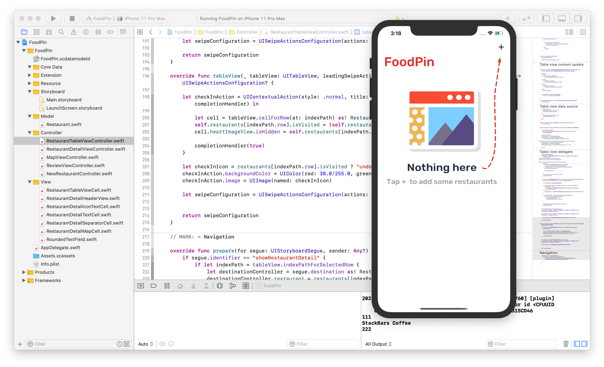
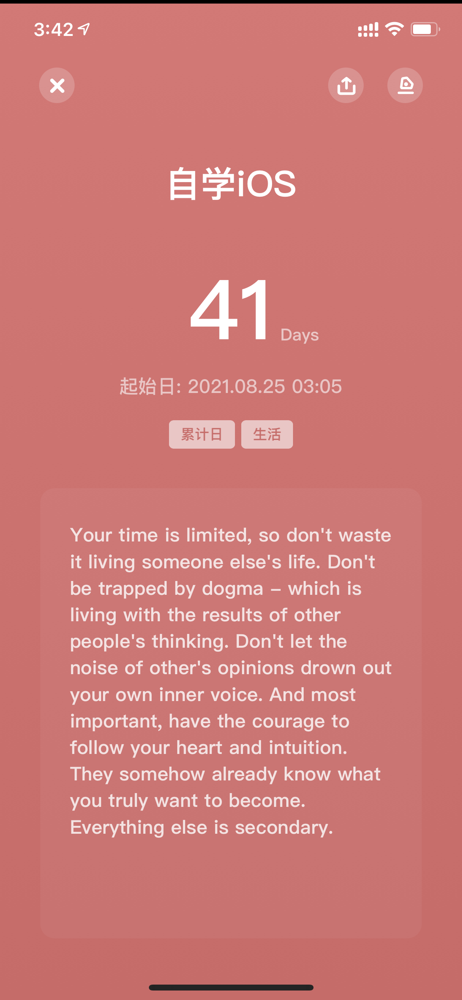
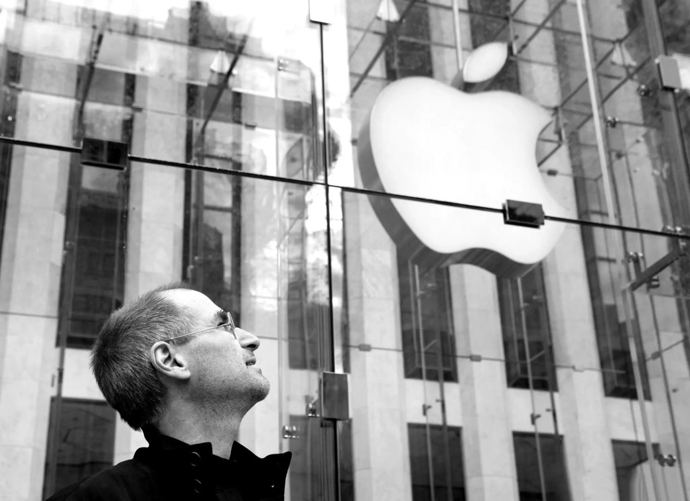

# iOS_SL
iOS Self Learning Recording

# 写在前面

&emsp;&emsp;2019年4月，自己在大三课业之余曾经出于兴趣自学过一段时间的iOS开发。当时是跟着教程《iOS 12程式设计实战心法》（这名字，我第一反应是乾坤大挪移心法哈哈哈）学的，还有模有样地写出过一个半成品，尽管只是在模拟器上运行：

没想到两年半后还能顺利运行起来当时写的app～
 

&emsp;&emsp;虽然是跟着教程写的，但当时也确实算是对iOS开发有了一个初步的认识，印象最深的包括`Storyboard`的`layout`、`Model`、`View`以及`Controller`，（其实能记住的也只有这些），具体的Swift语法已经忘得差不多，需要进一步地唤醒orz。（连如何更改simulator型号都忘了）

&emsp;&emsp;时隔两年半，经历了大三纠结的暑假，大四上的考研，大四下突如其来的疫情+毕设+复试+校招，研究生入学，研一上的焦头烂额，研一下的得过且过，以及研一暑假找实习时的屡面屡挫……这几天一直在反思自己未来想从事的具体方向，思来想去，作为一名果粉，觉得还是以兴趣为导向来得好。恰好，手头的Mac一直没升Big Sur，Catalina的Xcode刚好支持到iOS13过，与教程更新对应。也趁着iOS15正式版推送前，再次捡起iOS自学，希望借此机会好好督促自己，防止半途而废。

&emsp;&emsp;当然了，这个repo用于记录iOS开发的自学历程，不仅仅局限于《iOS 13程式设计实战心法》这一本书。目前的计划是先尽快过一遍，入门Swift；之后再根据知乎上大牛的推荐路线学习OC。如果可以，也希望自己能够在App Store上线一款app，具体的点子，会在学习的过程中寻找。

> “Brick walls are there for a reason: they let us prove how badly we want things.”
>
> 摘录来自: Simon Ng. “Beginning iOS 13 Programming with Swift。” Apple Books. 

# 20211005

​		今天是国庆假期的第五天，也是重拾iOS开发的第41天。目前除了需要加入Apple开发者计划的相关内容（iCloud、TestFlight、Notification等），其余部分已经基本都看完了。（3D Touch那章还剩一点点小尾巴🤏）在学习过程中，自己也看了很多其他的资料，包括stack overflow、官方开发文档、csdn等。虽然才短短四十天，但前阵子看到自己写的app能够运行在真机上，着实激动了好一会儿。接下去的计划就是加一些自己认为需要的功能，具体内容会单独开设一个*DIY*文件夹来记录；之后呢也会看一看进阶的那本书。同时呢，实习相关的准备也得重新捡起来，不能留在舒适圈不是～最主要的，打算把iOS开发相关的学习重心移到官方开发文档上去：官方的开发文档是最好的教程，也是最规范的例子，同时也是最新的版本，而且免费，面向所有人，岂不美哉？

​		对了，今天也是乔帮主逝世十周年，时间真的过得好快啊。遥想十年前，还在上初中，也是差不多十年前吧，第一次接触到了iPhone。且不论乔帮主的其他，感谢乔帮主创建Apple～

> Your time is limited, so don't waste it living someone else's life. Don't be trapped by dogma - which is living with the results of other people's thinking. Don't let the noise of other's opinions drown out your own inner voice. And most important, have the courage to follow your heart and intuition. They somehow already know what you truly want to become. Everything else is secondary.
>
> ---Steve Jobs

**Follow Your Heart,don't waste it living someone else's life.**
