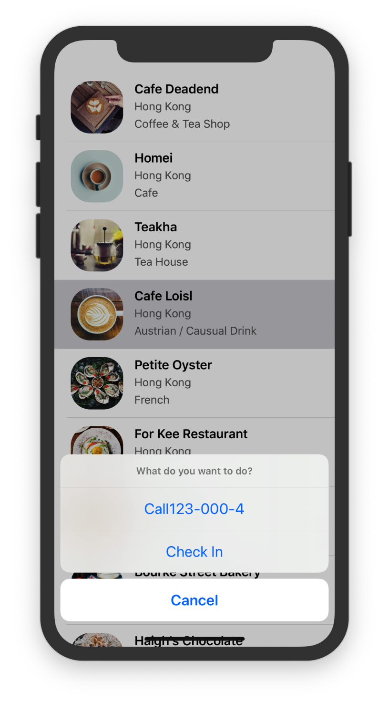
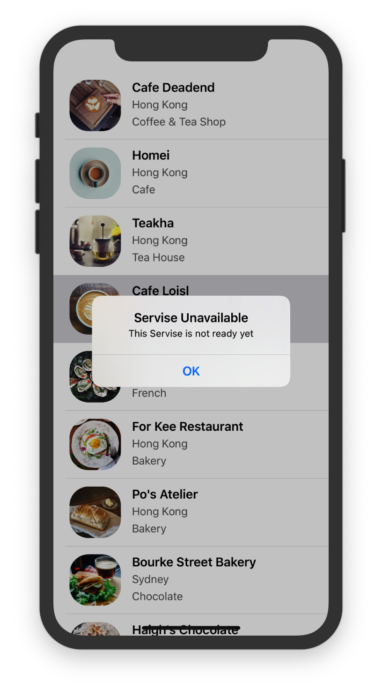
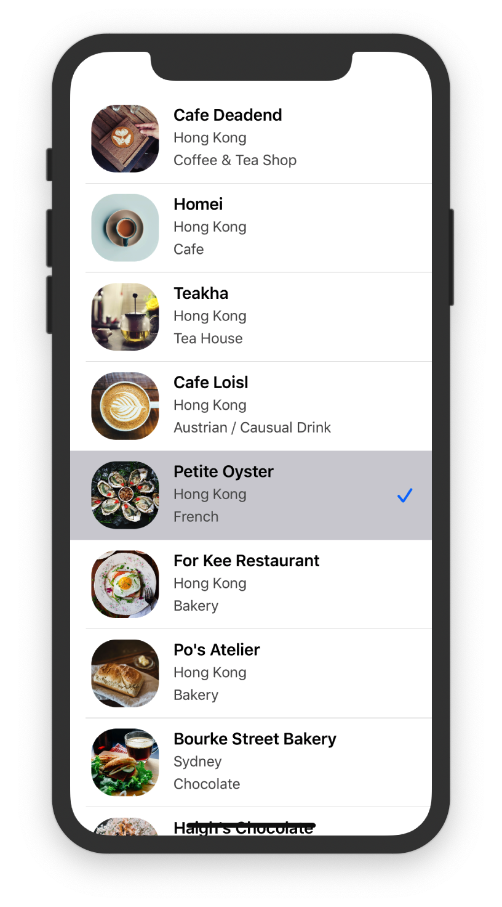

# Basic Alert Action

As we know, `UITableViewController` adopts two protocol: `UITableViewDataSource` and `UITableViewDelegate`. The former is for managing table data, the latter is for setting the section headings and footers of the table view, as well as, handling cell selections and cell reordering. Make good use of official reference, this time we will use the func `func tableView(_ tableView: UITableView, didSelectRowAt indexPath: IndexPath)` to define actions after tapping a cell. Note that this func has no return value, so no `->`.

```sw
override func tableView(_ tableView: UITableView, didSelectRowAt indexPath: IndexPath) {
        let optionMenu = UIAlertController(title: nil, message: "What do you want to do?", preferredStyle: UIAlertController.Style.actionSheet)
        
        optionMenu.addAction(UIAlertAction(title: "Cancel", style: UIAlertAction.Style.cancel, handler: nil))
        
        present(optionMenu, animated: true, completion: nil)
    }
```

Easy to understand, right? This func will automatically detect a touch, no need for extra connections.

> Swift gives developers a shorthand and helps us type less code. Because the type of the preferredStyle parameter is already known (i.e. UIAlertController.Style), Swift lets you use a shorter dot syntax by omitting UIAlertController.Style.

So, the code above can be wirtten like this:

```sw
override func tableView(_ tableView: UITableView, didSelectRowAt indexPath: IndexPath) {
        let optionMenu = UIAlertController(title: nil, message: "What do you want to do?", preferredStyle: .actionSheet)
        
        optionMenu.addAction(UIAlertAction(title: "Cancel", style: .cancel, handler: nil))
        
        present(optionMenu, animated: true, completion: nil)
    }
```


# Add *Check-In* and *Call*

New concept: **Closure**, directly to the code

Call action:

```sw
let callActionHandler = { (action:UIAlertAction!) -> Void in
            let alertMessage = UIAlertController(title: "Servise Unavailable", message: "This Servise is not ready yet", preferredStyle: .alert)
            alertMessage.addAction(UIAlertAction(title: "OK", style: .cancel, handler: nil))
            self.present(alertMessage, animated: true, completion: nil)
        }
        let callAction = UIAlertAction(title: "Call"+"123-000-\(indexPath.row+1)", style: .default, handler: callActionHandler)
        optionMenu.addAction(callAction)
```

Explanation:


Here has a question: Why the Closure doesn't need a parameter when being called? It has a parameter `action:UIAction`. I got the answer from official doc:


See more: [official](https://developer.apple.com/search/?q=Closure)     [zhihu](https://zhuanlan.zhihu.com/p/92464947)

Check-In action:

```sw
let CheckInHandler = { (action:UIAlertAction!) -> Void in
//            let cell = tableView.cellForRow(at: indexPath)
            cell?.accessoryType = .checkmark
        }
        optionMenu.addAction(UIAlertAction(title: "Check In", style: .default, handler: CheckInHandler))
```

  

---

DIY TIME

Running the code, I found that if tapping *Check-In*, the check-mark won't dissapear until rerunning. So I code a uncheck action:

```sw
//uncheck in
        optionMenu.addAction(UIAlertAction(title: "UnCheck", style: .default, handler: {
            (action:UIAlertAction!)->Void in
//            let cell = tableView.cellForRow(at: indexPath)
            cell?.accessoryType = .none
        }))
```

