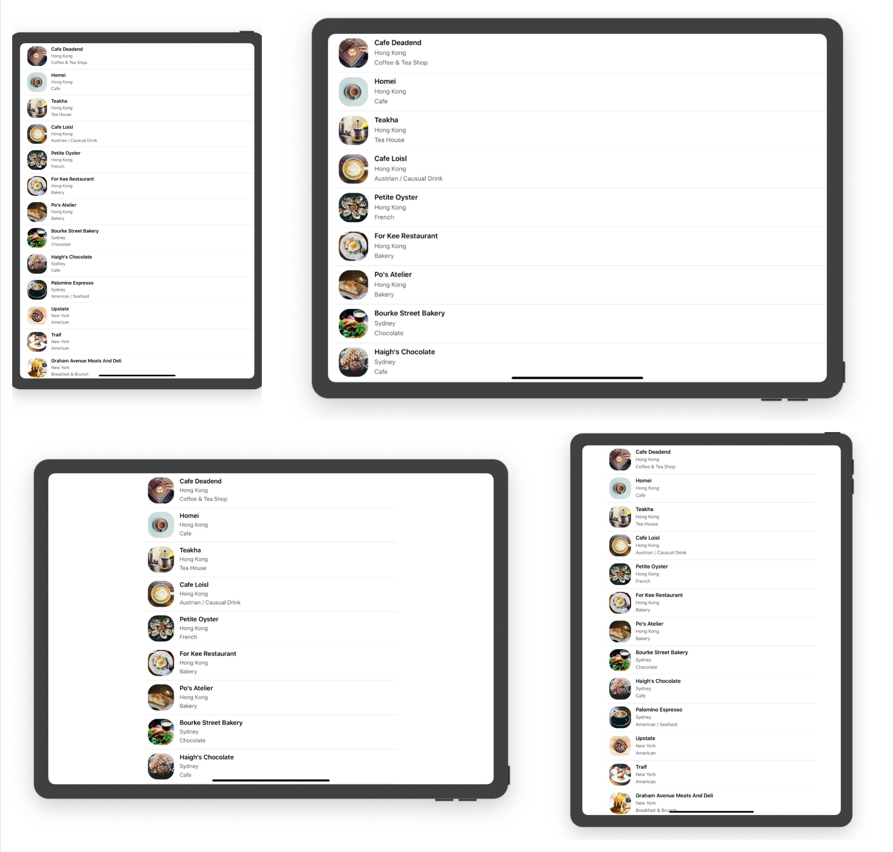
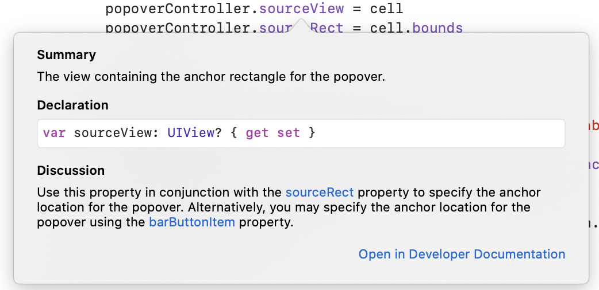
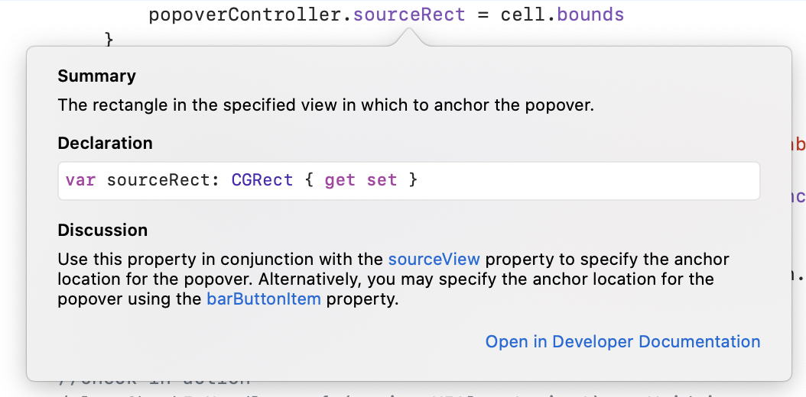
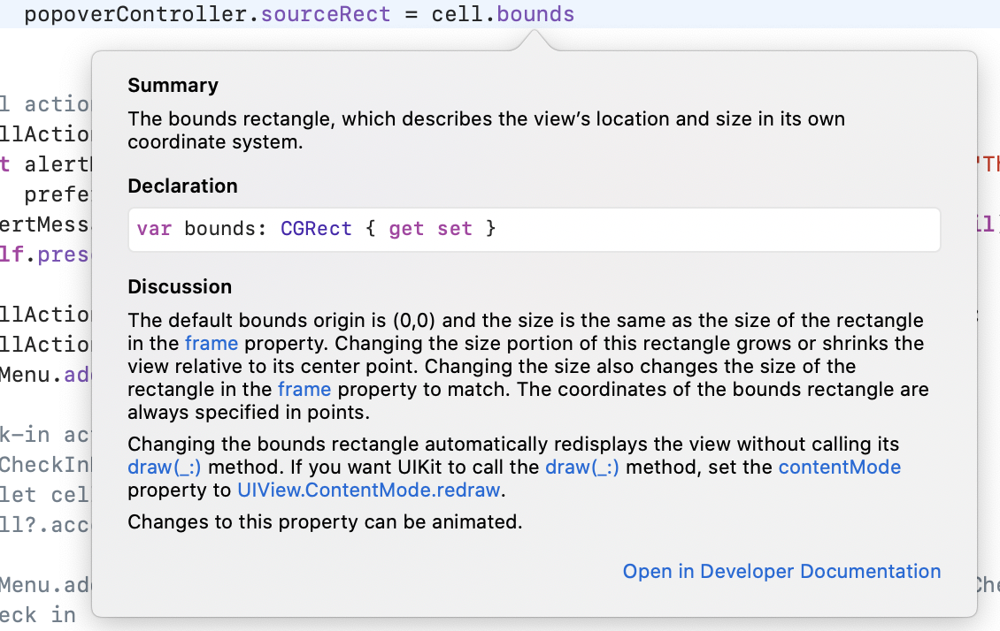
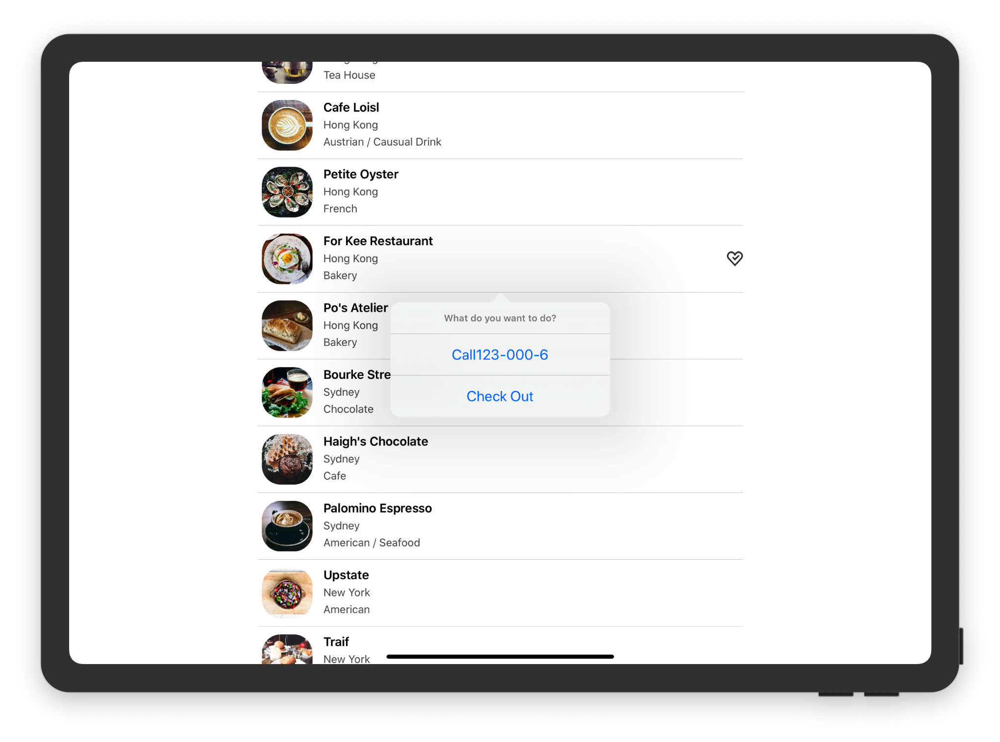

# Basic Alert Action

As we know, `UITableViewController` adopts two protocol: `UITableViewDataSource` and `UITableViewDelegate`. The former is for managing table data, the latter is for setting the section headings and footers of the table view, as well as, handling cell selections and cell reordering. Make good use of official reference, this time we will use the func `func tableView(_ tableView: UITableView, didSelectRowAt indexPath: IndexPath)` to define actions after tapping a cell. Note that this func has no return value, so no `->`.

```sw
override func tableView(_ tableView: UITableView, didSelectRowAt indexPath: IndexPath) {
        let optionMenu = UIAlertController(title: nil, message: "What do you want to do?", preferredStyle: UIAlertController.Style.actionSheet)
        
        optionMenu.addAction(UIAlertAction(title: "Cancel", style: UIAlertAction.Style.cancel, handler: nil))
        
        present(optionMenu, animated: true, completion: nil)
    }
```

Easy to understand, right? This func will automatically detect a touch, no need for extra connections.

> Swift gives developers a shorthand and helps us type less code. Because the type of the preferredStyle parameter is already known (i.e. UIAlertController.Style), Swift lets you use a shorter dot syntax by omitting UIAlertController.Style.

So, the code above can be wirtten like this:

```sw
override func tableView(_ tableView: UITableView, didSelectRowAt indexPath: IndexPath) {
        let optionMenu = UIAlertController(title: nil, message: "What do you want to do?", preferredStyle: .actionSheet)
        
        optionMenu.addAction(UIAlertAction(title: "Cancel", style: .cancel, handler: nil))
        
        present(optionMenu, animated: true, completion: nil)
    }
```


# Add *Check-In* and *Call*

New concept: **Closure**, directly to the code

Call action:

```sw
let callActionHandler = { (action:UIAlertAction!) -> Void in
            let alertMessage = UIAlertController(title: "Servise Unavailable", message: "This Servise is not ready yet", preferredStyle: .alert)
            alertMessage.addAction(UIAlertAction(title: "OK", style: .cancel, handler: nil))
            self.present(alertMessage, animated: true, completion: nil)
        }
        let callAction = UIAlertAction(title: "Call"+"123-000-\(indexPath.row+1)", style: .default, handler: callActionHandler)
        optionMenu.addAction(callAction)
```

Explanation:


Here has a question: Why the Closure doesn't need a parameter when being called? It has a parameter `action:UIAction`. I got the answer from official doc:


See more: [official](https://developer.apple.com/search/?q=Closure)     [zhihu](https://zhuanlan.zhihu.com/p/92464947)

Check-In action:

```sw
let CheckInHandler = { (action:UIAlertAction!) -> Void in
//            let cell = tableView.cellForRow(at: indexPath)
            cell?.accessoryType = .checkmark
        }
        optionMenu.addAction(UIAlertAction(title: "Check In", style: .default, handler: CheckInHandler))
```

 

---

DIY TIME

Running the code, I found that if tapping *Check-In*, the check-mark won't dissapear until rerunning. So I code a uncheck action, the Closurepar is embeded.

```sw
//uncheck in
        optionMenu.addAction(UIAlertAction(title: "UnCheck", style: .default, handler: {
            (action:UIAlertAction!)->Void in
//            let cell = tableView.cellForRow(at: indexPath)
            cell?.accessoryType = .none
        }))
```


Futher more, how about display the two-check button dynamically? Let me try.

```sw
let CheckHandler = {(action:UIAlertAction!) -> Void in
            cell?.accessoryType = ((cell?.accessoryType) == UITableViewCell.AccessoryType.none) ? .checkmark : .none
        }
        let CheckTitle = ((cell?.accessoryType) == UITableViewCell.AccessoryType.none) ? "Check In" : "Check Out"
        let CheckAction = UIAlertAction(title: CheckTitle, style: .default, handler: CheckHandler)
        optionMenu.addAction(CheckAction)
```


Wow~~

Got two attentions:

1. Both two sides of operator must have spacing!
2. Like `UITableViewCell.AccessoryType.none`, if you don't know, check the official docs!

---

> For a table view cell, the right part is reserved for an accessory view. There are four types of built-in accessory views including disclosure indicator, detail disclosure button, checkmark and detail.
>

By far, the row remains highlighted in gray after tapping , use the following line to fix:

```sw
tableView.deselectRow(at: indexPath, animated: true)
```

So Funny!

# Bug

When we *Check In* a restaurant, we'll find some other one checked as well. This is because we use `dequeueReusableCell`. In our code, we only update the image view and labels when the table view reuses the same cell. The accessory view is not updated.

So, the solution is clear. We need to track the checked items and update the reusablecell.

First, declare an array:

```sw
var RestaurantisChecked = Array(repeating: false, count: 21)
```

Then, we can change our DIY code like this:

```sw
...
let CheckHandler = {(action:UIAlertAction!) -> Void in
            cell?.accessoryType = ((self.RestaurantisChecked[indexPath.row]) == false) ? .checkmark : .none
            self.RestaurantisChecked[indexPath.row] = !self.RestaurantisChecked[indexPath.row]
        }
        let CheckTitle = ((self.RestaurantisChecked[indexPath.row]) == false) ? "Check In" : "Check Out"
...
```

BTW, we can just add line4 and leave others as they are.

Finally, we can update `dequeueReusableCell`

```sw
cell.accessoryType = (RestaurantisChecked[indexPath.row] == false) ? .none : .checkmark
```

Bug Fixed !!! 🥳

A tiny note: have you notice the key value `self` ? Why add this one? Maybe we just understand this as a rule:

这一点似乎与强引用有关，目前我们先理解为这样使用能够改变闭包外变量的值。加入To-Do中

# Crash! On iPad

1. The cells look too long on iPad, especially in lanscape mode.Use this is `viewDidLoad`

   ```
   tableView.cellLayoutMarginsFollowReadableWidth = true;
   ```

   

2. Crash when we tap any of the cells. This is because iOS uses different presentation style on iPad. We must provide call-location info to use pop-over present style.To fix that, add these code lines:

   ```sw
   if let popoverController = optionMenu.popoverPresentationController{
               if let cell = tableView.cellForRow(at: indexPath){
                   popoverController.sourceView = cell
                   popoverController.sourceRect = cell.bounds
               }
           }
   ```

   Explanations:

   > When the app is run on iPhone, the popoverPresentationController property of the alert controller (i.e optionMenu) is set to nil. Conversely, it will store the popover presentation controller when the app is run on iPad. Therefore, we use if let to check if the popoverPresentationController property has a value. If yes, we configure its sourceView to the cell that triggers the action. Optionally, we set the sourceRect property to the cell's bounds, so that the popover will be originated from the center of the cell.

   





# Exercise

## 1

Exercise 1 is DIY BMS.

## 2

Not so hard as well(叉腰).

1. add an imageview in storyboard

2. create a new *@IBoutlet* var `HeartImage`, and make connection with step1

3. Downcast `cell` in func `func tableView(_ tableView: UITableView, didSelectRowAt indexPath: IndexPath)` to `RestaurantTableViewCell`

4. comment line 65 in `RestaurantTableViewController` and add this line:

   ```sw
   cell.HeartImage.image = ((self.RestaurantisChecked[indexPath.row]) == false) ? UIImage(named: "heart-tick") : .none
   ```

   `nil` is Okey as well

5. comment line 101 and add this to update *dequeueReusableCell*:

   ```sw
   cell.HeartImage.image = (RestaurantisChecked[indexPath.row] == false) ? nil : UIImage(named: "heart-tick")
   ```



Perfect!

BTW, my first trial was set the name of new imageView to "heart-tick" directly, leading displaying the image in every cell whether Check In/Out

My second attemp excludes step 3&4, causing only displaying the image after scrolling🤣

---

Oh-My-Gosh, the stand answer just using the property `isHidden` ! In fact, my first thought is the same, but I can't find the name of this preperty!🤦‍♂️

# To Do

- [ ] self and closure, weak self ? hard self ? capture closure?