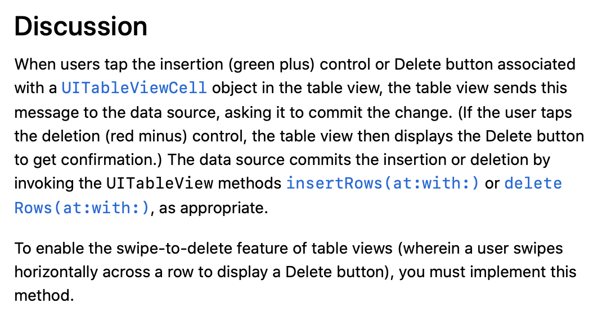

Select, delete, insert and update are the basic operations when dealing with data. We've realized how to select, let's achieve deleting.

# MVC

* Model:

  responsible for holding the data or any operations on the data. The simplest model is *Array*.

* View:

  manages the visual display of information.

* Controller;

  a bridge between the model and the view. It translates the user interaction from the view (e.g. tap) into the appropriate action to be performed in the model.


# Enable the Swipe-to-delete feature

Insert these lines:

```sw
override func tableView(_ tableView: UITableView, commit editingStyle: UITableViewCell.EditingStyle, forRowAt indexPath: IndexPath) {
        
    }
```



From the discussion, we can infer that this function can receive either delete or insert action by the par `editingStyle`

Then we got result like this:


# Delete element in the model and Reload

```sw
if editingStyle == .delete {
            restaurantNames.remove(at: indexPath.row)
            RestaurantisChecked.remove(at: indexPath.row)
            restaurantTypes.remove(at: indexPath.row)
            restaurantLocations.remove(at: indexPath.row)
            tableView.reloadData()
        }
```

Easy to understand. However, we don't need to reload the whole tableView, just delete the specified row of it using methhod `deleteRows(at: with: )`

```
tableView.deleteRows(at: [indexPath], with: .fade)
```

BTW, in addition to `.fade`, I tried `.left` `.right` `.top`, but did't see any difference.

# Swipe to more

If we just need to implement the swipe to delete function in our app, the above method is good enough. However, if we won't to swipe for more, it's far from enough. We need to use `UIContextualAction` Class. So, delete above code first. 

There are two methods : `tableView(_:leadingSwipeActionsConfigurationForRowAt:)` (swipe to right, display in leading),  `tableView(_:trailingSwipeActionsConfigurationForRowAt:)`(swipe to left, display in trailing)

Let's put the code first and analyze line by line.

```
override func tableView(_ tableView: UITableView, trailingSwipeActionsConfigurationForRowAt indexPath: IndexPath) -> UISwipeActionsConfiguration? {
        let deleteAction = UIContextualAction(style: .destructive, title: "Delete"){ (action, sourceView, completionHandler) in
            //delete row
            self.restaurantNames.remove(at: indexPath.row)
            self.restaurantLocations.remove(at: indexPath.row)
            self.restaurantTypes.remove(at: indexPath.row)
            self.RestaurantisChecked.remove(at: indexPath.row)
            tableView.deleteRows(at: [indexPath], with: .fade)
            //dismiss the action button
            completionHandler(true)
        }
        
        let shareAction = UIContextualAction(style: .normal, title: "Share"){(action, sourceView, completionhandler) in
            let defaultText = "Just Checking in at " + self.restaurantNames[indexPath.row]
            let activilityController = UIActivityViewController(activityItems: [defaultText], applicationActivities: nil)
            self.present(activilityController, animated: true, completion: nil)
            
            completionhandler(true)
        }
        
        let swipeConfiguration = UISwipeActionsConfiguration(actions: [deleteAction, shareAction])
        return swipeConfiguration
    }
```

* line2 : `UIContextualAction`:

  > Create `UIContextualAction` objects to define the types of actions that can be performed when the user swipes left or right on a table row. 

  

  

* `completionHandler`:这里的Handler没有写代码块，直接传入一个true参数，我的理解为其默认功能是使选中的按钮消失。见下图，如果我们把shareaction的此行注释掉，则左滑动作不会自动消失。deleteaction由于会删除整行，看不出来


* `UIActivityViewController`:

  > The system provides several standard services, such as copying items to the pasteboard, posting content to social media sites, sending items via email or SMS, and more. Apps can also define custom services.

  

  就是平时经常看到的空投的那个分享页面

* `UISwipeActionsConfiguration`:

  > The set of actions to perform when swiping on rows of a table.
  >
  > Create a `UISwipeActionsConfiguration` object to associate custom swipe actions with a row of your table view. 