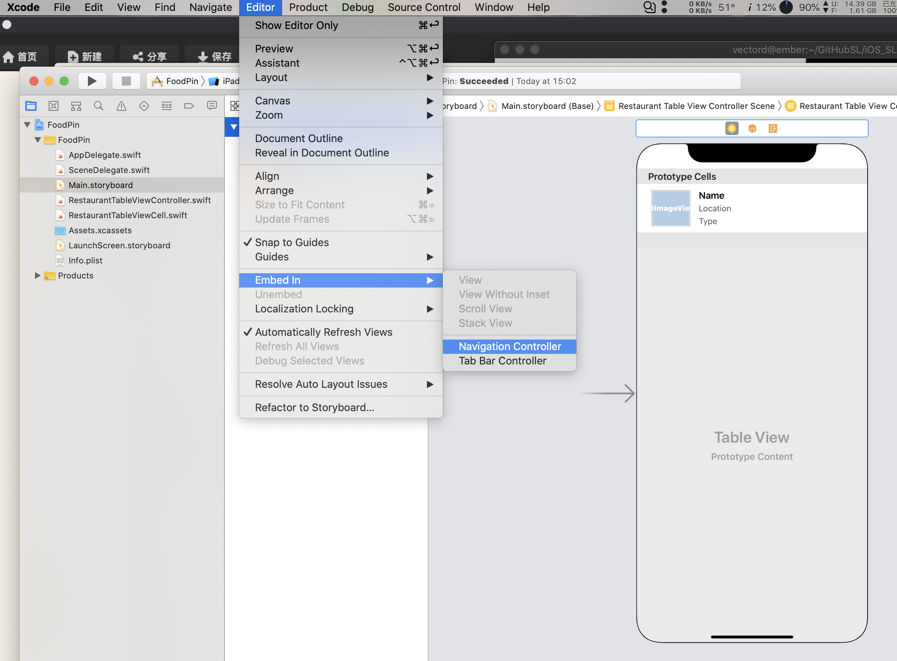
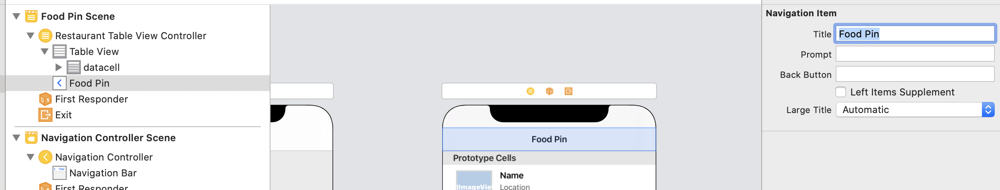
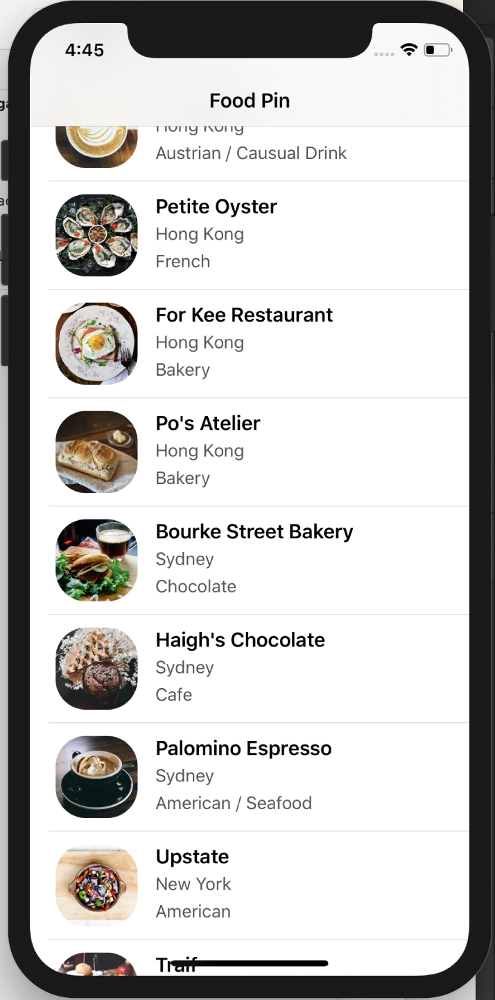
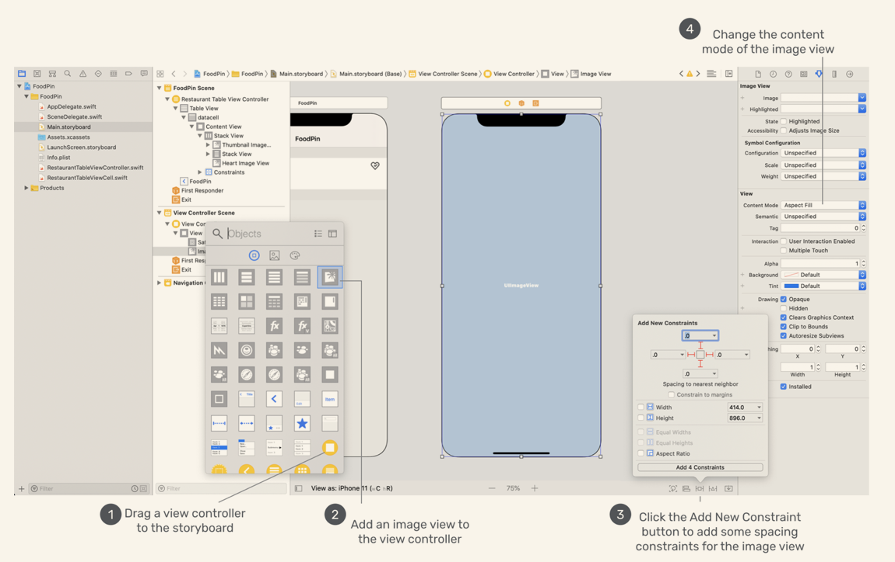
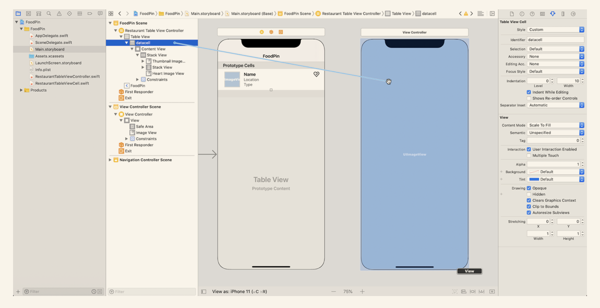
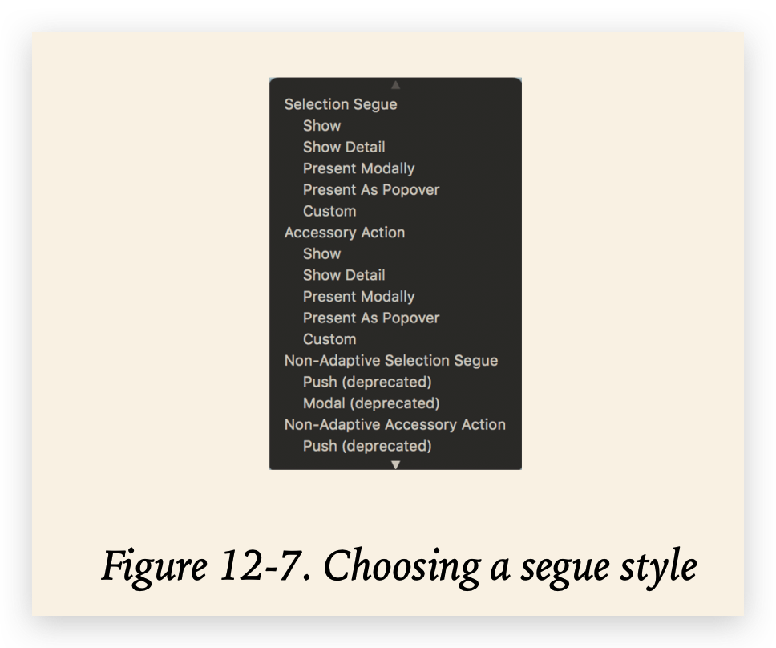
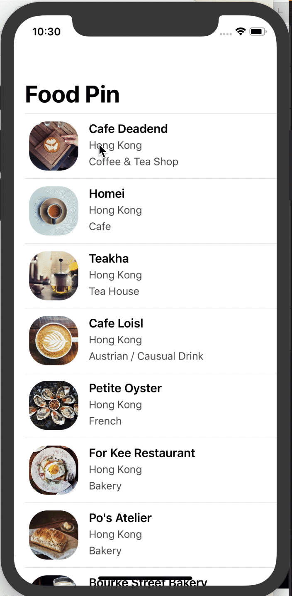
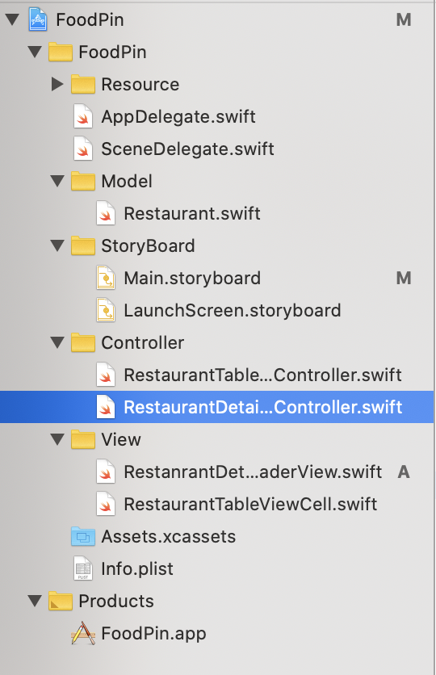

# Navigation, scence and segues

*  Scence: refers to the on-screen content. In oter words, the current view on the device is a scence
* Segue: Transition among scences
* Navigation: segues' class (IMU)

# Create Navigation Controller

Choose *Restaurant Table View Controller Scence*, the in the top menu, *Editor -> Embed In -> Navigation Controller*.



Change the name of *Navigation Item* in *Restaurant Table View Controller* to `Food Pin`





We can set the title to *Large Title* :

```sw
navigationController?.navigationBar.prefersLargeTitles = true
```


# Create Detail View Controller

When we tap one of the restaurants, we want to see the detail info rather than alertactions. Thus, we need to create *Detail View Controller*

This chapter's theme is navigation, so let's keep the detail scence as simple as possible.



Now, we got two view controller, what we need to do is to connect them.

> In music, a segue is a seamless transition between one piece of music and another. In storyboards, the transition between two scenes is called segue.

The connection is easy to establish. Select `datacell`, hold `control` and drag form it to the new control view. Then, a pop over view appears, select `show`.





* **Show** - when the show style is used, the content is pushed on top of the current view controller stack. A back button will be displayed in the navigation bar for navigating back to the original view controller. Typically, we use this segue type for navigation controllers.
* **Show detail** - similar to the show style, but the content in the detail (or destination) view controller replaces the top of the current view controller stack. For example, if you select show detail instead of show in the FoodPin app, there will be no navigation bar and back button in the detail view.
* **Present modally** - presents the content modally. When used, the detail view controller will be animated up from the bottom and cover the entire screen on iPhone. A good example of present modally segue is the "Add" feature of the built-in Calendar app. When you click the + button in the app, it brings up a "New Event" screen from the bottom.
* **Present as popover** - Present the content as a popover anchored to an existing view. Popover is commonly found in iPad apps, and you have already implemented popover in earlier chapters.

In my testing, I can't find the difference between 2 and 3 by now, and 4 built failed....

# Create RestaurantDetailViewController

After create this Class, we need to create `restaurantImageName` to pass the image name, and `restaurantImageView` to display the image, which is an outlet.Then, make a connection.Next, add `restaurantImageView.image = UIImage(named: restaurantImageName)` in `viewDidLoad()`

# Pass data Using Segues

> When a segue is triggered, before the visual transition occurs, the storyboard runtime notifies the source view controller (i.e. RestaurantTableViewController) by calling the `prepare(for:sender:)` method:
>
> ``` 
> func prepare(for segue: UIStoryboardSegue, sender: Any?) {
> 
> }
> ```
>
> By overriding the method, you can pass any relevant data to the new controller, which is `RestaurantDetailViewController` in our project.

It is very likely that we will have more than one segue between view controllers. Thus, the best way is to give each segue a unique identifier in storyboard.

Then, we got detail view like this:



Finally, we can disable the `Large Title` in detail view controller in `viewdidload` func in `RestaurantDetailView.swift`

```sw
navigationItem.largeTitleDisplayMode = .never
```

# Exercise

I wonder why can't I code like `RestaurantTableViewCell`?

```
// in REstaurantTableViewController
destinationController.NameLabel.text = restaurantNames[indexPath.row]
                destinationController.TypeLabel.text = restaurantTypes[indexPath.row]
                destinationController.LocationLabel.text = restaurantLocations[indexPath.row]
                
// in RestaurantTableDeatilView
@IBOutlet var NameLabel : UILabel!
@IBOutlet var TypeLabel : UILabel!
@IBOutlet var LocationLabel : UILabel!
```

I didn't define names of three new var, and the app carshed when running.

So the question why can't assign value to `NameLabel`  `TypeLabel` and `LocationLabel` directly like vars in `RestaurantTableViewCell` ?

# To Do

- [ ] Exercise:

  这个问题，我个人的理解是，cell那个类，cell本身在创建之前已经存在，故所有的var已经有了对应的value；而destination则不然。但是，[stackoverflow](https://stackoverflow.com/questions/32170456/what-does-fatal-error-unexpectedly-found-nil-while-unwrapping-an-optional-valu)上的动图里也用的是reusablecell，也产生的这个错误，所以就不是很明白了:

  从14章回来，文件结构如下：

  

我们可以看到，exercise里的是一个controller，而之前的`RestaurantTableViewCell`是一个cell，并不是controller，再看下面两行代码：

```sw
let cell = tableView.dequeueReusableCell(withIdentifier: "datacell", for: indexPath) as! RestaurantTableViewCell

let destinationController = segue.destination as! RestaurantDetailViewController
```

还是和上面一样的理解，deque使用reuse的方法，使得cell内部的outlet在调用前均已有值；而line3的destination，这一行在定义时会调用`RestaurantDetailViewController`内的初始化方法`viewDidLoad`，若不在该方法内定义初值，将会crash。

但是又出现了新的问题：我尝试在detailController里把namelabel的text字段初始化为空，此时已有初值；但后续无法通过直接访问text字段更新其值。具体的见chapter12的exercise

BTW，因为每一张都是直接复制的上一章的工程文件夹，所以可能会造成target混乱。例如13章创建了`Restaurant`文件，在12章的工程目录里也出现了，只是没有实体，最终造成错误。解决方法是在12章的工程目录中将其删去即可。