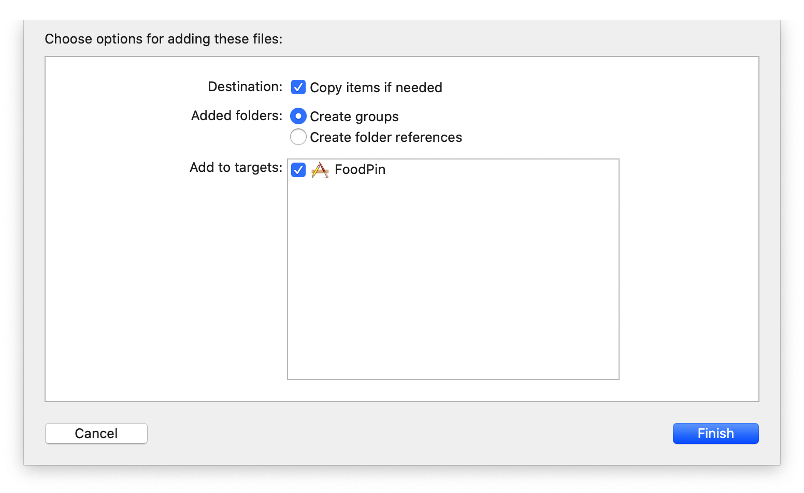
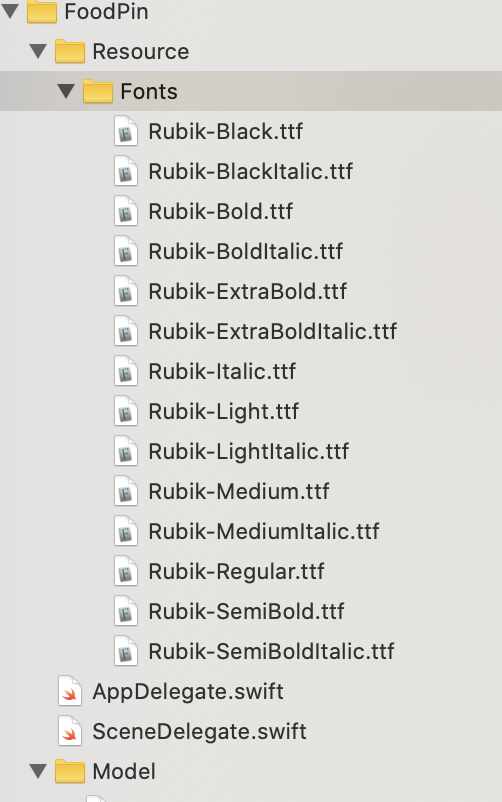
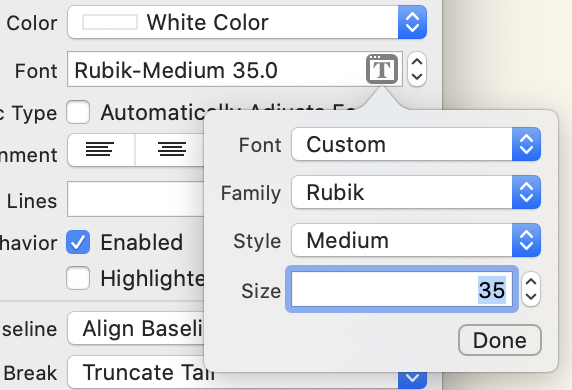
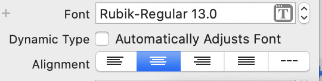
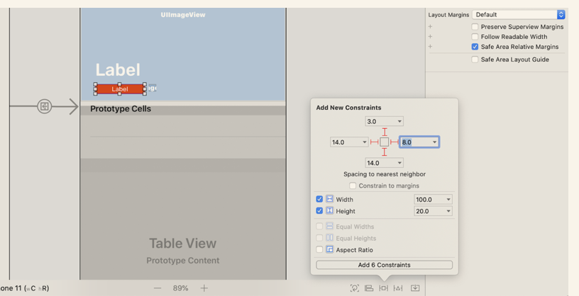
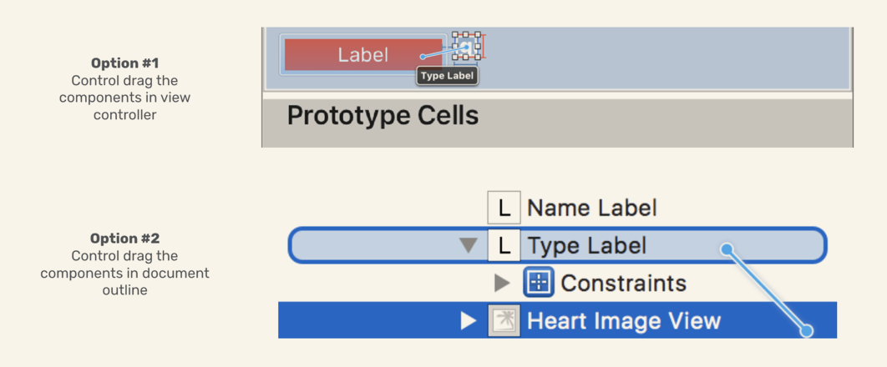
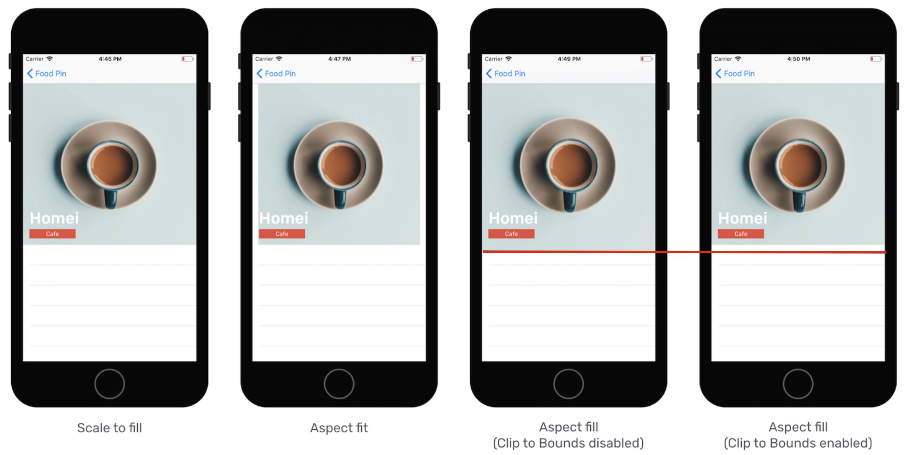
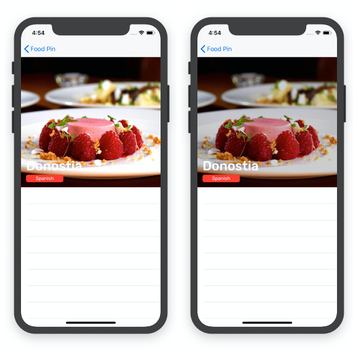
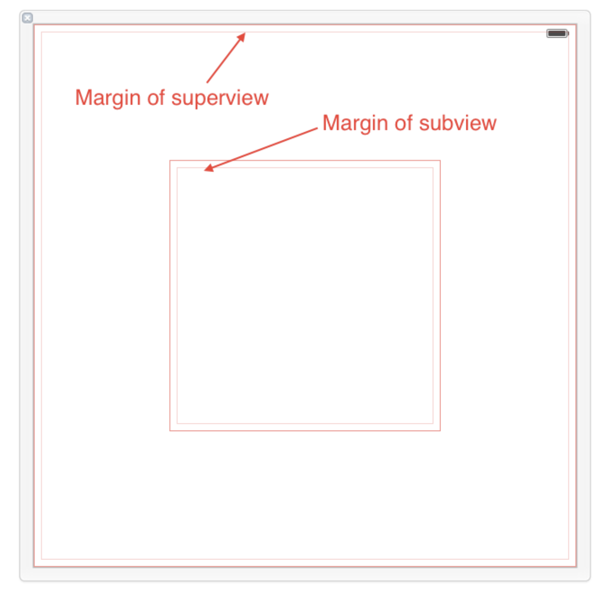

<font color = "red">本章工程文件与chapter13为同一个</font>

# Customize your own font

We can drag the fonts to project navigator, and in order manage files easier, use **group*8 feature.





# Design your table view header

> Each table view has its own header view. This header view resides on top of the table cells. The header view is empty by default, but you are allowed to add your own view to that.
>

The `view` of Detail view controller should be removed as well. Drag a *TableView* to it, and Xcode automatically resize the tableview to fill the whole screen. Set the number of *Prototype Cells* to `2` this time. Drag a `View` (<font color = "red">Note</font>, `View`, no any prefix) to the top of cells and adjust its height to `350`. This view serves as the container view holding other elements which will be added later. Rename the view to `header view`. (So the Header View must be added ourselves....)Header View doesn't need to set constraints.

Then, drag an *Image View* and config, adding four constraints.

Next, the *Name Label*: 

*Type Label*: width:100 height:20 background-color:red font-color:white font:as following



Heart Image View: 15x15

Let's set some constraints now:

Change the width constraint of *Type Label* form `Equal` to `Greater`. For the align of small image, use `control`+`drag`



For the *Name Label*, use the same method to set the mode to `Leading`, and trailing >=50

# Header Code

Create class `RestaurantDetailHeaderView` , code outlets and make connections.

---

写到这里的时候突然被左边大纲的文件结构启发，对chapter12的To-Do有了新的想法，具体见chapter12 To-Do部分

---

Go to `RestaurantDetailViewController`, define two outlets for `TableView` and `HeaderView`:

```sw
@IBOutlet var tableView : UITableView!
@IBOutlet var headerView : RestanrantDetailHeaderView!
```

Then, in `viewDidload()`

# Problems

## 1 The header image 

The header image covers nearly half of the table cell. ~~(In fact, I don't think it's a problemಠ_ಠ)~~ I misunderstood, overlaps the table cell blow it. To solve this, clip `Clip to Bounds`. 



## 2 restaurant names

For some long names, they can't be fully displayed.There are two ways to fix this problem:

1. select the label and set the number of `lines` form `1` to `2`

2. (recommand) set the `nameLabel` 's number of lines in to 0 in `didset`. In this way, the label's lines will change automatically.

   ```sw
   @IBOutlet var nameLabel : UILabel!{
           didSet{
               nameLabel.numberOfLines = 0
           }
       }
   ```

## 3 Type Label

Suppose to have rounded corners

Similar to the thumbnailImage

```sw
@IBOutlet var typeLabel : UILabel!{
        didSet{
            typeLabel.layer.cornerRadius = 5.0
            typeLabel.layer.masksToBounds = true
        }
    }
```

A little different: in *View*, we use `clip`, while in layer(not view), we use `masks`. In fact, `cliptobounds` will call `maskstobounds` [ref](https://blog.csdn.net/a1056244734/article/details/51536483)s

## Heart Image

The original color of heart image is black, we can change the color of that in two ways:

1. In assets catalog, select heart-image and change the `Render As` property to `Template image`, and in *StoryBoard*, select the imageView and change the `Tint` to the color you like.

2. code.

   ```sw
   didSet{
               headerImageView.image = UIImage(named: "heart-tick")?.withRenderingMode(.alwaysTemplate)
               headerImageView.tintColor = .white
           }
   ```

   What's wrong with the code above? Yes! It should be `heartImageView` instead of `headerImageView`!

## 5 white background

Restaurant name may not be clearly shown in white background.Thus, we plan to add a view to dim the background image.Drag a *View* blow the *Header Image View*, rename it as `Dim View`. Then, config its color to `black`, alpha to `0.2`. Do not foget to set constraints.



从这里也能看出storyboard里的顺序并不是层次堆叠的顺序，例如这里的dim放在第二个，但alpha为1时Name被遮挡，type没有。

# Prototype Cells

Drag one imageView to the first prototype cell, set width and height 20 and lock them. Drag a Label next to it. This time we use stack view to auto-layout. Set the spacing to `10` and Aligning mode to `Center` . Set four constraints of stack view and make sure check `Constarints to margins`, <font color = "red">[about Constraints to Margins](https://stackoverflow.com/questions/25807545/what-is-constrain-to-margin-in-storyboard-in-xcode-6)</font>,



<font color = "red">For each cell/view/controller,</font> we need to create a new class to make collections. Thus, create class `RestaurantDetailIconTextCell` to make collections to objects within `prototype cell 1`. Remember to set the `Identifier` of `prototype cell1` to `RestaurantDetailIconTextCell`, same as class name.

For the designing of second cell, a *Label* is enough. Add four constraints (to margins). Create class and connect. Set `identifier` to `RestaurantDetailTextCell`.

Ok, back to `RestaurantDetailViewController`.