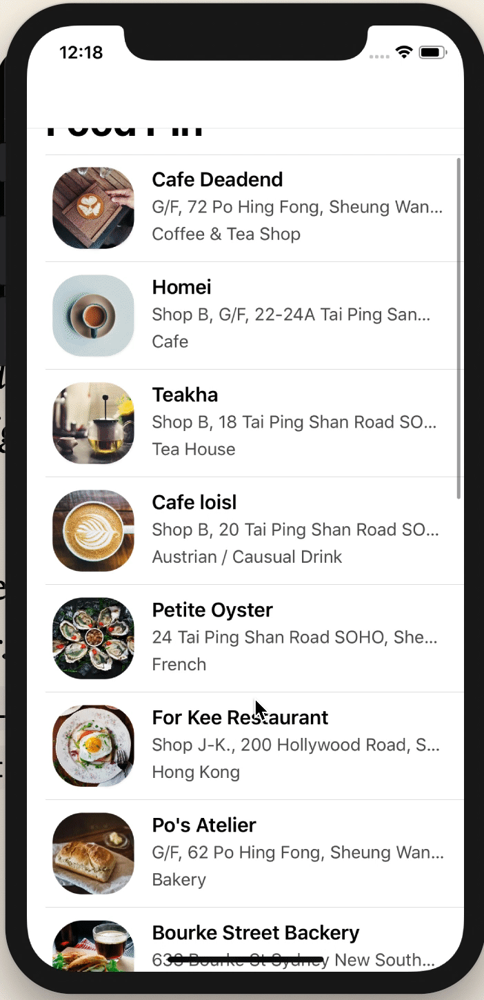
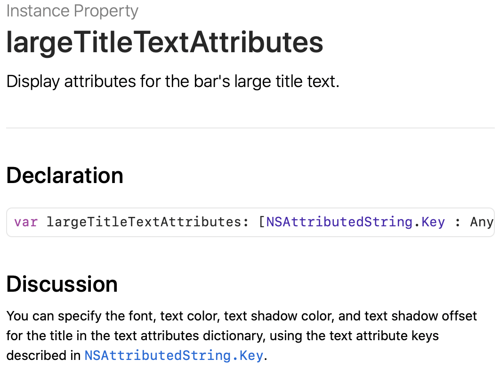
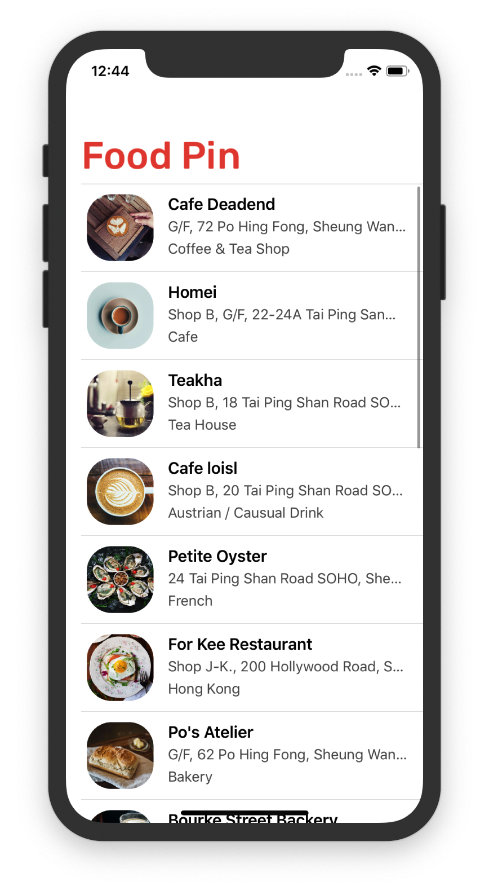
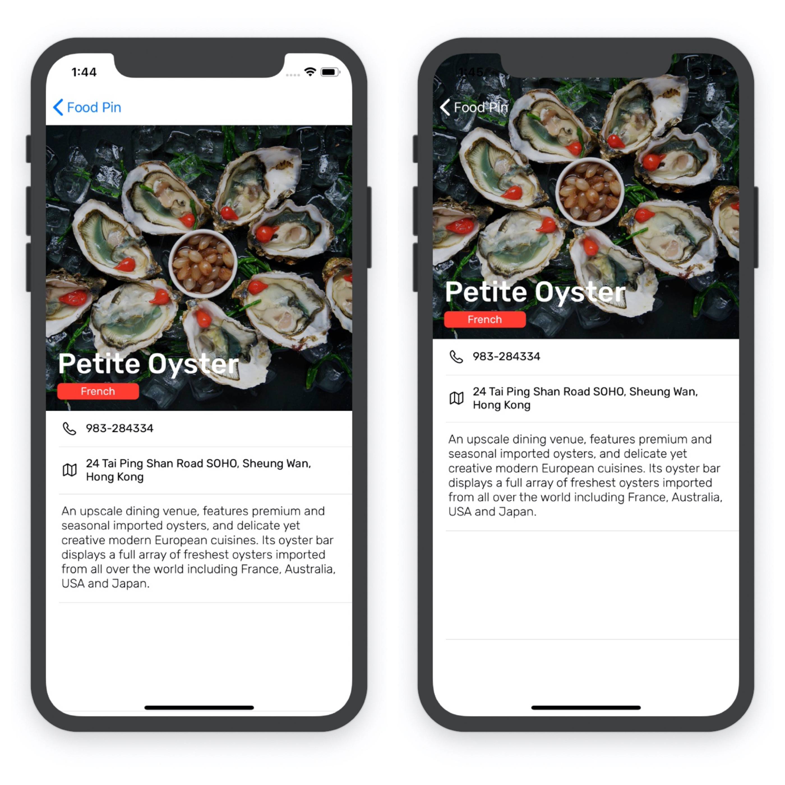
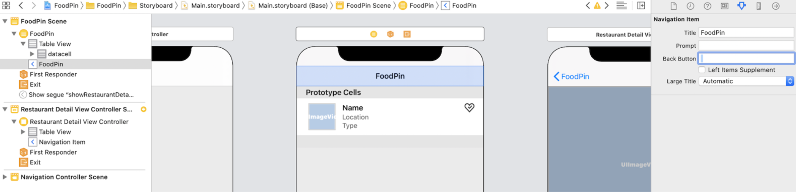

# Customize Navigation Bar

Let's go to the code directly.

```sw
navigationController?.navigationBar.setBackgroundImage(UIImage(), for: .default)
```

Set the background image a transparent one.



```sw
navigationController?.navigationBar.shadowImage = UIImage()
```

顾名思义即可，就是把阴影部分（横线）设置为一个空的图

```sw
if let customFont = UIFont(name: "Rubik-Medium", size: 40.0){
            navigationController?.navigationBar.largeTitleTextAttributes = [NSAttributedString.Key.foregroundColor : UIColor(red: 231/255, green: 76/255, blue: 60/255, alpha: 1.0), NSAttributedString.Key.font: customFont]
        }
```



Result:



For the `DetailViewController`:

```sw
				navigationController?.navigationBar.setBackgroundImage(UIImage(), for: .default)
        navigationController?.navigationBar.shadowImage = UIImage()
        navigationController?.navigationBar.tintColor = .white
        tableView.contentInsetAdjustmentBehavior = .never
```

First three lines are easy to understand.For the fourth line:

> “The value of the property controls the behavior for determining the adjusted content offsets of the table view. By default, it is set to .always. In this case, iOS automatically adjusts the content offset of the table view such that the content area will not be blocked by the navigation bar (see figure 15-3 (left)). Now as the navigation bar is set to transparent, we want to shift the table view upward. In order to do that, we set contentInsetAdjustmentBehavior to .never, telling iOS not to adjust the content area.”
>
> 摘录来自: Simon Ng. “Beginning iOS 13 Programming with Swift。” Apple Books. 



# Back Button

Have you ever wondering what's the two files`AppDelegate.swift` and `SceneDelegate` in `Resource` folder for? As for `AppDelegate`, it's the entry of a application. So, to customize the back button globally, we can insert code in the method `didFinishLaunchingWithOptions`. We can infer the effect from the name.

> This method will be called when the application loads up and is suitable for adding customization code that affects the entire application

```sw
func application(_ application: UIApplication, didFinishLaunchingWithOptions launchOptions: [UIApplication.LaunchOptionsKey: Any]?) -> Bool {
        // Override point for customization after application launch.
        let backButtonImage = UIImage(systemName: "arrow.left", withConfiguration: UIImage.SymbolConfiguration(weight: .bold))
        UINavigationBar.appearance().backIndicatorImage = backButtonImage
        UINavigationBar.appearance().backIndicatorTransitionMaskImage = backButtonImage
        
        return true
    }
```

`weight: .bold` set the font of backimage. And line4&5 are used together to make the customizing effect. Finally, we need to remove the title text. Go to storyboard, set the value of `Back Button` field to space in *Food Pin* controller's Attributes inspector.(<font color = "red">It's a Space ` `, not `nil`!!!</font>



