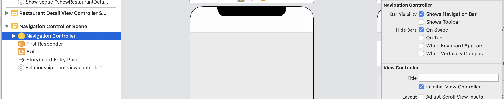

# Customize Navigation Bar

Let's go to the code directly.

```sw
navigationController?.navigationBar.setBackgroundImage(UIImage(), for: .default)
```

Set the background image a transparent one.


```sw
navigationController?.navigationBar.shadowImage = UIImage()
```

顾名思义即可，就是把阴影部分（横线）设置为一个空的图

```sw
if let customFont = UIFont(name: "Rubik-Medium", size: 40.0){
            navigationController?.navigationBar.largeTitleTextAttributes = [NSAttributedString.Key.foregroundColor : UIColor(red: 231/255, green: 76/255, blue: 60/255, alpha: 1.0), NSAttributedString.Key.font: customFont]
        }
```


Result:


For the `DetailViewController`:

```sw
				navigationController?.navigationBar.setBackgroundImage(UIImage(), for: .default)
        navigationController?.navigationBar.shadowImage = UIImage()
        navigationController?.navigationBar.tintColor = .white
        tableView.contentInsetAdjustmentBehavior = .never
```

First three lines are easy to understand.For the fourth line:

> “The value of the property controls the behavior for determining the adjusted content offsets of the table view. By default, it is set to .always. In this case, iOS automatically adjusts the content offset of the table view such that the content area will not be blocked by the navigation bar (see figure 15-3 (left)). Now as the navigation bar is set to transparent, we want to shift the table view upward. In order to do that, we set contentInsetAdjustmentBehavior to .never, telling iOS not to adjust the content area.”
>
> 摘录来自: Simon Ng. “Beginning iOS 13 Programming with Swift。” Apple Books. 


# Back Button

Have you ever wondering what's the two files `AppDelegate.swift` and  `SceneDelegate`  in `Resource` folder for? As for `AppDelegate`, it's the entry of a application. So, to customize the back button globally, we can insert code in the method `didFinishLaunchingWithOptions`. We can infer the effect from the name.

> This method will be called when the application loads up and is suitable for adding customization code that affects the entire application

```sw
func application(_ application: UIApplication, didFinishLaunchingWithOptions launchOptions: [UIApplication.LaunchOptionsKey: Any]?) -> Bool {
        // Override point for customization after application launch.
        let backButtonImage = UIImage(systemName: "arrow.left", withConfiguration: UIImage.SymbolConfiguration(weight: .bold))
        UINavigationBar.appearance().backIndicatorImage = backButtonImage
        UINavigationBar.appearance().backIndicatorTransitionMaskImage = backButtonImage
        
        return true
    }
```

`weight: .bold` set the font of backimage. And line4&5 are used together to make the customizing effect. Finally, we need to remove the title text. Go to storyboard, set the value of `Back Button` field to space in *Food Pin* controller's Attributes inspector.(<font color = "red">It's a Space ` `, not `nil`!!!</font>


result:


# Hide the bar when swiping

This feature is my favourite!

We can select `Navigation Controller` in story board and check the `On swipe` to achieve.



However, this will apply to all the navigation controllers in the app. In order to hide bar in certain controller, we need to code.Remember to uncheck `On Swipe` before go to coding.

```sw
navigationController?.hidesBarsOnSwipe = true
```

add this one in `TableViewController` 's `viewDidLoad`, and set `false` in another controller. However, there are two problems:


This is because `viewDidLoad` only be called once when the view is loaded.Here has an image:


---

# Chapter12 To-Do

接着这次机会，使用print找出了调用的顺序，也解释了chapter12的To-Do:在`DetailViewController`的`viewDidLoad`方法里print `Detail`, 在TableViewController的`prepare`方法里最后一行print `Detail_Segue`， 最后得出前者的执行顺序更晚。

* 不同scene之间的restaurant值是如何传递的？

还是调用顺序的问题，直接看代码就明白了：

```sw
		override func viewDidLoad() {
        print(restaurant.name)
        super.viewDidLoad()
        navigationItem.largeTitleDisplayMode = .never
        headerView.nameLabel.text = restaurant.name
        headerView.typeLabel.text = restaurant.type
        headerView.headerImageView.image = UIImage(named: restaurant.image)
        headerView.heartImageView.isHidden = !(restaurant.isVisited)
        //connections
        tableView.delegate = self
        tableView.dataSource = self
        //separate
//        tableView.separatorStyle = .none
        // navigation bar
        navigationController?.navigationBar.setBackgroundImage(UIImage(), for: .default)
        navigationController?.navigationBar.shadowImage = UIImage()
        navigationController?.navigationBar.tintColor = .white
        tableView.contentInsetAdjustmentBehavior = .never
        //show bar
        navigationController?.hidesBarsOnSwipe = false
        print("Detail")
    }
```

注意line2和line21的print，line2的输出不为空，输出如下：


换句话说，在执行`viewDidLoad`之前，值已经传进来了。

---

So, problem 1 is easy to explain now: when we are in *DeatilView*, *TableView*'s `viewDidLoad` has been called, after tapping `backbutton`, the status of hidebar is set to `false` again.（复现问题1只需要在bar未被隐藏时点入detail，再返回，之后bar将不再被隐藏）.

As for problem 2, the reason is different. I don't know why.从执行来看，detail的didload确实是在table的detailload后面执行的，照理说不应该被隐藏才对。书上是这么说的

> For Problem #2, the hidden navigation bar is carried over to the detail view. Even if we manage to set the hidesBarsOnSwipe property back to false in the viewDidLoad method, it won't display the navigation bar. <font color = "red">We have to explicitly tell the app to re-display the navigation bar. </font>

<span jump id = "todo1">意思是即便我们在detailview的viewdidload里定义了hidebar，其值也会被table的覆盖ಠ_ಠ🤦‍♂️行吧.</span>

Thus, we use `willAppear` to code. For `TableViewController`:

```sw
override func viewWillAppear(_ animated: Bool) {
        super.viewWillAppear(animated)
        
        navigationController?.hidesBarsOnSwipe = true
    }
```

For `RestaurantDetailViewController`:

```sw
override func viewWillAppear(_ animated: Bool) {
        super.viewWillAppear(animated)
        
        navigationController?.hidesBarsOnSwipe = false
        navigationController?.setNavigationBarHidden(false, animated: true)
    }
```

Line 5 explicitly tells the app to redisplay bar, and in my test, line4 can be removed.Strange

# Swift Extension

This feature can let us customize *Class* , *struct*, *enum* and *protocol*, even for the built-in one.[ref](https://www.jianshu.com/p/783df05a9b59).

For example, let's change `UIColor` method from `UIColor(red: 242/255, green: 38/255, blue: 19/255, alpha: 1.0)` to `UIColor(red: 242, green: 38, blue: 19)`.First, let's create a group for extension files.

Then, code like this:

```sw
import UIKit

extension UIColor{
    convenience init(red : Int, green : Int, blue : Int){
        let redvalue = CGFloat(red)/255.0
        let greenvalue = CGFloat(green)/255.0
        let bluevalue = CGFloat(blue)/255.0
        self.init(red : redvalue, green : greenvalue, blue : bluevalue, alpha : 1.0)
    }
}
```

Easy to understand. After this, we can change `UIColor` code. BTW, we can still use the old initializer func. Futhermore, how about this:

```sw
extension UIColor{
    convenience init(_ red : Int, _ green : Int, _ blue : Int){
        let redvalue = CGFloat(red)/255.0
        let greenvalue = CGFloat(green)/255.0
        let bluevalue = CGFloat(blue)/255.0
        self.init(red : redvalue, green : greenvalue, blue : bluevalue, alpha : 1.0)
    }
}
```

Then, we can change `UIColor` like this:

```sw
deleteAction.backgroundColor = UIColor(242, 38, 19)
```

Pretty Cool !

# Customize Status Bar

Let's make status bar in *Detail View* white. Basiclly, we need to override the `preferredStatusStyle` method in `DetailViewController`.

```sw
override var preferredStatusBarStyle: UIStatusBarStyle {
        return .lightContent
    }
```

However, it doesn't work when testing, why?

> Things get a little bit tricky here. Because the detail view controller is embedded in a navigation controller, iOS will use the default style specified in the navigation controller instead of the one we specify above.

（所以，swift为啥要这么不‘人性化’，不过应该是我了解的还不够多的缘故。。。）

> There is a property called childViewControllerForStatusBarStyle that controls which view controller to use for determining status bar style. <font color = "red">By default, it is set to refer to the navigation controller. </font>Therefore, we have to modify this property of the navigation controller. Again we will use extensions to implement the changes.

Let's extend it! 

```sw
import UIKit

extension UINavigationController{
    open override var childForStatusBarStyle: UIViewController?{
        return topViewController
    }
}
```

We can understand `open` as a more public `public` key word. [ref](https://blog.csdn.net/watertekhqx/article/details/90701418)

Besides, the tutorial also introduces the global way to set the status bar. Like the *Back Button* customization, we can insert code in the method : `didFinishLaunchingWithOptions`.

```sw
UIApplication.shared.statusBarStyle = .lightContent
```

 However, the Xcode project is enabled to use "View controller-based status bar appearance". This means you can control the appearance of the status per view controller. So, select `Info.plist` file ,insert a new line named `View controller-based status bar appearence` and set the value to `NO`. BTW, I didn't do this one.


# Dynamic Type

> Dynamic Type is not new and has been introduced since iOS 7. With this feature, users are able to customize the text size of an app to fit their own needs. However, there is a catch - only apps that adopt Dynamic Type respond to the text change.

The key to adopt `Dynamic Type` is to use `text style` instead of a fixed one. So, the *TableView* has already adopted *Dynamic Type*, while the *deatilView* not. Now, let's go to the *setting app* in the simulator and turn on the *Larger Text*, then, we will see like this.


The tutorial says that we need to check `Automatically adjust the font` so that the fonts can change in time , no need to rerun the app. However, in my test, even if didn't check `Automatically adjust the font`, the font can also change itself in time. Strange...

# exercise

## 1

For exercise1, after change te font of detailview's all labels to *text sytle* (delete the height constraint of *Type Label*), I find that the *name label* and *type label* won't change themselves in time. So, check `Automatically adjust the font`

## 2

Not So hard, add `numberoflines = 0`.

To make the `namelabel`, `typelabel` and `location label` look more nice, change the stack's spacing from 3 to 1, and the `Alignment Mode` from `Fill Equally` to `Fill`

# To Do

- [ ] problem 2 and its line5 [jump](#todo1)

- [x] is `Automatically adjust the font` useful in the newest version? I didn't check it and the dynamic font still can change.

  A: useful, IMU, for long text, we can uncheck, for short we must check. See exercise 1.