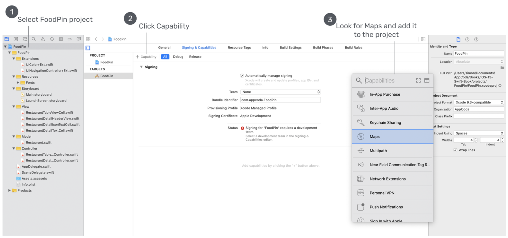
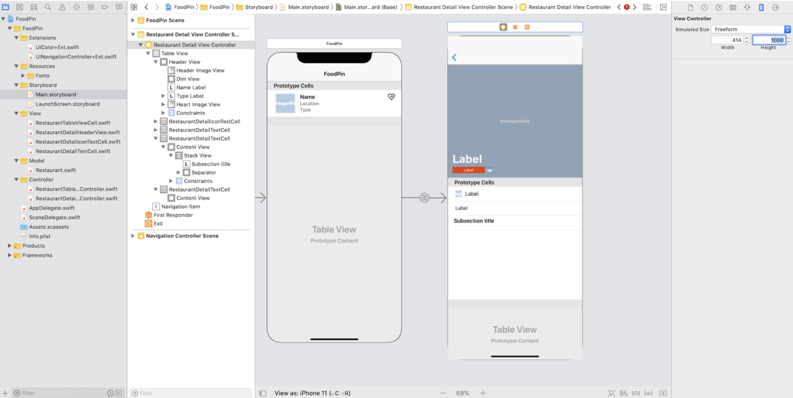

This chapter, let's have a look at Mapkit.

First, enable Mapkit like this:



# Customize DetailView

Let's change the number of DetailView cells from 2 to 4 first, remove the labels of two new cells.

## Third cell

Add a new label, set the font to `HeadLine` and modify its title to `SubsectionTitle`. Do you notice the gray separator blow the Label? Actually it's a UIView🤣, whose height is 1.Set its background color to `light gray`, lock its height. Embed label and separator, set constraints 5,18,12,18. To support the Dynamic Type, change the top constraint to `>=`.

## Fourth cell

This cell should be bigger, so change the height of this cell to 215.BTW, we can change the height of interface view like this:



Then, drag a *Map Kit View* to the cell and make four 0 constraints with *Bargin* unchecked. Change the top one to `>=` and lock the height. As this map view is just displayed in a table cell, let's keep it as simple as possible: uncheck `Scrolling`, `Rotating`, `3D View` in *Attributes inspector* of map view.

Next, create *Swift* files for those two new cells.After this, make connections for them.

## Map View Controller

Create a new view controller in story board and drag a map view to it.Then , we can make a new segue form fourth cell to this new map view controller. Run the project, we will find a full map view when tapping the fourth cell.

# Use Gecoder to pin address

Here are some concepts:

* *placemark*: textual address
* *forward geocoding*: convert a placemark into global coordinates
* *reverse geocoding*: convert global coordinates into a placemark
* *Geocoder*: the class for *forward geocoding*.

Here is an example, not hard to understand.

```sw
let geoCoder = CLGeocoder()
geoCoder.geocodeAddressString("524 Ct St, Brooklyn, NY 11231", completionHandler: { placemarks, error in

// Process the placemark

})
```

> There is no designated format of an address string. The method submits the specified location data to the geocoding server asynchronously. The server then parses the address and returns you an array of placemark objects. The number of placemark objects returned greatly depends on the address you provide. The more specific the address information you have given, the better the result.

🐂🍺

To get geographical coordinates, we can code like this:

```sw
let coordinate = placemark.location?.coordinate
```

# Map Annotations

Consists of two parts:

1. **an annotation object**: the one stores the data of annotation, such as name of placemark, using **MKAnnotation** protocol.
2. **an annotation view**: the one stores the image of annotation.

By default, the *MapKit* comes with standard annotation object and view, if you want to customize, such as customizing the pin view, we need to create our own annotation object/view.

