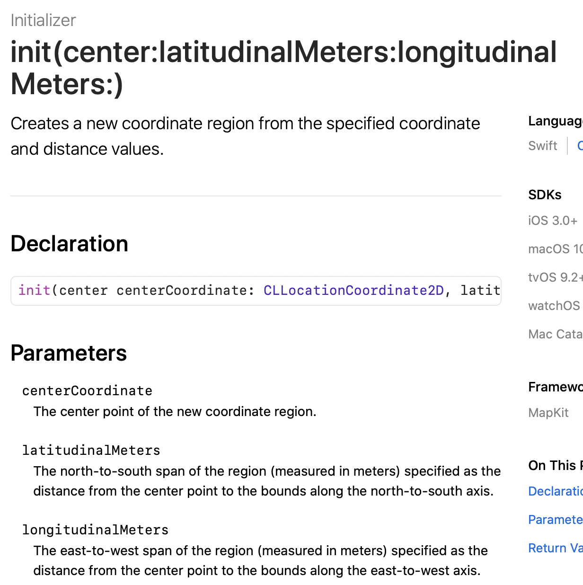
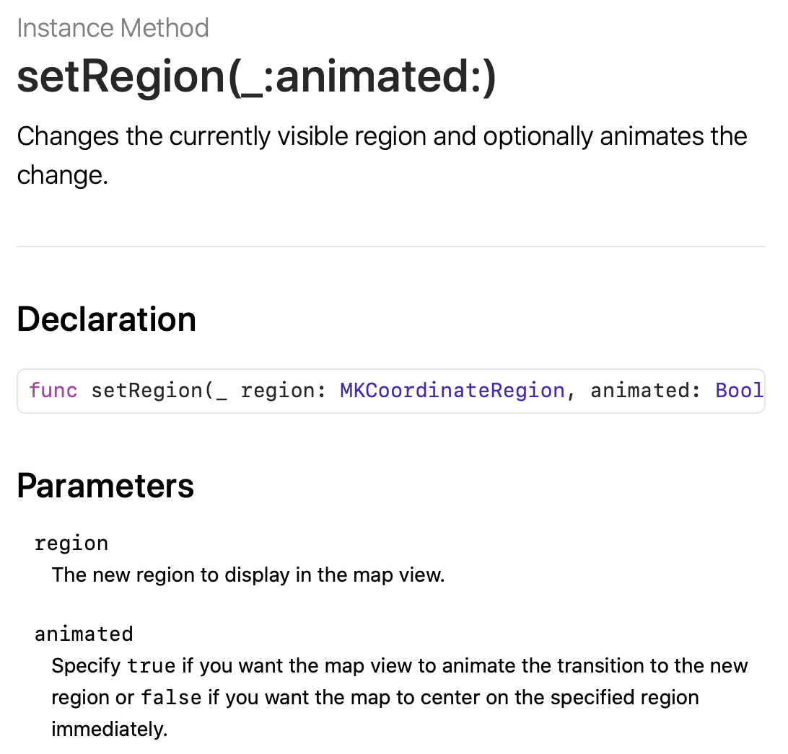

This chapter, let's have a look at Mapkit.

First, enable Mapkit like this:


# Customize DetailView

Let's change the number of DetailView cells from 2 to 4 first, remove the labels of two new cells.

## Third cell

Add a new label, set the font to `HeadLine` and modify its title to `SubsectionTitle`. Do you notice the gray separator blow the Label? Actually it's a UIView🤣, whose height is 1.Set its background color to `light gray`, lock its height. Embed label and separator, set constraints 5,18,12,18. To support the Dynamic Type, change the top constraint to `>=`.

## Fourth cell

This cell should be bigger, so change the height of this cell to 215.BTW, we can change the height of interface view like this:


Then, drag a *Map Kit View* to the cell and make four 0 constraints with *Bargin* unchecked. Change the top one to `>=` and lock the height. As this map view is just displayed in a table cell, let's keep it as simple as possible: uncheck `Scrolling`, `Rotating`, `3D View` in *Attributes inspector* of map view.

Next, create *Swift* files for those two new cells.After this, make connections for them.

## Map View Controller

Create a new view controller in story board and drag a map view to it.Then , we can make a new segue form fourth cell to this new map view controller. Run the project, we will find a full map view when tapping the fourth cell.

# Use Gecoder to pin address

Here are some concepts:

* *placemark*: textual address
* *forward geocoding*: convert a placemark into global coordinates
* *reverse geocoding*: convert global coordinates into a placemark
* *Geocoder*: the class for *forward geocoding*.

Here is an example, not hard to understand.

```sw
let geoCoder = CLGeocoder()
geoCoder.geocodeAddressString("524 Ct St, Brooklyn, NY 11231", completionHandler: { placemarks, error in

// Process the placemark

})
```

> There is no designated format of an address string. The method submits the specified location data to the geocoding server asynchronously. The server then parses the address and returns you an array of placemark objects. The number of placemark objects returned greatly depends on the address you provide. The more specific the address information you have given, the better the result.

🐂🍺

To get geographical coordinates, we can code like this:

```sw
let coordinate = placemark.location?.coordinate
```

# Map Annotations

Consists of two parts:

1. **an annotation object**: the one stores the data of annotation, such as name of placemark, using **MKAnnotation** protocol.
2. **an annotation view**: the one stores the image of annotation.

By default, the *MapKit* comes with standard annotation object and view, if you want to customize, such as customizing the pin view, we need to create our own annotation object/view.

---

插播：

突然发现自己的代码跑起来后tableview controller的标题不现实红色，代码检查了很多遍都没问题，无奈，只得使用git回滚找出问题所在：在完成chapter15的exercise1时，将所有的custom rubik字体都更换为了系统的text style字体。经测试，将storyboard的任意一个label字体改为**Rubik-Medium**，即代码中指定的自定字体，标题便会重新显示红色。所以，这里的逻辑是自定义字体必须在storyboard使用过，才能在代码中生效，至少navigation是这样的。（这合理吗？。。。

解决方法是使用系统字体，在tableviewcell.swift文件中得到通过代码`print(locationLabel.font!.fontName)`得到系统字体名字`.SFUI-Regular`，但这样的标题没有自定义字体来得醒目。最后在网上查到了[官方](https://developer.apple.com/documentation/uikit/text_display_and_fonts/adding_a_custom_font_to_your_app)的解决办法：在`Info.plist`中添加相应的key即可。

---

The most simple example of **Map Annotations**:

```sw
let annotation = MKPointAnnotation()
if let location = placemark.location {
    annotation.coordinate = location.coordinate
    mapView.addAnnotation(annotation)
} 
```

OK, let's code.The explazation of `mapView` key word is in the following.

```sw
func configure(location: String){
        let geoCoder = CLGeocoder()
        print(location)
        geoCoder.geocodeAddressString(location, completionHandler: { placemarks, error in
            if let error = error{
                print(error.localizedDescription)
                return
            }
            if let placemarks = placemarks{
                let placemark = placemarks[0]
                //add annotations
                let annotation = MKPointAnnotation()
                if let location = placemark.location{
                    annotation.coordinate = location.coordinate
                    self.mapView.addAnnotation(annotation)
                    //set the zoom level
                    let region = MKCoordinateRegion(center: annotation.coordinate, latitudinalMeters: 250, longitudinalMeters: 250)
                    self.mapView.setRegion(region, animated: true)
                }
            }
        })
    }
```

Here, we create a new func, the whole code is not hard to understand, here just explain few of it:

* > In most cases, the placemarks array should contain a single entry. So we just pick the first element from the array and then display the annotation on the map view.
  >

* `MKAnnotation` is a protocol, while `MKPointAnnotation` is a class.

* **mapView**: the one we declare in this file....🤦‍♂️

* **region**: directly to the graph:

  



​		The animated par aim for zooming .

​		The *region* step is a **MUST**. Here is the comparion:

​	

Don't forget to call this func in `RestaurantDetailViewController.swift` `case 4`.

