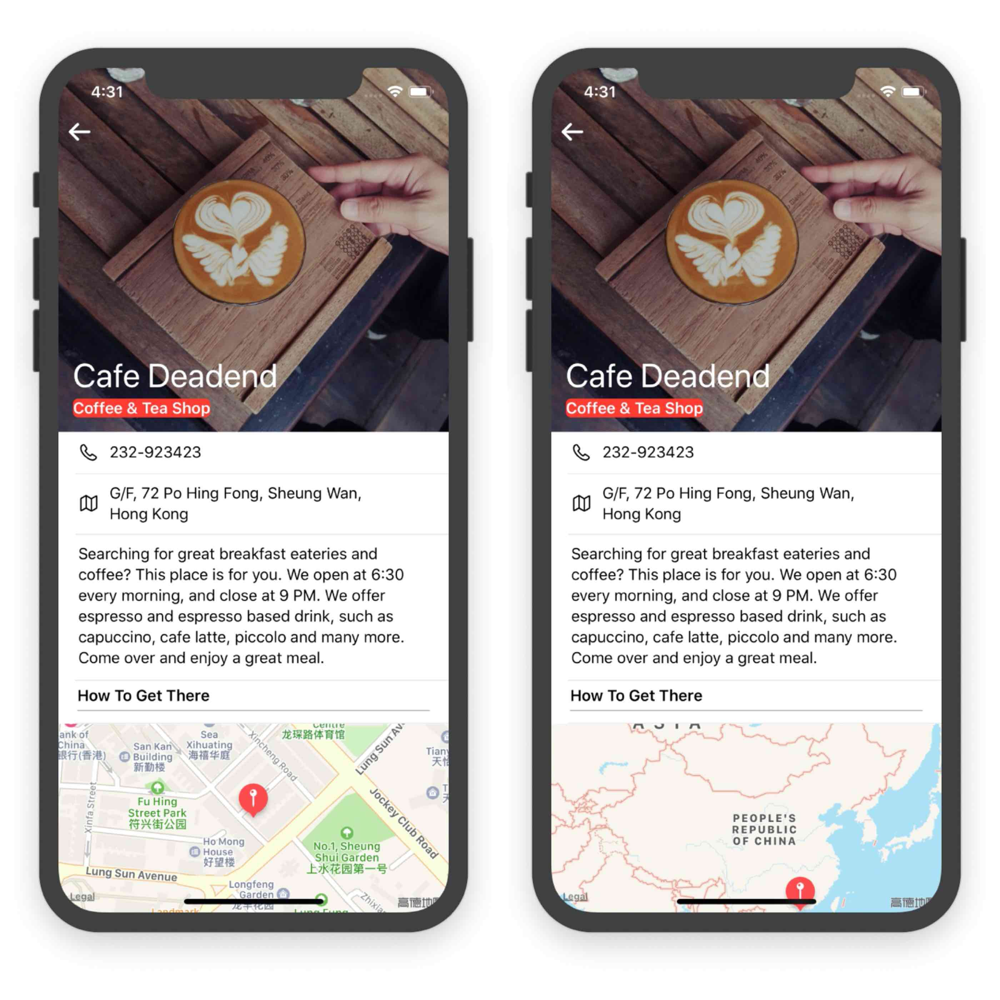

This chapter, let's have a look at Mapkit.

First, enable Mapkit like this:


# Customize DetailView

Let's change the number of DetailView cells from 2 to 4 first, remove the labels of two new cells.

## Third cell

Add a new label, set the font to `HeadLine` and modify its title to `SubsectionTitle`. Do you notice the gray separator blow the Label? Actually it's a UIView🤣, whose height is 1.Set its background color to `light gray`, lock its height. Embed label and separator, set constraints 5,18,12,18. To support the Dynamic Type, change the top constraint to `>=`.

## Fourth cell

This cell should be bigger, so change the height of this cell to 215.BTW, we can change the height of interface view like this:


Then, drag a *Map Kit View* to the cell and make four 0 constraints with *Bargin* unchecked. Change the top one to `>=` and lock the height. As this map view is just displayed in a table cell, let's keep it as simple as possible: uncheck `Scrolling`, `Rotating`, `3D View` in *Attributes inspector* of map view.

Next, create *Swift* files for those two new cells.After this, make connections for them.

## Map View Controller

Create a new view controller in story board and drag a map view to it.Then , we can make a new segue form fourth cell to this new map view controller. Run the project, we will find a full map view when tapping the fourth cell.

# Use Gecoder to pin address

Here are some concepts:

* *placemark*: textual address
* *forward geocoding*: convert a placemark into global coordinates
* *reverse geocoding*: convert global coordinates into a placemark
* *Geocoder*: the class for *forward geocoding*.

Here is an example, not hard to understand.

```sw
let geoCoder = CLGeocoder()
geoCoder.geocodeAddressString("524 Ct St, Brooklyn, NY 11231", completionHandler: { placemarks, error in

// Process the placemark

})
```

> There is no designated format of an address string. The method submits the specified location data to the geocoding server asynchronously. The server then parses the address and returns you an array of placemark objects. The number of placemark objects returned greatly depends on the address you provide. The more specific the address information you have given, the better the result.

🐂🍺

To get geographical coordinates, we can code like this:

```sw
let coordinate = placemark.location?.coordinate
```

# Map Annotations

Consists of two parts:

1. **an annotation object**: the one stores the data of annotation, such as name of placemark, using **MKAnnotation** protocol.
2. **an annotation view**: the one stores the image of annotation.**MKMarkerAnnotation**

By default, the *MapKit* comes with standard annotation object and view, if you want to customize, such as customizing the pin view, we need to create our own annotation object/view.

---

插播：

突然发现自己的代码跑起来后tableview controller的标题不现实红色，代码检查了很多遍都没问题，无奈，只得使用git回滚找出问题所在：在完成chapter15的exercise1时，将所有的custom rubik字体都更换为了系统的text style字体。经测试，将storyboard的任意一个label字体改为**Rubik-Medium**，即代码中指定的自定字体，标题便会重新显示红色。所以，这里的逻辑是自定义字体必须在storyboard使用过，才能在代码中生效，至少navigation是这样的。（这合理吗？。。。

解决方法是使用系统字体，在tableviewcell.swift文件中得到通过代码`print(locationLabel.font!.fontName)`得到系统字体名字`.SFUI-Regular`，但这样的标题没有自定义字体来得醒目。最后在网上查到了[官方](https://developer.apple.com/documentation/uikit/text_display_and_fonts/adding_a_custom_font_to_your_app)的解决办法：在`Info.plist`中添加相应的key即可。

---

The most simple example of **Map Annotations**:

```sw
let annotation = MKPointAnnotation()
if let location = placemark.location {
    annotation.coordinate = location.coordinate
    mapView.addAnnotation(annotation)
} 
```

OK, let's code.The explazation of `mapView` key word is in the following.

```sw
func configure(location: String){
        let geoCoder = CLGeocoder()
        print(location)
        geoCoder.geocodeAddressString(location, completionHandler: { placemarks, error in
            if let error = error{
                print(error.localizedDescription)
                return
            }
            if let placemarks = placemarks{
                let placemark = placemarks[0]
                //add annotations
                let annotation = MKPointAnnotation()
                if let location = placemark.location{
                    annotation.coordinate = location.coordinate
                    self.mapView.addAnnotation(annotation)
                    //set the zoom level
                    let region = MKCoordinateRegion(center: annotation.coordinate, latitudinalMeters: 250, longitudinalMeters: 250)
                    self.mapView.setRegion(region, animated: true)
                }
            }
        })
    }
```

Here, we create a new func, the whole code is not hard to understand, here just explain few of it:

* > In most cases, the placemarks array should contain a single entry. So we just pick the first element from the array and then display the annotation on the map view.
  >

* `MKAnnotation` is a protocol, while `MKPointAnnotation` is a class.

* **mapView**: the one we declare in this file....🤦‍♂️

* **region**: directly to the graph:

  


​		The animated par aim for zooming .

​		The *region* step is a **MUST**. Here is the comparion:

​	

Don't forget to call this func in `RestaurantDetailViewController.swift` `case 4`.

# Map Detail Controller

Next, let's move to the *Map Detail Controller*.Create `MapViewController`, import `mapkit` and define a `mapview` outlet.Set the class of this view in storyboard and make connection.

Then, in the method `viewDidLoad`, add these code:

```sw
let geoCoder = CLGeocoder()
        geoCoder.geocodeAddressString(restaurant.location, completionHandler: {placemarks, error in
            if let error = error{
                print(error.localizedDescription)
                return
            }
            if let placemarks = placemarks{
                let placemark = placemarks[0]
                //add annotation
                let annotation = MKPointAnnotation()
                if let location = placemark.location{
                    annotation.coordinate = location.coordinate
                    //display
                    self.mapView.showAnnotations([annotation], animated: true)
                    self.mapView.selectAnnotation(annotation, animated: true)
                }
            }
        })
```

Nothing different.We only explain line 14 and 15 here.

> But this time we assign it with a title and a subtitle and use the showAnnotations method of the mapView object to put a pin on the map. The method is smart enough to determine the best-fit region for the annotation.
>
> By default, when the annotation marker is not selected, it is in a normal state that appears smaller. In the code above, we invoke the selectAnnotation method to select the annotation marker to turn it into the selected state. Its icon will grow larger in this state.

In short, the latter makes the marker bigger.


Finally, let's pass the data.In `RestaurantDetailViewConyroller`:

```sw
override func prepare(for segue: UIStoryboardSegue, sender: Any?) {
        // Get the new view controller using segue.destination.
        // Pass the selected object to the new view controller.
        if segue.identifier == "showMap"{
            let destinationController = segue.destination as! MapViewController
            destinationController.restaurant = self.restaurant
        }
    }
```

Easy to understand.

# Customize Annotation

To do this, we need to adopt `MKMapViewDelegate` protocol. Every time when the map view needs an annotation, it calls the method :`mapView(_:viewFor:)`. So, in the `MapViewController.swift`, add this one after the class defination, and add`mapView.delegate = self` in the `viewDidLoad` method.

Then, let's add the `mapView` method:

```sw
func mapView(_ mapView: MKMapView,viewFor annotation: MKAnnotation) -> MKAnnotationView? {
        let identifier = "MyMarker"
        if annotation.isKind(of: MKUserLocation.self){
            return nil
        }
        
        //reuse the annotation if possible
        var annotationView : MKMarkerAnnotationView? = mapView.dequeueReusableAnnotationView(withIdentifier: identifier) as? MKMarkerAnnotationView
        
        if annotationView == nil{
            annotationView = MKMarkerAnnotationView(annotation: annotation, reuseIdentifier: identifier)
        }
        
        annotationView?.glyphText = "🌚"
        annotationView?.glyphTintColor = UIColor.orange
        
        return annotationView
    }
```

* First, why the return type of func definition is different from the code within?

  `MKMarkerAnnotationView` is subclass of `MKAnnotationView`

* For line 3: there are two types of annotations , one is *Placemark*, the other is *Current location*. For the latter, the map will display a blue dot, so we don't change its annotation.

  

  ​	return `nil` will just leave the blue dot as what it's like.

* line 8 is easy to understand. `as?` stands for downcasting to `MKMaekerAnnotationView` **if yes**.

* If there is no reuseable annotation, we will create a new one (line 10-12).

  

  The `reuseIdentifier` par aims for reusing this annotation.

Result🤣

​	

# Customize Map

> * **showTraffic** - shows any high traffic on your map view
> * **showScale** - shows a scale on the top-left corner of your map view.
> * **showCompass** - displays a compass control on the top-right corner of your map view. Please note that the compass will only appear when the map is rotated a little bit away from pure north.

(I don't know how to control the map to scale or rotate...

# To Do

- [ ] MapView's back button title.
- [ ] [MKDirections](https://developer.apple.com/documentation/mapkit/mkdirections): extral
