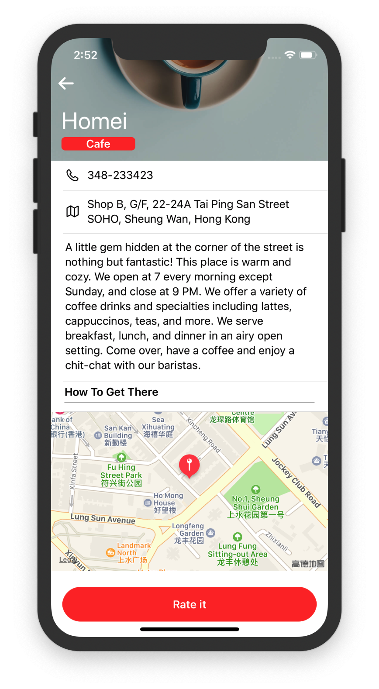
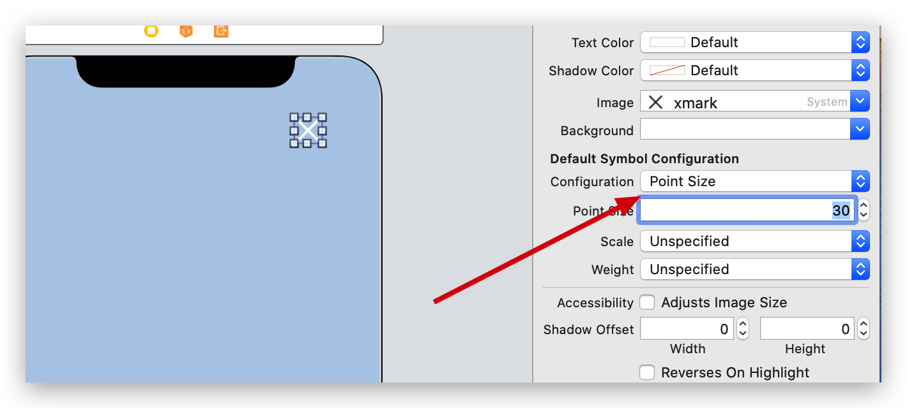
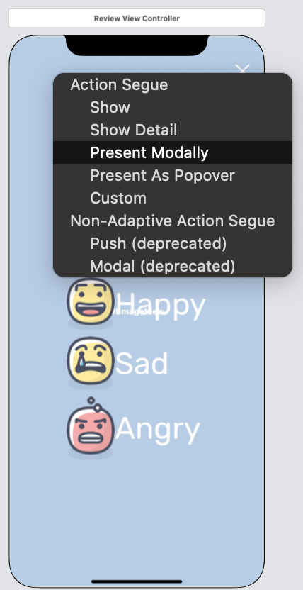
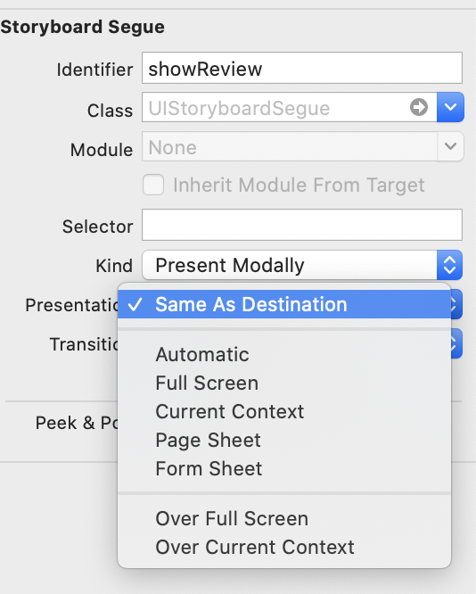
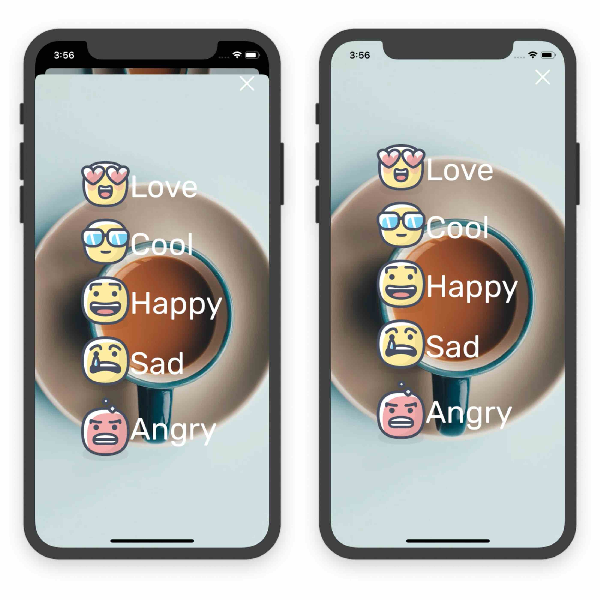
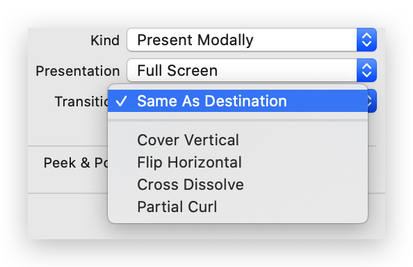
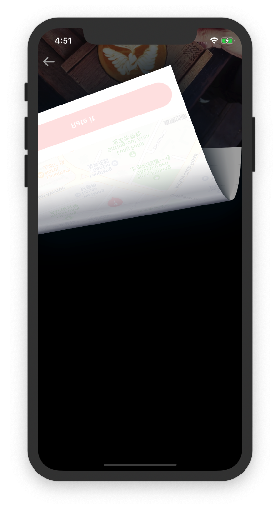
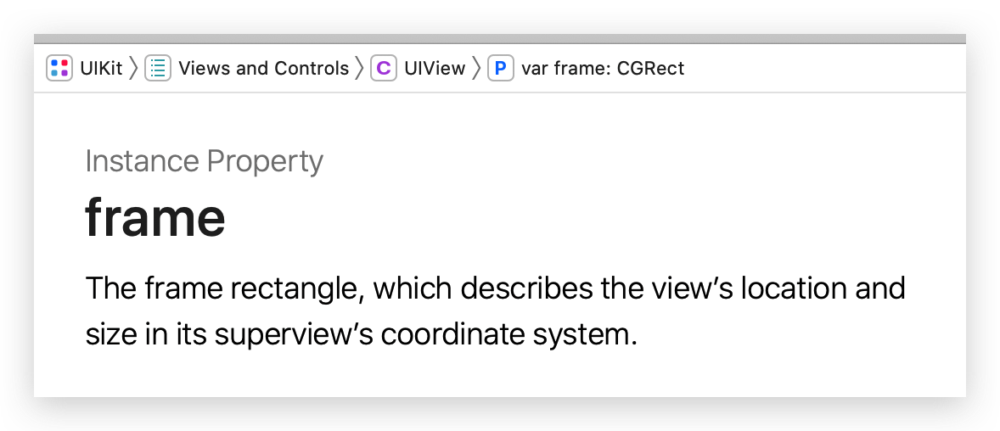
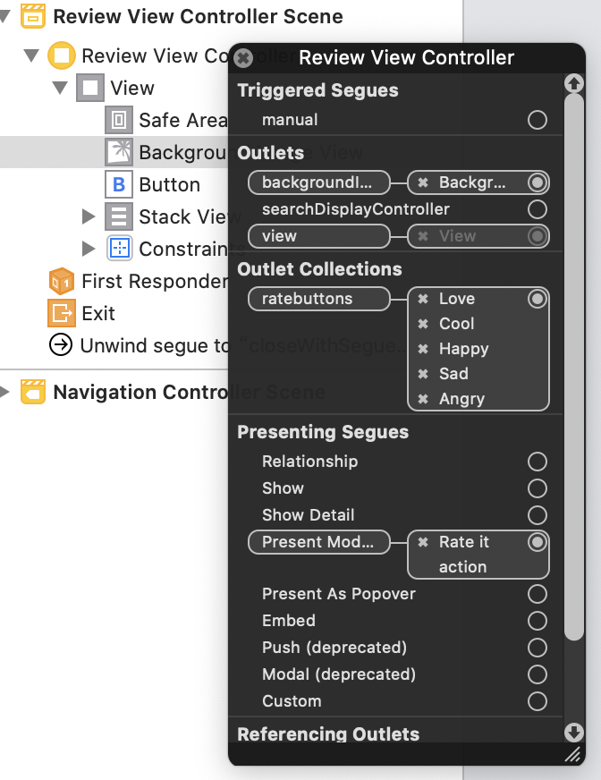

This chapter, we will add some fantastic animations to *Food Pin*.

# Rate button

After import the images downloaded (I love these images), drag a *View* under the mapcell, set the height to 90.Then goes to the button. Headline,white/red,345/47,lock height, left/right/buttom:15/15/21.Next, let this button has rounded corners.We've done similar thing in `thumbnailImageView`, this time let's do it in the storyboard.

Select the button and in the `Identity inspector` click `+` button under the `User Defined Runtime Attributes`, add a new key `layer.cornerRadius`, set the type `number` and value `25`.



# Restaurant Review Controller

Drag a new view controller and add a new image view. Set four 0 constraints to the image view.Then, drag a button to the top-right corner. This one is used for closing. Set the title blank and image to `xmark`, which is a SF-symbol. Set the `Point Size` to 30 to make this button larger, and set the color to white.Top/right:0/20



For the rating buttons, this time they have both text and images. Rubik, 50. After C/V, embed them into a stack view. **Leading**, spacing:10. And make the stackview center of the screen.

Next, create a custom class.Define a IBoutlet and make connection.

# Create a Segue

`control` + `drag` from `rate it` button to the review controller, select `prsentmodally`



Remember to set the `Identifier` of this segue to `showReview`, and add

```sw
else if segue.identifier == "showReview"{
            let destinationController = segue.destination as! ReviewViewController
            destinationController.restaurant = self.restaurant
        }
```

to the `prepare` func.

BTW, set the background image `content mode` to `Aspect Fill`.

From iOS 13, the `Present Modally` displays a scene like a card, to make it full screen, selet the segue and set `Presentation` to `Full Screen`.



Try some other Transtions 🌚, `Partial Curl` is prefered~

# Create a Exit

After we change the display mode from "card" to "Full Screen", we can't just exit the scene by scrolling down.Thus, we must create a Exit, which is the "Xmark" button on the top-right corner.This called `unwind segue`, which can be used to navigate back through a <font color = "red">modal or push segue.</font>

To use `unwind segue`, we must declare a method in the **destination view controller**, i.e. `RestaurantDetailViewController`. Add the following:

```sw
@IBAction func close(segue : UIStoryboardSegue){
        dismiss(animated: true, completion: nil)
    }
```

> Before you can begin adding unwind segues in Interface Builder, you must define at least one unwind action in the destination controller. This action method tells Xcode that it can be unwound.
>

Then, in the `ReviewController`, `control`+`drag` from *Close* button to *Exit icon* of the scene dock, select `closeWithSegue:`. (Familiar, right? Similar step in chapter6~)

---

If I set the Transition mode to *Partical Curl*, when I click the `close` button, it will get stuck.



To solve it, we can set the `IBAction` 's `animated` to `false`, or just use other mode. We use `Cover Vertical` for the moment.

# Add a BlurEffect

Just add these lines in the `ReviewViewController`'s `viewDidLoad`:

```sw
let blureffect = UIBlurEffect(style: .dark)
        let blurEffectView = UIVisualEffectView(effect: blureffect)
        blurEffectView.frame = view.bounds
        backgroundImageView.addSubview(blurEffectView)
```

line3:



# Outlet Collections

The only difference between **Outlet Collections** and **OutLet** is that this one allows to reference multiple UI objects with a single outlet variable.Let's go to the code. The defination is like this:`@IBOutlet var ratebuttons : [UIButton]!`, not hard to understand.Then we can make multiple connections from this one.



Then, we can access certain button the same way accessing array element.

# Make them animated!

Finally,we come to the most important part of this chapter. In an animation, we just need to provide the start state and the end state.Let's take **fade-in** animation as an example:

* the **Invisible state** , aka start state, can be done by setting its alpha to `0`
* the **Visible state**, aka end state,can be done by setting its alpha to `1`

Let's first set the alpha of buttons to 0, in `viewDidLoad`, add these:

```sw
for button in ratebuttons{
            button.alpha = 0
        }
```

Then for the end state:

```sw
override func viewWillAppear(_ animated: Bool) {
        UIView.animate(withDuration: 2.0){
            for button in self.ratebuttons{
                button.alpha = 1.0
            }
        }
    }
```

line2:

Here we use the **Trailing Closures** synax.

# To Do

- [ ] Get stuck, mode `Partical Curl`. Use the chapter17's ref to judge the bug source, code or official.

