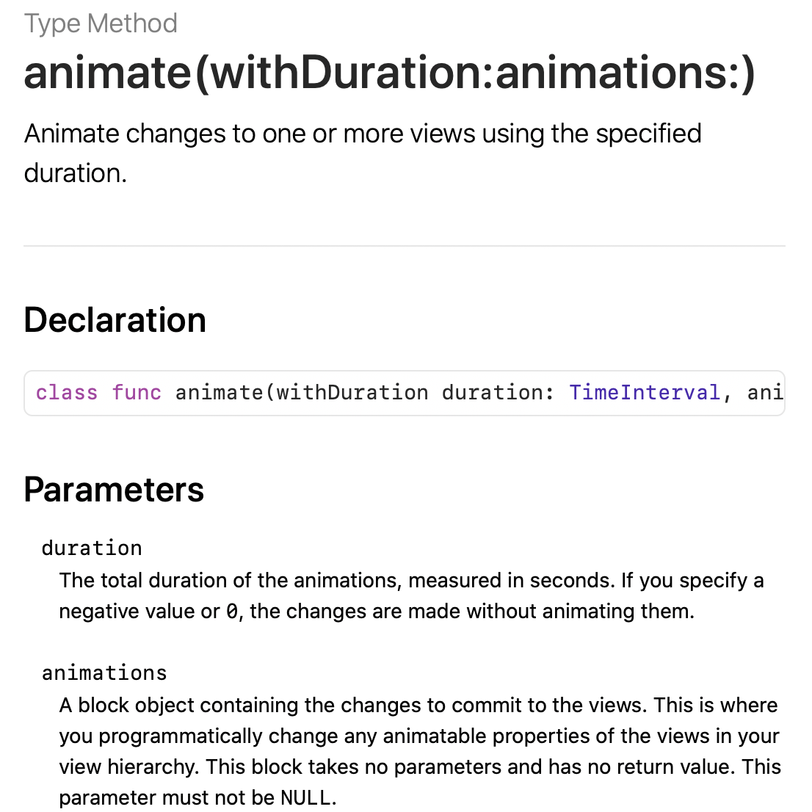
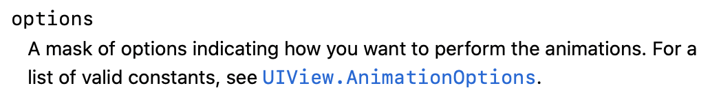
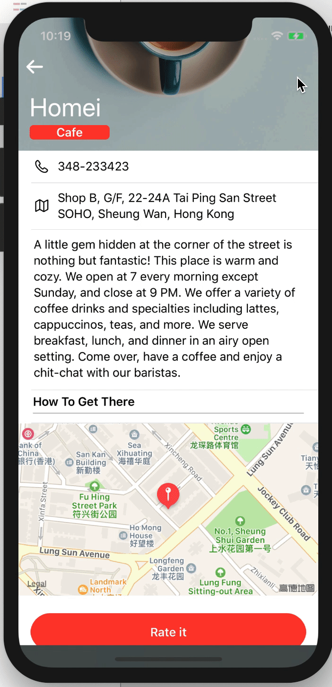
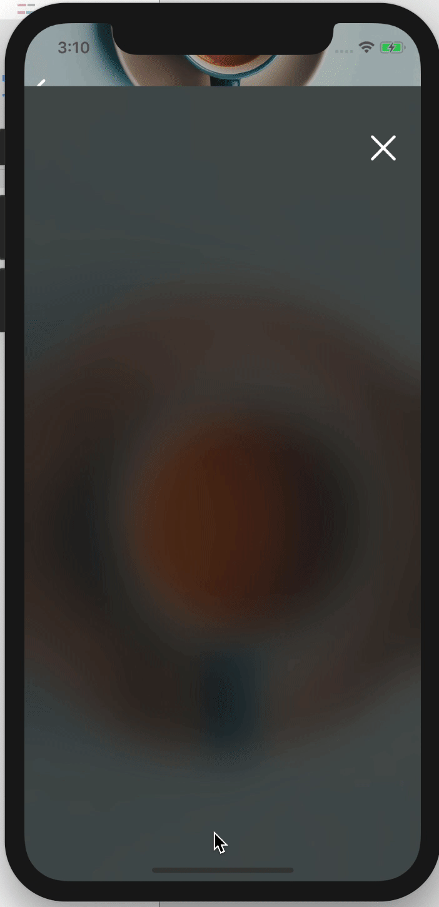
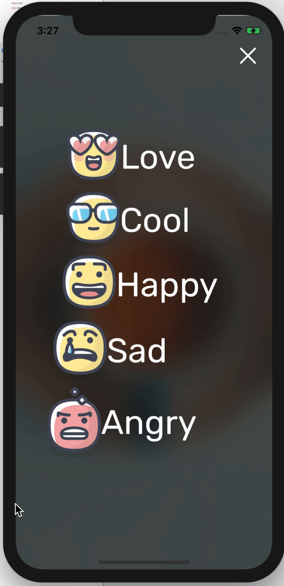
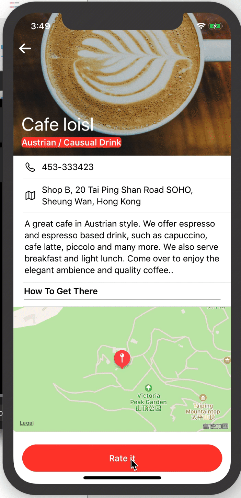
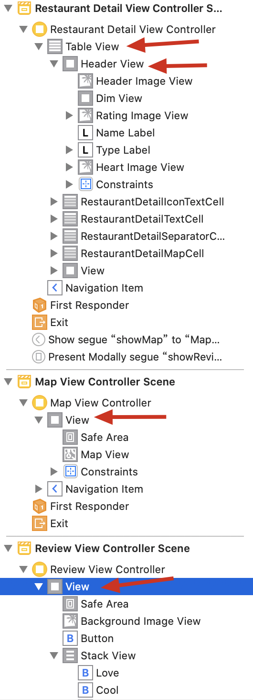

This chapter, we will add some fantastic animations to *Food Pin*.

# Rate button

After import the images downloaded (I love these images), drag a *View* under the mapcell, set the height to 90.Then goes to the button. Headline,white/red,345/47,lock height, left/right/buttom:15/15/21.Next, let this button has rounded corners.We've done similar thing in `thumbnailImageView`, this time let's do it in the storyboard.

Select the button and in the `Identity inspector` click `+` button under the `User Defined Runtime Attributes`, add a new key `layer.cornerRadius`, set the type `number` and value `25`.


# Restaurant Review Controller

Drag a new view controller and add a new image view. Set four 0 constraints to the image view.Then, drag a button to the top-right corner. This one is used for closing. Set the title blank and image to `xmark`, which is a SF-symbol. Set the `Point Size` to 30 to make this button larger, and set the color to white.Top/right:0/20


For the rating buttons, this time they have both text and images. Rubik, 50. After C/V, embed them into a stack view. **Leading**, spacing:10. And make the stackview center of the screen.

Next, create a custom class.Define a IBoutlet and make connection.

# Create a Segue

`control` + `drag` from `rate it` button to the review controller, select `prsentmodally`


Remember to set the `Identifier` of this segue to `showReview`, and add

```sw
else if segue.identifier == "showReview"{
            let destinationController = segue.destination as! ReviewViewController
            destinationController.restaurant = self.restaurant
        }
```

to the `prepare` func.

BTW, set the background image `content mode` to `Aspect Fill`.

From iOS 13, the `Present Modally` displays a scene like a card, to make it full screen, selet the segue and set `Presentation` to `Full Screen`.


Try some other Transtions 🌚, `Partial Curl` is prefered~

# Create a Exit

After we change the display mode from "card" to "Full Screen", we can't just exit the scene by scrolling down.Thus, we must create a Exit, which is the "Xmark" button on the top-right corner.This called `unwind segue`, which can be used to navigate back through a <font color = "red">modal or push segue.</font>

To use `unwind segue`, we must declare a method in the **destination view controller**, i.e. `RestaurantDetailViewController`. Add the following:

```sw
@IBAction func close(segue : UIStoryboardSegue){
        dismiss(animated: true, completion: nil)
    }
```

> Before you can begin adding unwind segues in Interface Builder, you must define at least one unwind action in the destination controller. This action method tells Xcode that it can be unwound.

Then, in the `ReviewController`, `control`+`drag` from *Close* button to *Exit icon* of the scene dock, select `closeWithSegue:`. (Familiar, right? Similar step in chapter6~)

---

If I set the Transition mode to *Partical Curl*, when I click the `close` button, it will get stuck.


To solve it, we can set the `IBAction` 's `animated` to `false`, or just use other mode. We use `Cover Vertical` for the moment.

# Add a BlurEffect

Just add these lines in the `ReviewViewController`'s `viewDidLoad`:

```sw
let blureffect = UIBlurEffect(style: .dark)
        let blurEffectView = UIVisualEffectView(effect: blureffect)
        blurEffectView.frame = view.bounds
        backgroundImageView.addSubview(blurEffectView)
```

line3:


# Outlet Collections

The only difference between **Outlet Collections** and **OutLet** is that this one allows to reference multiple UI objects with a single outlet variable.Let's go to the code. The defination is like this:`@IBOutlet var ratebuttons : [UIButton]!`, not hard to understand.Then we can make multiple connections from this one.


Then, we can access certain button the same way accessing array element.

# Make them animated!

Finally,we come to the most important part of this chapter. In an animation, we just need to provide the start state and the end state.Let's take **fade-in** animation as an example:

* the **Invisible state** , aka start state, can be done by setting its alpha to `0`
* the **Visible state**, aka end state,can be done by setting its alpha to `1`

Let's first set the alpha of buttons to 0, in `viewDidLoad`, add these:

```sw
for button in ratebuttons{
            button.alpha = 0
        }
```

Then for the end state:

```sw
override func viewWillAppear(_ animated: Bool) {
        UIView.animate(withDuration: 2.0){
            for button in self.ratebuttons{
                button.alpha = 1.0
            }
        }
    }
```

line2:

Here we use the **Trailing Closures** synax.

Have you ever wondering why we didn't add these in the method `viewDidLoad`? Because this method will only be called once, and<font color = "red"> the animation probably starts too early and finishes even before the view appears.</font>

## Add delay

Change the code of `viewWillAppear` to these:

```sw
override func viewWillAppear(_ animated: Bool) {
//        UIView.animate(withDuration: 2.0){
//            for button in self.ratebuttons{
//                button.alpha = 1.0
//            }
//        }
        for i in 0...self.ratebuttons.count-1 {
            UIView.animate(withDuration: 0.4, delay: 0.4+Double(i)*0.1, options: [], animations: {
                self.ratebuttons[i].alpha = 1.0
            }, completion: nil)
        }
    }
```

The difference is that we add **delay** of the animation. **Optional** explaization :



result:



# Slide-in Animation

iOS provodes a structure called `CGAffineTransform` to move, scale or rotate a view.For example, `CGAffineTransform.init(translationX:600, y: 0)` means to moves a view 600 points to the right of the screen.Correspondingly, -x:left, +y:above.

So, add two line in `viewDidLoad`:

```sw
override func viewDidLoad() {
        super.viewDidLoad()
        
        backgroundImageView.image = UIImage(named: restaurant.image)
        // Do any additional setup after loading the view.
        //blur effect
        let blureffect = UIBlurEffect(style: .dark)
        let blurEffectView = UIVisualEffectView(effect: blureffect)
        blurEffectView.frame = view.bounds
        backgroundImageView.addSubview(blurEffectView)
        //move beyond the trailing
        let moveRightTransform = CGAffineTransform(translationX: 600, y: 0)
        //fade-in animation
        for button in ratebuttons{
            button.alpha = 0
            button.transform = moveRightTransform
        }
    }
```

And add this line to `viewWillAppear`:

```sw
self.ratebuttons[i].transform = .identity
```

> There is a built-in transform called identity transform that can be used to clear any pre-defined transform.



# Spring Animation

Just update the `viewWillAppear` like this:

```sw
override func viewWillAppear(_ animated: Bool) {
//        UIView.animate(withDuration: 2.0){
//            for button in self.ratebuttons{
//                button.alpha = 1.0
//            }
//        }
        for i in 0...self.ratebuttons.count-1 {
            UIView.animate(withDuration: 0.4, delay: 0.1+Double(i)*0.05, usingSpringWithDamping: 0.7, initialSpringVelocity: 1, options: [], animations: {
                self.ratebuttons[i].alpha = 1.0
                self.ratebuttons[i].transform = .identity
            }, completion: nil)
        }
    }
```

We add two parameters: For the `usingSpringWithDamping`,  the value is between 0 and 1, standing for the oscillation(振幅) of the spring. The bigger value, the more smooth.For the `initialSpringVelocity`, defines the initial speed of the animation. If set to `x`, the speed will be `distance*x`.



<font color = "red">I like this effect</font>

# Combine two transforms

We can concatenate(把……联合；串联) two transforms by `transform1.concatenating(transform2)`.

```sw
//move beyond the trailing
        let moveRightTransform = CGAffineTransform(translationX: 600, y: 0)
        let scaleUpTransform = CGAffineTransform(scaleX: 5.0, y: 5.0)
        let moveScaleTransform = scaleUpTransform.concatenating(moveRightTransform)
        //fade-in animation
        for button in ratebuttons{
            button.alpha = 0
            button.transform = moveScaleTransform
        }
```

Leave the `viewWillAppear` as it is, then we will see a cool result:



# Pass data from Review To Detail

First, let's add a new property for the Restaurant Class.Update the `init` method. We set a default value to the parameter, when being called, if this one's value not specify, its value will be set to the default value.

Back to the storyboard, drag a image view blow the dim view, and set 4 constraints : right and buttom :10, height 50, width 52. When done, we find that the buttom's constraint is relative to the Name label's top, change that to the type's buttom and set the value to 0.Then, define a outlet and make a connection.

Next, the action. Add these lines to the `RestaurantDetailViewController.swift`

```sw
//rate action
    @IBAction func rateRestaurant(segue: UIStoryboardSegue){
        if let rating = segue.identifier{
            self.restaurant.rating = rating
            self.ratingImageView.image = UIImage(named: rating)
            dismiss(animated: true, completion: nil)
        }
    }
```

Then, make connections to this action. Remember set the identifier of each review button.

---

写这一部分的时候，发现一个问题，还挺有意思的，总结一下。

在storyboard里，每一个object都需要view来容纳。~~这里的reviewimage在storyboard中定义在headerview里，而对应的outlet却定义在了restaurantDetailViewController里，故更新的时候更新不到。解决方案是将outlet定义在Headerview里。~~破案了。。。。没生效是因为自己没定义identifier，亏我还在上文强调**Remember**🤦‍♂️。为了规范，我们还是定义在HeaderView里。




其实写这个插播最重要的是上图：假设每一个outlet都定义在与storyboard相同的结构中（这是规范其实），那么，写代码的时候，以self为本类，调用某个outlet时，子层里的可以直接使用`.`来访问，而不需要写上子层的名字。例如，在`RestaurantDetailViewController`里，调用headerview可以直接`self.headerview`而不用`self.tableview.header`；`MapViewController`里，访问mapview可以直接`self.mapview`。但子层的子层就需要使用两个dot synax

调整为规范结构时候接得接触`ratingImage`与`detailviewcontroller`的连接，否则程序会崩

---

# Add animation to the ratingimage in DetailView

Just add these lines, easy to understand.

```sw
@IBAction func rateRestaurant(segue: UIStoryboardSegue){
        if let rating = segue.identifier{
//            self.restaurant.rating = rating
//            self.headerView.ratingImageView.image = UIImage(named: rating)
            dismiss(animated: true, completion: {
                self.restaurant.rating = rating
                self.headerView.ratingImageView.image = UIImage(named: rating)
                // start state
                let scaletransform = CGAffineTransform(scaleX: 0.1, y: 0.1)
                self.headerView.ratingImageView.transform = scaletransform
                self.headerView.ratingImageView.alpha = 0
                //end state
                UIView.animate(withDuration: 0.4, delay: 0, options: [], animations: {
                    self.headerView.ratingImageView.transform = .identity
                    self.headerView.ratingImageView.alpha = 1.0
                }, completion: nil)
            })
        }
    }
```

# Exercise

## 1


# To Do

- [ ] Get stuck, mode `Partical Curl`. Use the chapter17's ref to judge the bug source, code or official.
- [ ] Add disappears animation?

