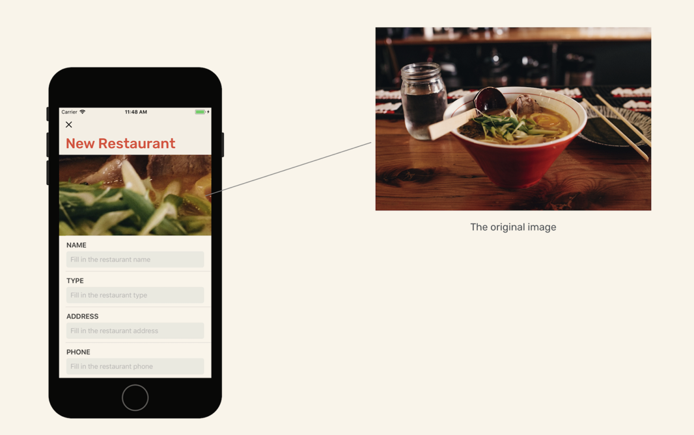

This chapter, we will build a new screen for adding a new restaurant.

# Design

Drag a *Table View Controller* and set its *Content* to `Static Cells`, *Table View Section* *Rows* to `6`.

For the first cell, set the height to `200` and change the background color to `light gray`.<font color = "red">Set the *Selection option to `None`</font>. Drag a imageview upon it, and set the image to `photo`(system).Change the tint color to `black`.24x18, lock in the center.

---

For the second cell, height:88, *Selection*: `None`. Drag a label, title:name, font: Headline, color: dark gray. Then, drag a text field under the name label.

> The text field is a control for capturing the user input and displaying the editable text. Typically you use it to gather small amounts of text from users.

Set the *placeholder value* :` Fill in the restaurant name`.*border style*:`None`.*Font type*:`Body`. *Background color*: `light gray` . Embed these two, add four constraints:5/2/2/1. Select the stack view and change the *Alignment* to `Fill`. Change the spacing to `5`.

---

Third-fifth cell are the same as second cell, just make the title different.

---

For the last one, height:125. Drag a label and name it `DESCRIPTION`.This time drag a *Text View* to let users input multiple lines.Background:light gray. Font:body.Embed these two, the stack view is same as above.

---

Finally, embed this table view to navigation bar.(Why?Oh, I know: To let the top of the screen show title)Select the tableview, go to the menu->editor->Embed IN->NavigationBar.Set the title name `New Restaurant`

# Link Up

We need to show this controller when user tapping `+` button. <font color = "red">Drag a **Bar Button** to the navigation bar of the Food Pin controller.</font>Set the title blank, and the image `plus`. Tint: black.


> A bar button (UIBarButtonItem) is very similar to a standard button (UIButton). However, a bar button is specifically designed for navigation bars and toolbars.
>

Hold `control` and drag from the button to the `newrestaurant`'s navigation bar.Select `present modally` and the segue's identifier `addRestaurant`.

We also need to add a exit for users in newrestaurantviewcontroller.Add a new bar button   to the navigation bar top-left, set the image `Xmark`, title blank, tint black.Add code to `RestaurantTableViewController`, and make connection.

```sw
@IBAction func unwindtohome(segue: UIStoryboardSegue){
        dismiss(animated: true, completion: nil)
    }
```

Have a test:


# Rounded Corner Text Field

> The default text field doesn't come with rounded corners and text indentation. It's our responsibility to build a custom text field with these features. To do that, we will create a custom version of `UITextField`.

Create a new file of `view` folder, name it `RoundedTextField`, subclass of `UITextField`.

```sw
let padding  = UIEdgeInsets(top: 0, left: 10, bottom: 0, right: 10)
    
    override func textRect(forBounds bounds: CGRect) -> CGRect {
        return bounds.inset(by: padding)
    }
    
    override func placeholderRect(forBounds bounds: CGRect) -> CGRect {
        return bounds.inset(by: padding)
    }
    
    override func editingRect(forBounds bounds: CGRect) -> CGRect {
        return bounds.inset(by: padding)
    }
    
    override func layoutSubviews() {
        super.layoutSubviews()
        self.layer.cornerRadius = 5.0
        self.layer.masksToBounds = true
    }
```

1. UIEdgeInsets:

   

2. textRect:Returns the drawing rectangle for the text field’s text.

   So does `placeholderRect` and `editingRect`

3. layoutSubviews:This one  is called every time when the text field is laid out.

4. [.masksToBounds](https://blog.csdn.net/hhcncx/article/details/51278026)

Remember to set the class of text to `RoundedTextField`, except for the description one.


# Move to the next text field

When we type sth in the text and hit the `return` key, the cursor doesn't go to the next field.

Okey, time to create a new controller for the new restaurant review.Set it to the subview of `UITableViewController`, and create an Outlet for each of the textview and textfield.

Adopt the protocol : `UITextFieldDelegate`.

> UITextFieldDelegate is the protocol we need to adopt in order to process the event. The protocol provides developers a set of optional methods to manage the editing of a text field. 

```sw
@IBOutlet var nameTextField: RoundedTextField!{
        didSet{
            nameTextField.tag = 1
            nameTextField.becomeFirstResponder()
            nameTextField.delegate = self
        }
    }
    @IBOutlet var typeTextField: RoundedTextField!{
        didSet{
            typeTextField.tag = 2
            typeTextField.delegate = self
        }
    }
    @IBOutlet var addressTextField: RoundedTextField!{
        didSet{
            addressTextField.tag = 3
            addressTextField.delegate = self
        }
    }
    @IBOutlet var phoneTextField: RoundedTextField!{
        didSet{
            phoneTextField.tag = 4
            phoneTextField.delegate = self
        }
    }
    @IBOutlet var descriptionTextView: UITextView!{
        didSet{
            descriptionTextView.tag = 5
            descriptionTextView.layer.cornerRadius = 0.5
            descriptionTextView.layer.masksToBounds = true
        }
    }
```

<span jump id = "question1">Question</span>: why description doesn't add delegate?

Ok, let's use the `.tag` to move the cursor.When user tapping `return` button, the func `textFieldShouldReturn` will be invoked.So, let's code this method.

```sw
func textFieldShouldReturn(_ textField: UITextField) -> Bool {
        if let nextTextField = view.viewWithTag(textField.tag + 1){
            textField.resignFirstResponder()
            nextTextField.becomeFirstResponder()
        }
        
        return true
    }
```

1. `viewWithTag(_:)`:Returns the view whose tag matches the specified value.
2. `resignFirstResponder()`:Notifies this object that it has been asked to relinquish(放弃) its status as first responder in its window.

Finally, make connections with text view/fields!


# Customize the navigation bar

To make the UI consistent, let's customize the newrestaurantController's navigation bar.

```sw
navigationController?.navigationBar.tintColor = .white
//        navigationController?.navigationBar.barTintColor = .black
        navigationController?.navigationBar.shadowImage = UIImage()
        if let customFont = UIFont(name: "Rubik-Medium", size: 35.0){
            navigationController?.navigationBar.largeTitleTextAttributes = [NSAttributedString.Key.foregroundColor: UIColor(231, 76, 60), NSAttributedString.Key.font : customFont ]
        }
```

Easy to understand(yeah, but have you remember them...🤦‍♂️)

<font color = "red">Note:</font>`navigationController?.navigationBar.tintColor = .white` does not work unless we set this button's color to `default` in `storyboard`.


# Display the photo library

This time we will use `UIAlertController` to let users choose which photo source to use.

```sw
override func tableView(_ tableView: UITableView, didSelectRowAt indexPath: IndexPath) {
        if indexPath.row == 0{
            let photoSourceRequestController = UIAlertController(title: "Choose your photo source", message: "", preferredStyle: .actionSheet)
            
            let cameraAction = UIAlertAction(title: "Camera", style: .default, handler: {(action) in
                if UIImagePickerController.isSourceTypeAvailable(.camera){
                    let imagePicker = UIImagePickerController()
                    imagePicker.allowsEditing = false
                    imagePicker.sourceType = .camera
                    self.present(imagePicker, animated: true, completion: nil)
                }
            })
            
            let photoLibraryAction = UIAlertAction(title: "Photo Library", style: .default, handler: {(action) in
                if UIImagePickerController.isSourceTypeAvailable(.photoLibrary){
                    let imagePicker = UIImagePickerController()
                    imagePicker.sourceType = .photoLibrary
                    imagePicker.allowsEditing = false
                    self.present(imagePicker, animated: true, completion: nil)
                }
            })
            
            photoSourceRequestController.addAction(cameraAction)
            photoSourceRequestController.addAction(photoLibraryAction)
            // for iPad
            if let popoverController = photoSourceRequestController.popoverPresentationController{
                if let cell = tableView.cellForRow(at: indexPath){
                    popoverController.sourceView = cell
                    popoverController.sourceRect = cell.bounds
                }
            }
            
            present(photoSourceRequestController, animated: true, completion: nil)
        }
    }
```

If we test, the app will crash.(Mine doesn't, and there is no item in privacy in setting, strange.)

```sw
[access] This app has crashed because it attempted to access privacy-sensitive data without a usage description.  The app's Info.plist must contain an NSPhotoLibraryUsageDescription key with a string value explaining to the user how the app uses this data.

[access] This app has crashed because it attempted to access privacy-sensitive data without a usage description.  The app's Info.plist must contain an NSCameraUsageDescription key with a string value explaining to the user how the app uses this data.
```

> In iOS 10 or later, for privacy reasons, you have to explicitly describe the reason why your app accesses the user's photo library or camera. If you fail to do so, you will end up with the above error.

In `info.plist`, Right-click, add row, privacy-> Photo Library Usage Description. Set the value to `You need to grant the app access to your photo library so you can pick your favorite restaurant photo.`. Repeat, choose Camera Usage Description, set the value to `You need to grant the app access to your camera in order to take photos.`

We can directly drag photos from finder to the simulator to store the photos within.


# Adopt Picker Delegate

To show the image pick by user in photo library, we need to adopt two protocols:

`UIImagePickerControllerDelegate, UINavigationControllerDelegate`

Then, create an outlet for the photoimage and make a connection.When a user chooses  photos, the func `imagePickerController(_ picker: UIImagePickerController, didFinishPickingMediaWithInfo info: [UIImagePickerController.InfoKey : Any])`will be called, and we can get the photos from the parameter `info`.

```sw
func imagePickerController(_ picker: UIImagePickerController, didFinishPickingMediaWithInfo info: [UIImagePickerController.InfoKey : Any]) {
        if let selectImage = info[UIImagePickerController.InfoKey.originalImage] as? UIImage{
            photoImageView.image = selectImage
            photoImageView.contentMode = .scaleAspectFill
            photoImageView.clipsToBounds = true
        }
        dismiss(animated: true, completion: nil)
    }
```

UIImagePickerController.InfoKey.originalImage: the key of original image.

Don't forget to add `imagePicker.delegate = self` right after its defination.

> The delegate receives notifications when the user picks an image or movie, or exits the picker interface. The delegate also decides when to dismiss the picker interface, so you must provide a delegate to use a picker.
>
> From Apple

# Define auto layout constraints

The image shown in the photo image view looks not good.



Thus, we need to define more constraints.This time, let's use `NSLayoutConstraint` to define instead of using storyboard.

We define four constraints whose values are 0 to top/leading/trailing/buttom.

```sw
let leadingConstraint = NSLayoutConstraint(item: photoImageView as Any, attribute: .leading, relatedBy: .equal, toItem: photoImageView.superview, attribute: .leading, multiplier: 1, constant: 0)
        leadingConstraint.isActive = true
        
        let trailingConstraint = NSLayoutConstraint(item: photoImageView as Any, attribute: .trailing, relatedBy: .equal, toItem: photoImageView.superview, attribute: .trailing, multiplier: 1, constant: 0)
        trailingConstraint.isActive = true
        
        let topConstraint = NSLayoutConstraint(item: photoImageView as Any, attribute: .top, relatedBy: .equal, toItem: photoImageView.superview, attribute: .top, multiplier: 1, constant: 0)
        topConstraint.isActive = true
        
        let bottomConstraint = NSLayoutConstraint(item: photoImageView as Any, attribute: .bottom, relatedBy: .equal, toItem: photoImageView.superview, attribute: .bottom, multiplier: 1, constant: 0)
        bottomConstraint.isActive = true
```

[Any type](https://docs.swift.org/swift-book/ReferenceManual/Types.html#grammar_any-type)

> The `Any` type can contain values from all other types. `Any` can be used as the concrete type for an instance of any of the following types:
>
> - A class, structure, or enumeration
> - A metatype, such as `Int.self`
> - A tuple with any types of components
> - A closure or function type


## 2

I Like this exercise, which is challenging!

```sw
@IBAction func StoreAction(sender: AnyObject){
        let alertMessageController = UIAlertController(title: "Oops", message: "We can't proceed because some of the fields are blank. Please note that all the fields are not blank:)", preferredStyle: .alert)
        alertMessageController.addAction(UIAlertAction(title: "OK", style: .cancel, handler: nil))
        if nameTextField.text=="" || typeTextField.text=="" ||
        addressTextField.text=="" || phoneTextField.text=="" ||
        descriptionTextView.text==""{
            present(alertMessageController, animated: true, completion: nil)
        }
        else{
            print("Name: "+nameTextField.text!)
            print("Type: "+typeTextField.text!)
            print("Location: "+addressTextField.text!)
            print("Phone: "+phoneTextField.text!)
            print("Description: "+descriptionTextView.text!)
            performSegue(withIdentifier: "unwindtohome", sender: self)
        }
    }
```


1. If you don't know which type of parameter to code, use `Any` or `AnyObject` like line 1

2. <font color = "red">Remember to set the identifier of back segue,</font> otherwise line 15 will crash.

3. <font color = "red">Note:</font> we can replace line 15 with `dismiss(animated: true, completion: nil)`. Yeah, we said that we must define at least one unwind action in the **destination** controller. IMU, if we want to connect a button with the **Exit** on the top of the controller, we must  define a unwind one in the destination. Otherwise, we can define inside the action code like here.

   After testing, above is wrong. If you want to code `dismiss` method directly in the source view, this view must have navigation controller.

   Let's have a test again.

   IMU, only navigation's items can code `dismiss` directly.


# To Do

- [ ] [Question1](#question1)

- [ ] UIToolbar

- [x] What does *navigation* aim for???

  Aims for navigation


