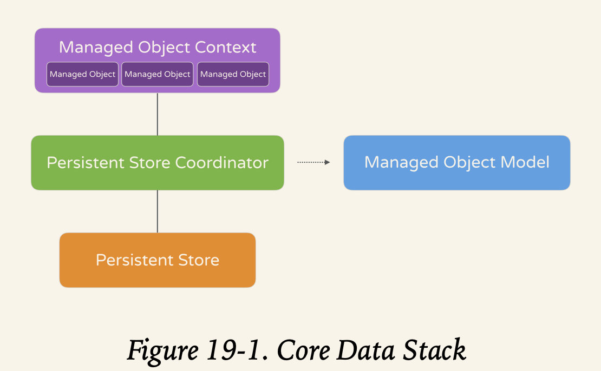
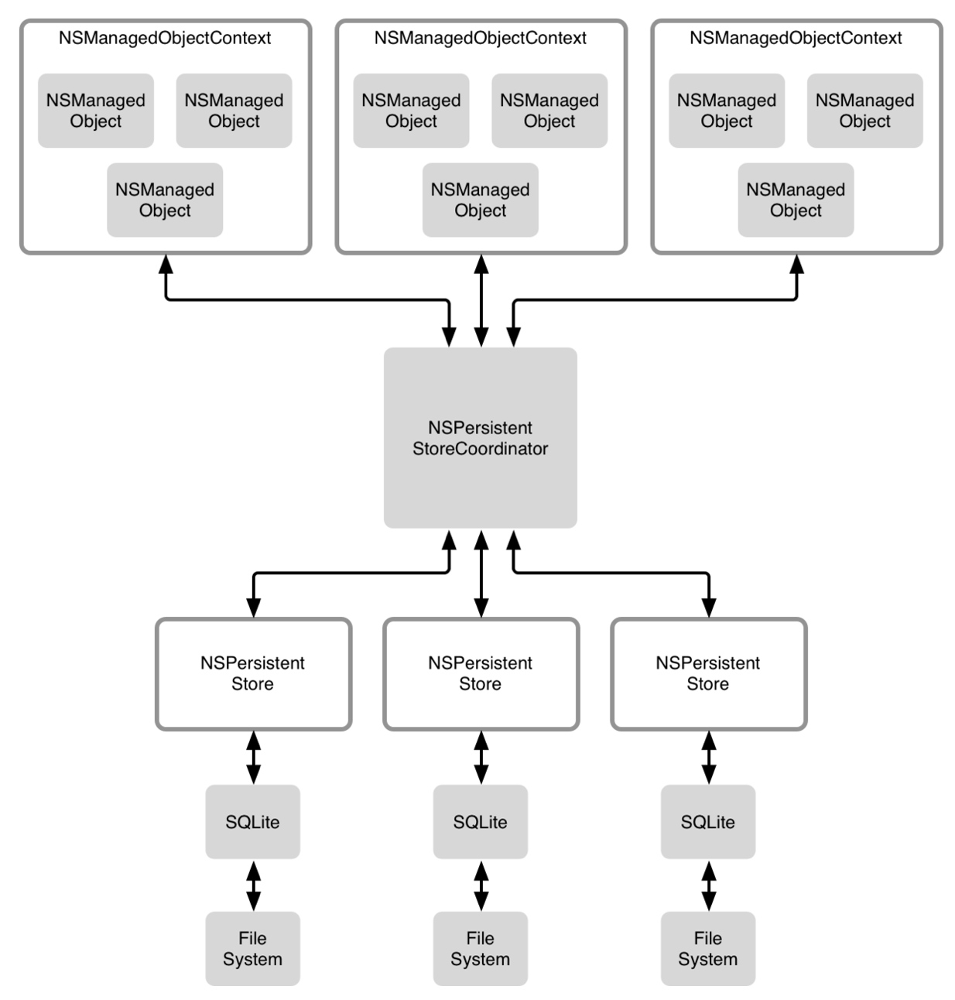
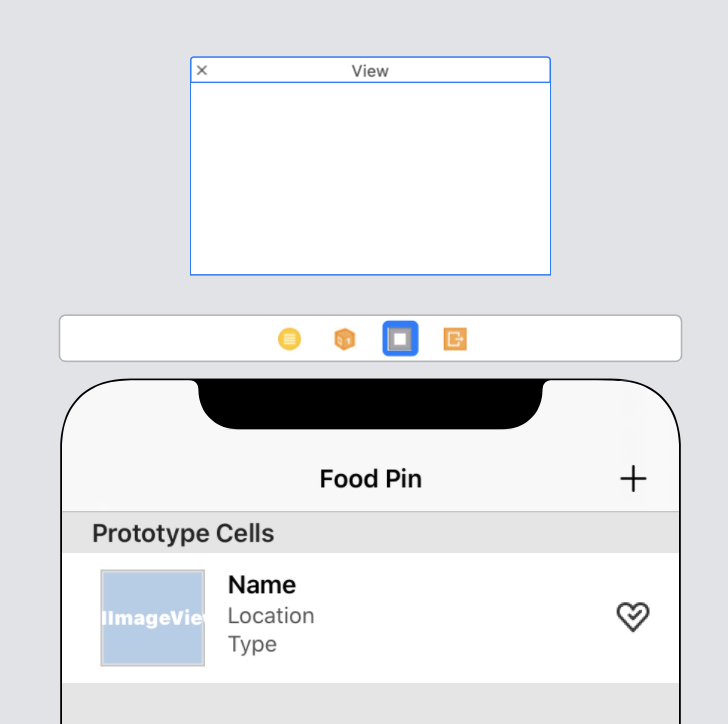
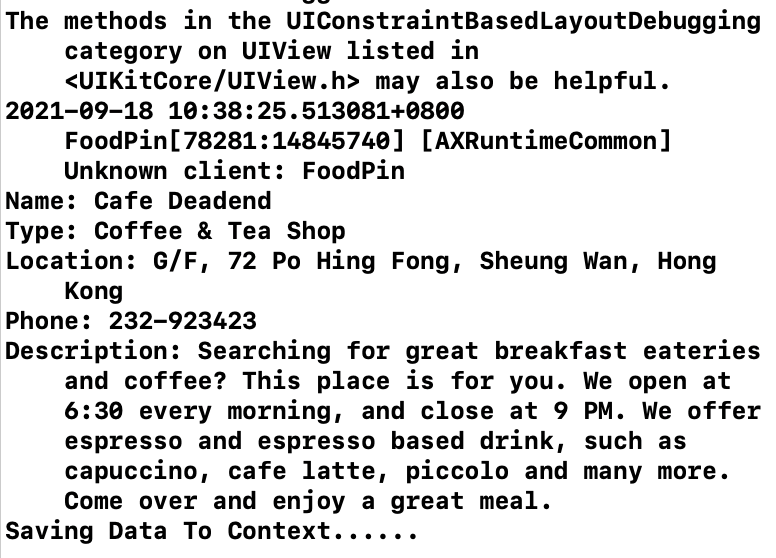
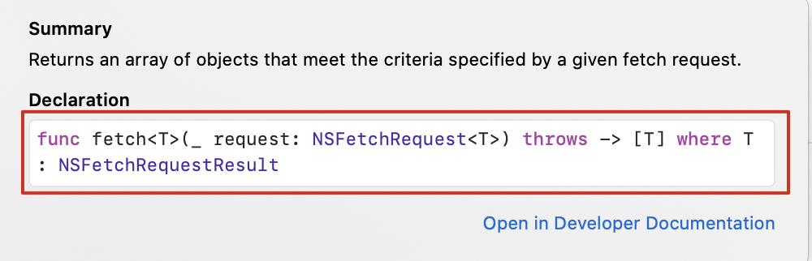
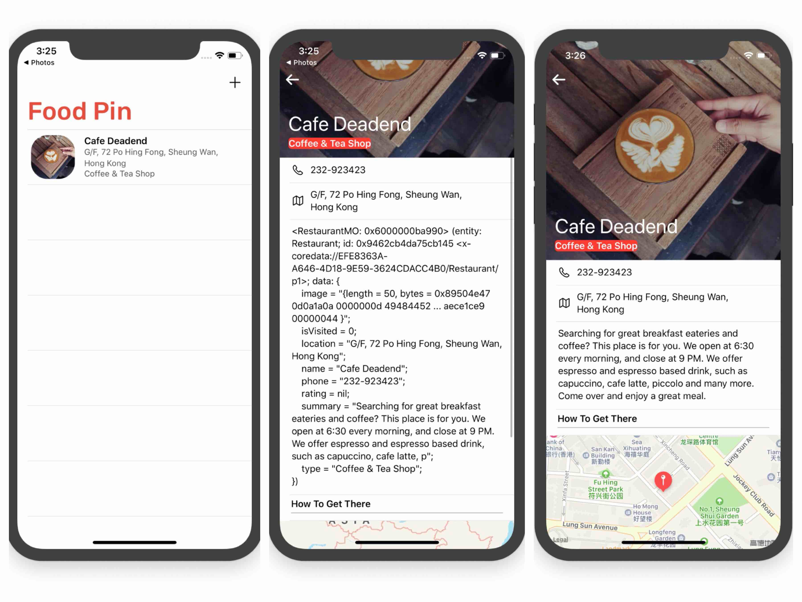
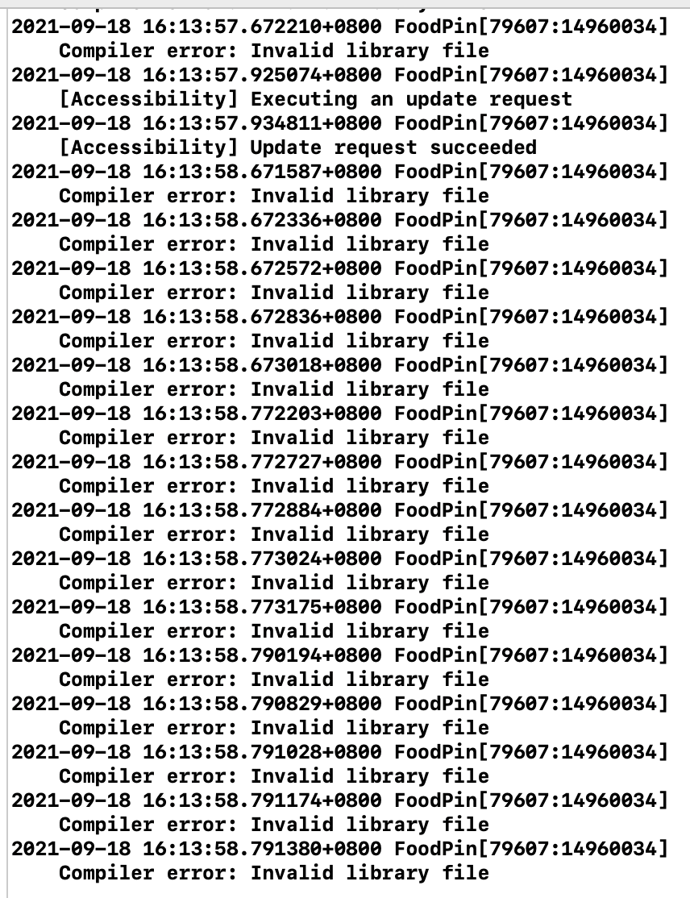

This chapter goes to the **Core Data**! Oh, finally we came to database!!!

# Core Data

First of all, **Core Data** is not a database.It is actually a framework that lets developers interact with databases in an object-oriented way.



* Managed Object Context:

  > Think of it as a scratch pad or temporary memory area containing objects that interact with data in the persistent store. Its job is to manage objects created and returned using Core Data framework. 

* Managed Object Model:

  > This describes the schema that you use in the app, the schema is represented by a collection of objects (also known as entities).In Xcode, the managed object model is defined in a file with the extension `.xcdatamodeld. `

* Persistent Store Coordinator:

  > It is the coordinator of the Core Data stack. It sits between the managed object context and the persistent store.While the figure shows a single store, a Core Data application can have multiple stores. The persistent store coordinator, an instance of NSPersistentStoreCoordinator, is the party responsible for managing different persistent object stores and saving the objects to the stores.

* Persistent Store:

  > This is the repository in which your data is actually stored. Usually, it's a database. SQLite is default.

个人总结（IMU）：简单说，core data 能够将OC对象转换为数据保存在SQLite库中，也能SQLite库中的数据转换为OC对象。上面的MOC就用来处理OC数据，可以理解为一个缓冲；PS用来管理实际的数据，也可以先理解为SQLite数据库。而MOM则定义了数据库的数据结构，即有什么属性啊、键值啊balbala的。PSC则负责协调MOC与PS之间的交互，毕竟一个是OC对象，一个是数据。可见下图：



NSObject：通过 Core Data 从数据库取出的对象，默认情况下都是 NSManagedObject 对象

总结[参考](https://blog.csdn.net/zh952016281/article/details/52105683)，[这里](https://blog.csdn.net/q199109106q/article/details/8563438)也可以看看。

---

Okey, back to the tutorial.

> That looks complicated, right? Definitely. Apple's engineers were also aware of the issue. Starting from iOS 10, the team introduced a class called `NSPersistentContainer` to simplify the management of Core Data stack in your apps. `NSPersistentContainer` is the class you will deal with for saving and retrieving data.

# Use Core Data

We can check `core data` to apply it when creating project. For an exsiting one, we can just add codes to `AppDelegate.swift`.

```sw
// MARK: - Core Data stack

    lazy var persistentContainer: NSPersistentContainer = {
        /*
         The persistent container for the application. This implementation
         creates and returns a container, having loaded the store for the
         application to it. This property is optional since there are legitimate
         error conditions that could cause the creation of the store to fail.
        */
        let container = NSPersistentContainer(name: "FoodPin")
        container.loadPersistentStores(completionHandler: { (storeDescription, error) in
            if let error = error as NSError? {
                // Replace this implementation with code to handle the error appropriately.
                // fatalError() causes the application to generate a crash log and terminate. You should not use this function in a shipping application, although it may be useful during development.
                 
                /*
                 Typical reasons for an error here include:
                 * The parent directory does not exist, cannot be created, or disallows writing.
                 * The persistent store is not accessible, due to permissions or data protection when the device is locked.
                 * The device is out of space.
                 * The store could not be migrated to the current model version.
                 Check the error message to determine what the actual problem was.
                 */
                fatalError("Unresolved error \(error), \(error.userInfo)")
            }
        })
        return container
    }()

    // MARK: - Core Data Saving support

    func saveContext () {
        let context = persistentContainer.viewContext
        if context.hasChanges {
            do {
                try context.save()
            } catch {
                // Replace this implementation with code to handle the error appropriately.
                // fatalError() causes the application to generate a crash log and terminate. You should not use this function in a shipping application, although it may be useful during development.
                let nserror = error as NSError
                fatalError("Unresolved error \(nserror), \(nserror.userInfo)")
            }
        }
    }
```

1. **lazy**: A lazy type will not be load until being needed. See [here](https://zhuanlan.zhihu.com/p/29068547)

2. > The variable `persistentContainer` is an instance of `NSPersistentContainer`, and has been initialized with a persistent store named "CoreDataDemo". This container encapsulates(总结,概括) the Core Data stack in your application. Before iOS 10, you will need to create and manage the creation of the `managed object model (NSManagedObjectModel)`, `persistent store coordinator (NSPersistentStoreCoordinator)`, and the `managed object context (NSManagedObjectContext)`. The introduction of `NSPersistentContainer` simplifies all that. Later, you just use this variable to interact with the Core Data stack.

3. `saveContext()` provides data saving function.

# Create Data Model

Right-click `Food Pin` and add new file. Scroll down to select `Data Model`.Then, click the file and create a entity `Restaurant`. Add eight attributes to it. Note: we can't name a attribute 'description' because this one is reserved. So, we use `summary` instead.

Considering that when create a new restaurant, we don't know the name of the image. So, we set the type of image to `Binary Data`.

Uncheck the `name` and `type` attributes to make these two mandatory(强制的).

# Create Managed Objects

> Here, the managed objects are very similar to outlet variables. You can modify the entity's content by updating the managed object.

Select the `Restaurant` entity and set the class name to `RestaurantMO`, the `Codegen`to `Class Definition`.Then, Xcode will generate the class for us when building the project.

> You will not find the generated class in the project navigator. It's stored somewhere else in the project folder. But you're now ready to use it in your code.

Now, let's go to the code.

We no longer need to initialize the restaurants array, declare like this:`var restaurants:[RestaurantMO] = []`. Once we did this, there will be a lot of errors. Fix one by one.

```sw
//cell.thumbnailImageView.image = UIImage(named: restaurants[indexPath.row].image)
        if let restaurantImage = restaurants[indexPath.row].image{
            cell.thumbnailImageView.image = UIImage(data: restaurantImage as Data)
        }
```

```sw
//if let shareImage = UIImage(named: self.restaurants[indexPath.row].image)
if let restaurantimage = self.restaurants[indexPath.row].image ,let shareImage = UIImage(data: restaurantimage as Data)
```

(We can infer form the code above that `,`  not equal tp `&&`, but used for sequence.)

```sw
//let defaultText = "Just Checking in at " + self.restaurants[indexPath.row].name
let defaultText = "Just Checking in at " + self.restaurants[indexPath.row].name!
```

Move to `RestaurantdetailViewController`:

```sw
//var restaurant = Restaurant()
var restaurant : RestaurantMO!
```

```sw
if let restaurantImage = restaurant.image{
            headerView.headerImageView.image = UIImage(data: restaurantImage)
        }
```

```sw
if let restaurantLocation = restaurant.location{
                cell.configure(location: restaurantLocation)
            }
            cell.configure(location: restaurant.location)
```

For the `MapViewController`

```sw
geoCoder.geocodeAddressString(restaurant.location ?? "", completionHandler: 
```

* ??:

  > known as nil coalescing operator. What this does is that it checks if the location property has a value. If not, it will use the default value we set after ??.

Change the rest of `restaurant` type to `RestaurantMO`

改好以后一直说Use of undeclared type，经过一通操作后居然就好了，各种`shift+command+k`

# Customize Empty Table

Unzip the file provided by the toturial, make sure to check `Preserve Vector Data`. Interface builder has a feature that allows us to embed an extra view in the existing view controller. Drag a *View object* to the <font color = "red">scene dock</font>, and put it right next to the exit.

Select the view, width/height: 414, 600. Drag an image view, set image to `empty` and width 320, height 356.For the constraints, top 100, left/right 28, and lock *Aspect Ratio*.

This view is an extra view for *TableViewController*, so we need to access it from code.Create an *Outlet* `emptyRestaurantView` for it and make a connection.

We need to hide this view when there are some exisiting records, and unhide when there are none. First, we code in the `viewDidLoad` method.

```sw
tableView.backgroundView = emptyRestaurantView
        tableView.backgroundView?.isHidden = true
```

BTW, I found that the var used in this method can be defined after it :)

Then, in the method `numberOfSection`

```sw
override func numberOfSections(in tableView: UITableView) -> Int {
        // #warning Incomplete implementation, return the number of sections
        if restaurants.count>0{
            tableView.backgroundView?.isHidden = true
            tableView.separatorStyle = .singleLine
        }
        else{
            tableView.backgroundView?.isHidden = false
            tableView.separatorStyle = .none
        }
        return 1
    }
```

This method will be called when table is configured.

---

<span jump id = "question1">question1:</span>can this be coded in `viewDidLoad`? I think this one only need to be called once.

At present, (there is no record of restaurant, yes).

---

# Use Managed Object

To use MO, we just need to do two steps:

1. Create a `RestaurantMO` with `view context` and set correspending properties.

   ```sw
   restaurant = RestaurantMO(context: appDelegate.persistentContainer.viewContext)
   restaurant.name = "Upstate"
   restaurant.type = "Cafe"
   restaurant.location = "New York”
   ```

2. call `saveContext()` to save the database

   ```sw
   appdelegate.saveContext()
   ```

Okey, let's go to `newRestaurant` to code. Import `CoreData` and define a `RestaurantMO` var.Put code below right before the `dismiss` line.

```sw
if let appDelegate = (UIApplication.shared.delegate as? AppDelegate){
                restaurant = RestaurantMO(context: appDelegate.persistentContainer.viewContext)
                restaurant.name = nameTextField.text
                restaurant.type = typeTextField.text
                restaurant.location = addressTextField.text
                restaurant.phone = phoneTextField.text
                restaurant.summary = descriptionTextView.text
                restaurant.isVisited = false
                if let restaurantImage = photoImageView.image{
                    restaurant.image = restaurantImage.pngData()
                }
                print("Saving Data To Context......")
                appDelegate.saveContext()
            }
```

* UIApplication.shared.delegate as? AppDelegate

> The persistentContainer variable is declared in AppDelegate.swift. To access the variable, we have to first get a reference to AppDelegate. In iOS SDK, you can use UIApplication.shared.delegate as? AppDelegate to get the AppDelegate object.

* pngData()

  Returns a data object containing the specified image in PNG format

  <span jump id = "question2">question2: try `jpegData`.</span>



As we can see, we now just store the data, can't show anything on the display.

# Fetch Data

First, import coredata in `RestaurantTableViewController`, only this can we use `NSFetchRequest`.

```sw
//fetch the latest one
        if let appDelegate = (UIApplication.shared.delegate as? AppDelegate){
            let request : NSFetchRequest<RestaurantMO> = RestaurantMO.fetchRequest()
            let context = appDelegate.persistentContainer.viewContext
            do{
                restaurants = try context.fetch(request)
            }
            catch{
                print(error)
            }
        }
```

In line 3, we define a `NSFetchRequest` type, then, in line 6, input this one to the func `.fetch` to get the latest one.

> The generated RestaurantMO class has a built-in fetchRequest() method. When called, it returns you an NSFetchRequest object that specifies the search criteria and which entity to search (here, it is the Restaurant entity).
>
> With the fetch request, we can then call the fetch method of viewContext to retrieve data from a persistent store (here, it's the database).



Run the app, we found that the `summary` attribute displays wrong, change one line in `RestaurantDetailViewController` 's `case 2` 

```sw
//cell.descriptionLabel.text = restaurant.description
cell.descriptionLabel.text = restaurant.summary
```



~~I found that even if I add more restaurants to the app, this app can load all the restaurants as long as rerun the app, different from what the tutorial said.~~ The tutorial explains why we don't use this API:

> You may wonder why we don't just use the simple method - the primary reason is for performance. Every time a user adds a new record or removes a record from the database, we load all restaurant records from the database and re-display them in the table view. This is not an efficient way to manage the data.
>

Okey, fine, let's go ahead and use another API called `NSFetchedResultsController`.This API can achieve goals like this:

* When adding a new record, add a new row in the table view.
* When delete a record, just remove the corresponding row.

To use this API, we need to adopt the `NSFetchedResultsControllerDelegate` protocol in the `RestaurantTableViewController`.

---

I still have some wondering about `delegate`, after go back to chapter14 and chapter8, IMU, when we need to connect the storyboard with code, we need to assign `.delegate`. Thus, the `.delegate` 's assignment in `MapView` is unnecessary, because it's an oulet which has been connected with storyboard. Comment this line, mapview works well:)

---


# To Do

- [ ] [question1](#question1)

- [ ] [question2](#question2)

- [ ] I found that when going to the `MapViewController` in simulator, there will be lots of *Compiler error* info in the console, even for the *Appcoda* official solution. (Take chapter18's as an example)

  

 

