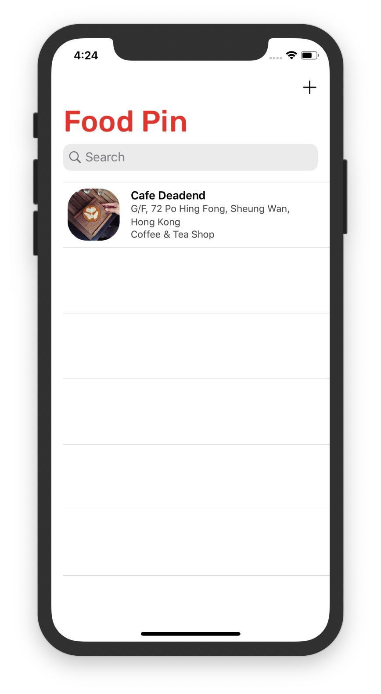

This chapter, we are going to add *Search Function* by using `UISearchController`.

# Add a Search Bar

After define a search, we add a search controller to the navigationItem.

```sw
//search bar
searchController = UISearchController(searchResultsController: nil)
self.navigationItem.searchController = searchController
```

> **searchResultsController**: The view controller that displays the search results. Specify `nil` if you want to display the search results in the same view controller that displays your searchable content.



# Filter Content

First, declare a variable to store the search result.

```sw
var searchResults : [RestaurantMO] = []
    
    func filterContent(for searchText: String){
        searchResults = restaurants.filter({
            (restaurant) -> Bool in
            if let name = restaurant.name{
                let isMatch = name.localizedCaseInsensitiveContains(searchText)
                return isMatch
            }
            return false
        })
    }
```

1. This func is self-defined.We return `true` if the name if match, else `false`.

2. `.filter`:

   * line3's `restaurant` is input as parameter `_ isIncluded: (RestaurantMO) throws -> Bool`

   * throws:

     > throws的使用很简单，只需要在可能出现异常的函数或者方法后面添加throws。
     > 经过这个关键字修饰的函数，在调用的时候，需要程序员加上do-catch来调用。
     > 对于错误类型开发者来说，只需要使用Throws进行修饰，就保证了以后的调用者必然需要对相应的错误进行处理（<font color = "red">当然也可以不处理，但无论如何，错误被throw携带出来了，以后的维护和优化不需要重新做错误处理的设计，直接加上错误处理的逻辑即可</font>）

   * rethrows:

     > rethrows是异常往上传递的关键字。上面说了throws用在可能出现异常的函数或者方法中，而rethrows针对的不是函数或者方法的本身，而是它携带的闭包类型的参数，当它的闭包类型的参数throws的时候，我们要使用rethrows继续将这个异常往上传递， 直到被调用者使用到。这相比throws多一个传递的环节。

   * [参考](https://www.jianshu.com/p/0b43a0b5bfd6)

3. `localizedCaseInsensitiveContains`:

   > Returns a Boolean value indicating whether the given string is non-empty and contained within this string by case-insensitive, non-literal search, taking into account the current locale.
   >
   > 返回一个布尔值，指示给定的字符串是否为非空并通过不区分大小写的非文字搜索包含在此字符串中，同时考虑当前区域设置。

   

   这里的where关键字可以理解为与英语里的定语从句一个意思，还挺好理解的。[ref](https://www.jianshu.com/p/478654266178)

# Update search results

Now, we've design the search logic. Then, we need to update the search results and display them.

To do this, we must adopt `UISearchResultsUpdating` protocol first, then insert method `updateSearchResults(for:)`

>  The protocol defines a method called `updateSearchResults(for:)`. When a user selects the search bar or key in a search keyword, the method will be called.

```sw
func updateSearchResults(for searchController: UISearchController) {
        if let searchtext = searchController.searchBar.text{
            filterContent(for: searchtext)
        }
        tableView.reloadData()
    }
```

Don't hurry to wonder why we can `reload` directly now, we are not done yet.The `restaurantTableViewController` should tell when to show all the restaurants and when to show search results.There is a property called `isActive` in search controller. And will be set to `true` when user tapping search bar.So, let's update the number now:

```sw
override func tableView(_ tableView: UITableView, numberOfRowsInSection section: Int) -> Int {
        // #warning Incomplete implementation, return the number of rows
        if searchController.isActive{
            return searchResults.count
        }
        else {
            return restaurants.count
        }
    }
```

<font color = "red">Note:</font> Swift must have `{}` in `if-else` statement.

Then, update which one to display:

```sw
override func tableView(_ tableView: UITableView, cellForRowAt indexPath: IndexPath) -> UITableViewCell {
        
        let cell = tableView.dequeueReusableCell(withIdentifier: "datacell", for: indexPath) as! RestaurantTableViewCell
        let restaurant = (searchController.isActive) ? searchResults[indexPath.row] : restaurants[indexPath.row]
        
        //Configure the cell
        cell.nameLabel.text = restaurant.name
        if let restaurantImage = restaurant.image{
            cell.thumbnailImageView.image = UIImage(data: restaurantImage as Data)
        }
        cell.locationLabel.text = restaurant.location
        cell.typeLabel.text = restaurant.type
        cell.HeartImageView.isHidden = !(restaurant.isVisited)
        
        return cell
    }
```

When search results appear, we want to see the detailview when tapping one of them, so we need to change the `prepare` method as well.

```sw
destinationController.restaurant = (searchController.isActive) ? searchResults[indexPath.row] : restaurants[indexPath.row]
```

Then, add these in `viewDidLoad` method:

```sw
searchController.searchResultsUpdater = self
searchController.obscuresBackgroundDuringPresentation = false
```

> The first line of code tells the search controller which object is responsible for updating the search result. It can be any object in your application or simply the current one.
>
> The obscuresBackgroundDuringPresentation property controls whether the underlying content is dimmed during a search. Because we are presenting the search results in the same view, the property should be set to false.


Finally, we found that when displaying search results, we can edit the results cells, not appropriate.

# Change the search bar's place to Header View

Just change the code in `viewDidLoad` from `self.navigationItem.searchController = searchController` to `tableView.tableHeaderView = searchController.searchBar`


