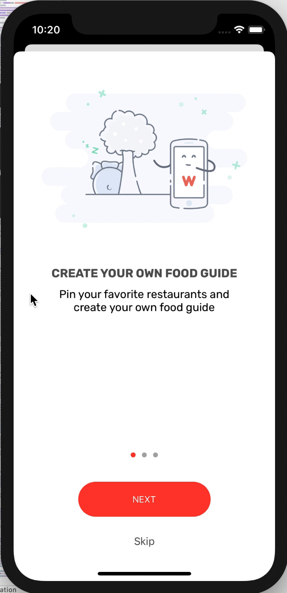

When first lanching some apps, there are some tutorials in the launching view calles *WalkThrough*.Whether is it good or bad is not within this chapter's discussion.Let's just learn how to do this.

# Page View Controller

Let's start with creating a new storyboard. Right-click the **StoryBoard** folder and create a storyboard, name it with `OnBoarding`. Then, drag a `Page View Controller` .

> Presents a sequence of view controllers as pages, via coordination with a data source and delegate. Swipe navigation between the pages is automatically handled with a page curl transition that tracks the user's finger. The navigation orientation can be horizontal, like pages in a book, or vertical, like pages in a wall calendar.
>
> From Apple.

Change the *Transition Style* from *Page Curl* (for book-like style) to *Scroll*.Assign a *Storyboard ID* to it:`WalkthroughController`.

There are two kinds of view controllers in the walkthrough we are going to achieve. One is *page content view controller*, which is a plain *view controller*, storing the objects within. The other is *page view controller* using `UIPageViewController`, responsible for managing *page content view controller*, such as control how one view switches to another.


The graph's four area are actually all *page content view controller*, and *page view controller* is responsible for managing them.Besides, we need a master controller(simply a view controller) to hold both of them.

# Get Started

Drag a *View Controller* for *Master View Controller* and drag a *Container view* upon it to contain *page view controller*. Set its width/height to 414/500. Then, `control` + `drag` to make a connection between the container and page view controller. Set *container view* 's top/left/right constraints to 0.

Then, drag a *view object*, set X/Y:0/500, width/height:414/396.Set four constraints to 0.

After this, there are still some layout errors. Here, the tutorial wants to let *container view* take up two-thirds part of view controller while the empty view one-third.

To achieve this, `contro` + `drag` from `view` to `safe area` and select `equal height`.Then, select the constraint we just defined, change its `Multiplier` to `1:3`.

Next, go to the buttons and page indicator. Drag a button: w/h:140/50. Title:Next. Font:Subhead. Color:white/red, lock this one's height and width. Another button: Skip/Body/Dark Gray. Drag a *page control object*, set its color to light gray and current page to red.Embed these three and set spacing to `20` , make the stack view centre both direction.

# Design Page Content View

Add the materials to `Assets`, check `preserve vector data` .Remember this is *Page Content View* instead of *Page View*. Set the simulator's height to `624` to let it look like the same as *container view*.Drag an Image View, 333x229.Drag a label, set to `Rubik bold`, centre **Alignment**, name it `heading`, dark gray.Drag another one, name it `Subheading`, rubik, regular, 16, cetre **Alignment**, light gray.

Embed two labels and set spacing to 10, Alignment Centre. Embed this one with Image View, Alignment Centre and spacing 50.For this stack view: top/left/button/right:50/24/10/24.Lock the Aspect Ratio of imageview, and the bottom one `Greater than or equal`.

# Create content class

After designing the UI, we need to create the class to pair with the view controllers.Let's start with the *Page Content View Controller*, refered as *WalkthroughContentViewController*. Create a new controller file as subclass of *UIViewController*, name it *WalkthroughContentViewController*.

```sw
		override func viewDidLoad() {
        super.viewDidLoad()
        headingLabel.text = heading
        subheadingLabel.text = subHeading
        contentImageView.image = UIImage(named: imageFile)
        // Do any additional setup after loading the view.
    }
		@IBOutlet var headingLabel : UILabel!{
        didSet{
            headingLabel.numberOfLines = 0
        }
    }
    @IBOutlet var subheadingLabel : UILabel!{
        didSet{
            subheadingLabel.numberOfLines = 0
        }
    }
    @IBOutlet var contentImageView: UIImageView!
    
    var index = 0
    var heading = ""
    var subHeading = ""
    var imageFile = ""
```

> The index variable is used to store the current page index. For instance, the first walkthrough screen will have the index value of 0. The view controller is designed to display an image, heading, and subheading. So we create three variables for data passing.

Then, let's make connections.First, set the onboarding storyboard as *WalkthroughContentViewController*, and set its storyboard ID as the same.Next, `control` and `drag`.

# Implemente the Page View Controller

Next step, we need to create each of the content and add it to the page view controller.There are two ways to do so: we can provide the content view one at a time, just display a certain view controller in *UIPageViewController*, by calling `setViewControllers(_:direction:animated:completion:)`.Since our app supports gesture-based navigation, we need to use the second method: on-demand approach.

In this method, we need adopt `UIPageViewControllerDataSource` protocol and call two methods:`pageViewController(_:viewControllerBefore:)` and `pageViewController(_:viewControllerAfter:)`.For example, if current controller's index is `1`, the formmer method should return controller 0 and the latter 2.

Ok, let's create a new class for `page view controller`, name it as `WalkthroughPageViewController`, subclass of `UIPageViewController`.Remember to adopt `UIPageViewControllerDataSource` protocol.(There will be an error after adopting, add two methods above to solve.)Then, declare these:

```sw
var pageHeadings = ["CREATE YOUR OWN FOOD GUIDE", "SHOW YOU THE LOCATION", "DISCOVER GREAT RESTAURANTS"]
var pageImages = ["onboarding-1", "onboarding-2", "onboarding-3"]
var pageSubHeadings = ["Pin your favorite restaurants and create your own food guide","Search and locate your favourite restaurant on Maps","Find restaurants shared by your friends and other foodies"]
var currentIndex = 0
```

Before we go two the two before-after method, let's declare our own func first:

```sw
func contentViewController(at index: Int) -> WalkthroughContentViewController?{
        if index<0 || index>=pageHeadings.count {
            return nil
        }
        // Create a new view controller and pass suitable data.
        let storyboard = UIStoryboard(name: "Onboarding", bundle: nil)
        if let pageContentViewController = storyboard.instantiateViewController(identifier: "WalkthroughContentViewController") as? WalkthroughContentViewController{
            pageContentViewController.imageFile = pageImages[index]
            pageContentViewController.heading = pageHeadings[index]
            pageContentViewController.subHeading = pageSubHeadings[index]
            pageContentViewController.index = index
            return pageContentViewController
        }
        
        return nil
    }
```

1. line 6: `bundle`:

   > The bundle containing the storyboard file and its related resources. If you specify `nil`, this method looks in the main bundle of the current application.

2. line 7: `instantiateViewController`:

   > Creates the specified view controller from the storyboard and initializes it using your custom initialization code.

This method is designed to receive an index and return corresponding walkthroughcontentviewcontroller. Easy to understand.Then, here it comes:

```sw
func pageViewController(_ pageViewController: UIPageViewController, viewControllerBefore viewController: UIViewController) -> UIViewController? {
        var index = (viewController as! WalkthroughContentViewController).index
        index -= 1
        return contentViewController(at: index)
    }
    
    func pageViewController(_ pageViewController: UIPageViewController, viewControllerAfter viewController: UIViewController) -> UIViewController? {
        var index = (viewController as! WalkthroughContentViewController).index
        index+=1
        return contentViewController(at: index)
    }
```

And in `viewDidLoad` method:

```sw
override func viewDidLoad() {
        super.viewDidLoad()

        // Do any additional setup after loading the view.
        dataSource = self
        if let startingViewController = contentViewController(at: 0){
            setViewControllers([startingViewController], direction: .forward, animated: true, completion: nil)
        }
    }
```

* line 7, `setViewControllers()`: Sets the view controllers to be displayed.

Finally, go to the storyboard, set the page view controller and set its class to `WalkthroughPageViewController`,  and storyboard ID to `WalkthroughPageViewController`.

# Walkthrough View Controller

Finally, let create class for `WalkthroughViewController`.Declare these:

```sw
@IBOutlet var pageControl: UIPageControl!
    @IBOutlet var nextButton: UIButton!{
        didSet{
            nextButton.layer.cornerRadius = 25.0
            nextButton.layer.masksToBounds = true
        }
    }
    @IBOutlet var skipButton: UIButton!
```

Then, go to the storyboard, set the master view controller as the class `WalkthroughViewController` and the storyboard ID `WalkthroughViewController`. Make connections.

# Let's display!

Okey, we are almost there! Because we want to bring up the walkthrough view controller when a user first launches the app, we instantiate(例举，举例说明) it in the `RestaurantTableViewController` 

```sw
override func viewDidAppear(_ animated: Bool) {
        let storyboard = UIStoryboard(name: "Onboarding", bundle: nil)
        if let walkthroughViewController = storyboard.instantiateViewController(identifier: "WalkthroughViewController") as? WalkthroughViewController{
            present(walkthroughViewController, animated: true, completion: nil)
        }
    }
```

 We can run the app now.



# Button action

As we can see, the buttons do not work yet.For skip button, the walkthroughview should dismiss after being tapped.Insert following code in the `walkthroughviewcontroller`:

```sw
@IBAction func skipButtonTapped(sender: UIButton){
        dismiss(animated: true, completion: nil)
    }
```

<span jump id = "question1"><font color = "red">Question1</font>:</span> Can we just define `dismiss` method in the button that not belongs to a **Navigation Bar**? We test this in chapter18.md

---

Okey, Next Button:

As we konw, when tapping this button, the app will automatically show the next walkthrough screen. So, let's define a new func first in the `PageViewController`:

```sw
func forwardPage(){
        currentIndex+=1
        if let nextViewController = contentViewController(at: currentIndex){
            setViewControllers([nextViewController], direction: .forward, animated: true, completion: nil)
        }
    }
```

This func will set current view to the next directly.But how can we get current index? We need to define a new var in `walkthroughviewcontroller`.

```sw
var walkthroughPageViewController: WalkthroughPageViewController!
```

Then, in the `prepare` method, we can get the reference:

```sw
 override func prepare(for segue: UIStoryboardSegue, sender: Any?) {
        // Get the new view controller using segue.destination.
        // Pass the selected object to the new view controller.
        let destination = segue.destination
        if let pageViewController = destination as? WalkthroughPageViewController{
            walkthroughPageViewController = pageViewController
        }
    }
```

We are now ready to perform nextbutton's action in `WalkThroughViewController` now.

```sw
@IBAction func nextButtonTapped(sender: UIButton){
        if let index = walkthroughPageViewController?.currentIndex{
            switch  index {
            case 0...1 :
                walkthroughPageViewController.forwardPage()
            case 2:
                dismiss(animated: true, completion: nil)
            default:
                break
            }
            updateUI()
        }
    }
    
    func updateUI(){
        if let index = walkthroughPageViewController?.currentIndex{
            switch index{
            case 0...1:
                nextButton.setTitle("NEXT", for: .normal)
                skipButton.isHidden = false
            case 2:
                nextButton.setTitle("GET STARTED!", for: .normal)
                skipButton.isHidden = true
            default:
                break
            }
            pageControl.currentPage = index
        }
    }
```

Easy to understand.

<span jump id = "answer1"><font color = "red">Connections:</font></span> The understanding about chapter18 is wrong, the main reason lays in the connection method: <font color = "red">we must make `control` + `drag` form **Button** instead of viewcontroller!!!</font> 

# Update UI by Gesture

When running, I find that only tapping action can update UI.This is because we define `updateUI()` func by `currentIndex`, which is defined by our own.And we call this func only in button action relative func.Thus, we need to let page view notify the walkthrough view to updateUI. How can we do that? Use `delegate`.

> In iOS programming, one common approach to performing this kind of notification is by using a delegate. The general idea is that the Walkthrough Page View Controller defines a delegate protocol with a required method.

This means that if B wants to be informed by A, then A needs to define a delegate protocol and B adopts that protocol.In other words, A defines protocol, and B is delegate.

Now, time to define our own protocol.Right after `import UIKit`, insert these:

```sw
protocol WalkthroughPageViewControllerDelegate: class {
    func didUpdatePageIndex(currentIndex: Int)
}
```

And define a variable to hold the protocol in class body.`weak var walkthroughDelegate: WalkthroughPageViewControllerDelegate?`.

> In most case, we use the `weak` keyword for delegate to prevent memory leak.

For more information about `weak`, check [here](http://www.cocoachina.com/cms/wap.php?action=article&id=25500). For official, check [here](https://docs.swift.org/swift-book/LanguageGuide/AutomaticReferenceCounting.html).

Okey, when should we call the delegate method?There is a method called `pageViewController(_ pageViewController, didFinishAnimating finished, previousViewControllers:, transitionCompleted completed)` in `UIPageViewControllerDelegate` protocol.Every time a gesture-based transition completes, this method will be called.So we can update UI in this method.

Therefore, adopt ths `UIPageViewControllerDelegate` protocol and insert this method like this:

```sw
func pageViewController(_ pageViewController: UIPageViewController, didFinishAnimating finished: Bool, previousViewControllers: [UIViewController], transitionCompleted completed: Bool) {
        if completed{
            if let contentViewController = pageViewController.viewControllers?.first as? WalkthroughContentViewController{
                currentIndex = contentViewController.index
                walkthroughDelegate?.didUpdatePageIndex(currentIndex: currentIndex)
            }
        }
    }
```

* line 3: `viewControllers`: since the pageViewController contains many content view, thus we need to use `.viewControllers.first` to get the current view. 

Then, insert `delegate = self` in `viewDidLoad` method.

Next, go to `WalkthroughViewController` and adopt the `WalkthroughPageViewControllerDelegate` protocol.And insert code like this:

```sw
func didUpdatePageIndex(currentIndex: Int) {
        updateUI()
    }
```

And add `walkthroughPageViewController.walkthroughDelegate = self` in the `prepare` method.


# To Do

- [ ] [question1](#question1)

  [answer1](#answer1)

- [ ] `weak` reference


