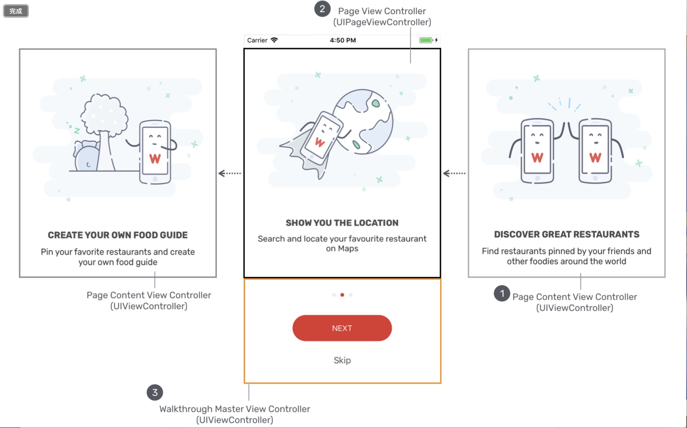

When first lanching some apps, there are some tutorials in the launching view calles *WalkThrough*.Whether is it good or bad is not within this chapter's discussion.Let's just learn how to do this.

# Page View Controller

Let's start with creating a new storyboard. Right-click the **StoryBoard** folder and create a storyboard, name it with `OnBoarding`. Then, drag a `Page View Controller` .

> Presents a sequence of view controllers as pages, via coordination with a data source and delegate. Swipe navigation between the pages is automatically handled with a page curl transition that tracks the user's finger. The navigation orientation can be horizontal, like pages in a book, or vertical, like pages in a wall calendar.
>
> From Apple.

Change the *Transition Style* from *Page Curl* (for book-like style) to *Scroll*.Assign a *Storyboard ID* to it:`WalkthroughController`.

There are two kinds of view controllers in the walkthrough we are going to achieve. One is *page content view controller*, which is a plain *view controller*, storing the objects within. The other is *page view controller* using `UIPageViewController`, responsible for managing *page content view controller*, such as control how one view switches to another.

The graph's four area are actually all *page content view controller*, and *page view controller* is responsible for managing them.

