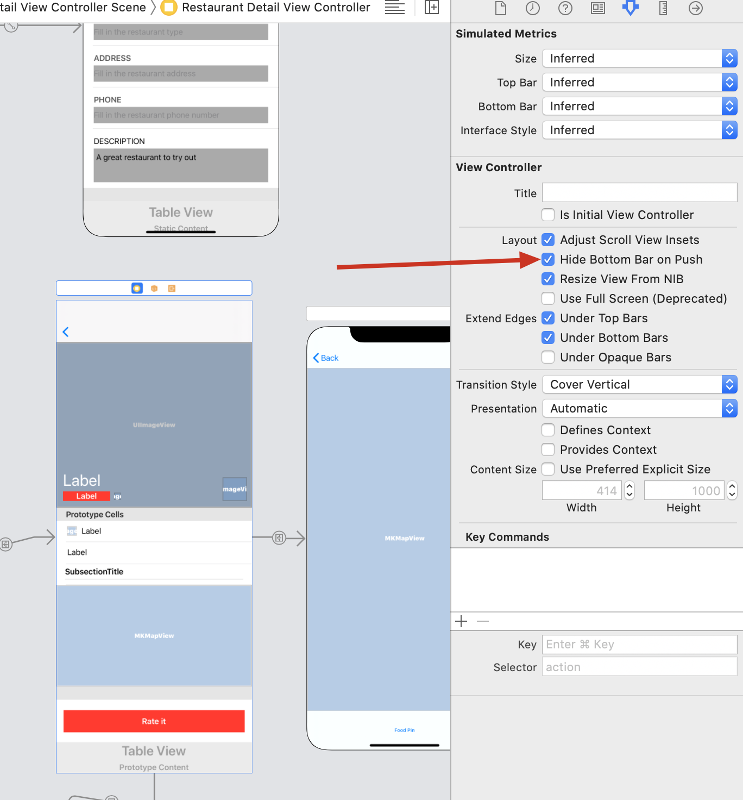
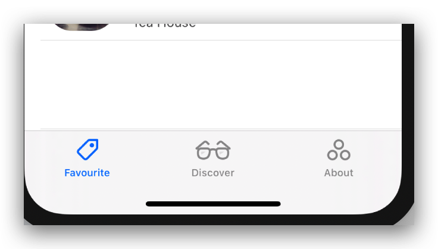

> While navigation controllers let users navigate hierarchical content by managing a stack of view controllers, tab bars manage multiple view controllers that don't necessarily have a relation to one another.

# Build a Tab Bar Controller

Go to the mainstoryboard, select `Navigation Controller` and in Xcode menu, Editor->Embed in-> Tab Bar Controller.Change the `System Item` to `Favourites`.Then, a tab bar is done, without any constraints needed.

# Hide when pushed

Take `RestaurantDetailViewController` as an example, there are two ways to hide the tab bar.

1. Select the detail view controller in storyboard, and check `Hide Bottom Bar on Push`.

   

2. add `destinationController.hidesBottomBarWhenPushed = true` in `prepare` method of `RestaurantTableViewController`.

   ---

   <span jump id = "question1"><font color = "red">Question1</font></span>: If I simply add `hidesBottomBarWhenPushed = true` in detailview's `viewDidLoad` or `viewWillAppear`, it doesn't work. Why?

   ---

# Add new Tabs

Drag a `Navigation Controller` to the storyboard and change its title to `Discover`.Then `control` + `drag` form <font color = "red">tab bar</font> to <font color = "red">the new controller</font>, set the item to `Recents`. Repeat, set to `More`.

# Customize the tab bar

* **tintColor**:

  ```sw
  UITabBar.appearance().tintColor = UIColor(red: 235.0/255.0, green: 75.0/255.0, blue: 27.0/255.0, alpha: 1.0)
  ```

* **barTintColor**:

  ```sw
  UITabBar.appearance().barTintColor = UIColor.black
  ```

* **backgroundImage**:

  ```sw
  UITabBar.appearance().backgroundImage = UIImage(named: "tabbar-background")
  ```

All can be code in `AppDelegate.swift`'s `didFinishLaunchingWithOptions` method.

Also, we can customize the tab bar item image.Select the item, set the `System Item` to `Custom` and choose corrsponding image.




# To Do

- [x] [Question1](#question1)

  Answer: 网上查了一下，大概意思就是这个tab bar的显示雨隐藏需要在push之前，也就是`viewDidLOad`之前调用才有效，故需要override init或者在前一个view的prepare里调用。