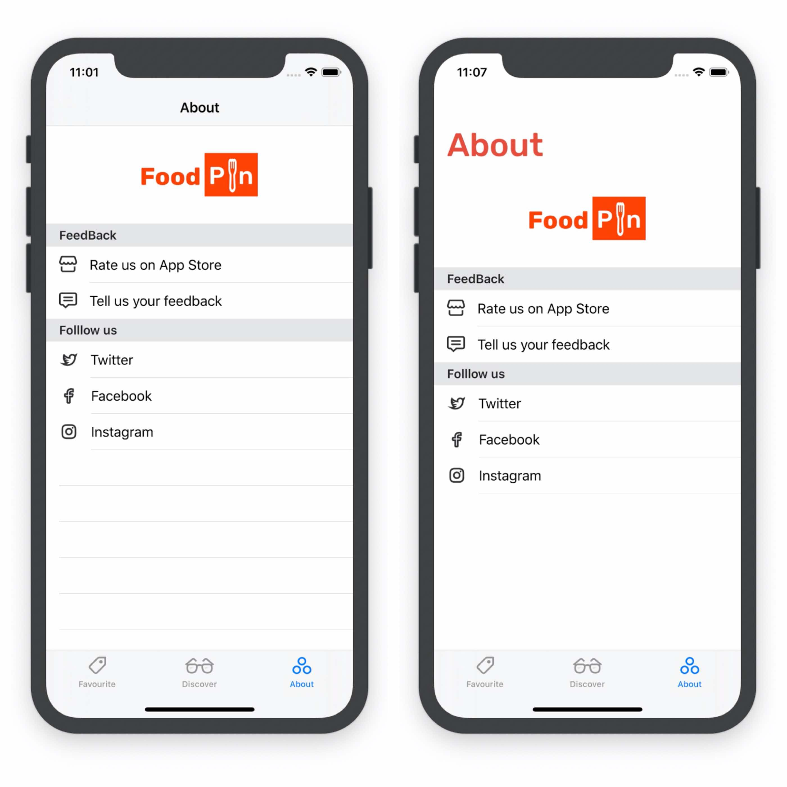
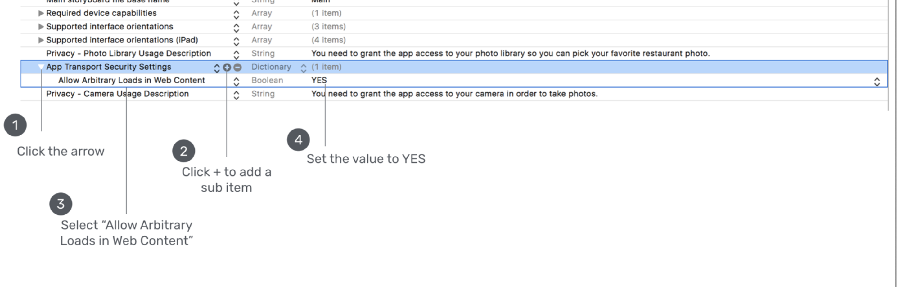
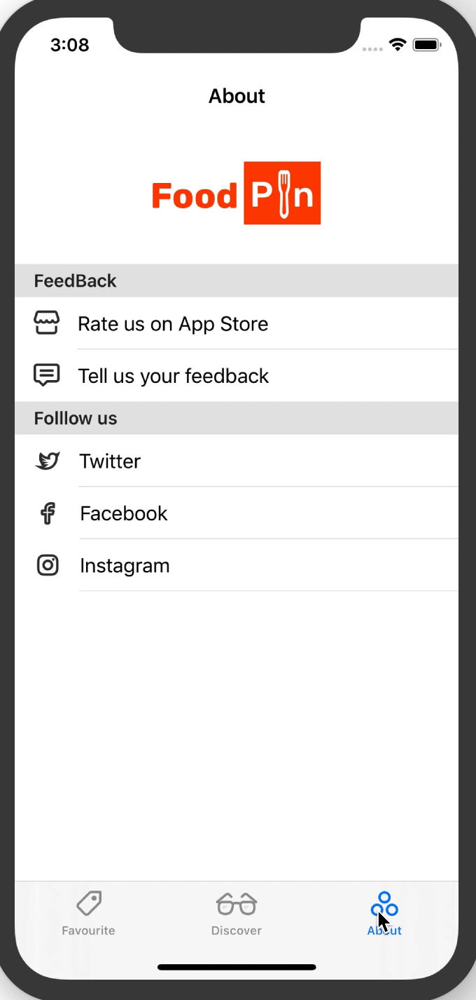
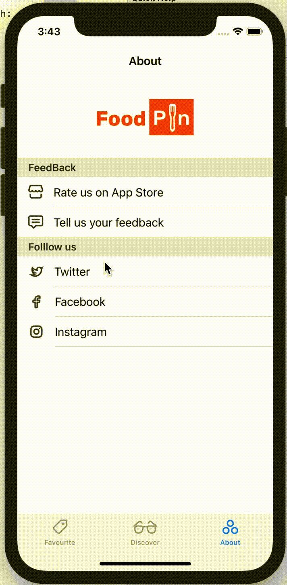

This chapter, we will use Web related APIs.

# *About* View

Drag a *View* object right above the table cell and set the height to `120`.Then, drag a imageView to it, width/height:142/53, set to the center and the image `foodpin-`.Then, set the identifier of table cell to `AboutCell` and style to `Basic`.

As usual, we need to create a controller for it.After creating `AboutTableViewController`, set the table's class to it.This time's code is a little different: introducing new type, **Tuples**, easy to understand.

```sw
var sectionContent = [[(image:"store", text:"Rate us on App Store", link: "https://www.apple.com/ios/appstore"), (image:"chat", text:"Tell us your feedback", link: "www.appcoda.com/contact")],[(image:"twitter", text:"Twitter", link:"https://twitter.com/appcodamobile"), (image:"facebook", text:"Facebook", link:"https://facebook.com/appcodamobile"), (image:"instagram", text:"Instagram", link:"https://www.instagram.com/appcodadotcom")]]
```

```sw
override func numberOfSections(in tableView: UITableView) -> Int {
        // #warning Incomplete implementation, return the number of sections
        return sectionContent.count
    }

    override func tableView(_ tableView: UITableView, numberOfRowsInSection section: Int) -> Int {
        // #warning Incomplete implementation, return the number of rows
        return sectionContent[section].count
    }
    override func tableView(_ tableView: UITableView, titleForHeaderInSection section: Int) -> String? {
        return sectionTitles[section]
    }
```

The method `titleForHeaderInSection section` is used to display the section title.

```sw
override func tableView(_ tableView: UITableView, cellForRowAt indexPath: IndexPath) -> UITableViewCell {
        let cell = tableView.dequeueReusableCell(withIdentifier: "AboutCell", for: indexPath)

        // Configure the cell...
        let cellData = sectionContent[indexPath.section][indexPath.row]
        cell.textLabel?.text = cellData.text
        cell.imageView?.image = UIImage(named: cellData.image)

        return cell
    }
```

Pay attention to line 2's Identifier!

Let's do some customizations.

```sw
override func viewDidLoad() {
        super.viewDidLoad()

        // Uncomment the following line to preserve selection between presentations
        // self.clearsSelectionOnViewWillAppear = false

        // Uncomment the following line to display an Edit button in the navigation bar for this view controller.
        // self.navigationItem.rightBarButtonItem = self.editButtonItem
        //for iPad readable
        tableView.cellLayoutMarginsFollowReadableWidth = true
        navigationController?.navigationBar.prefersLargeTitles = true
        navigationController?.navigationBar.setBackgroundImage(UIImage(), for: .default)
        navigationController?.navigationBar.shadowImage = UIImage()
        if let customFont = UIFont(name: "Rubik-Medium", size: 40.0){
            navigationController?.navigationBar.largeTitleTextAttributes = [NSAttributedString.Key.foregroundColor : UIColor(231, 76, 60), NSAttributedString.Key.font: customFont]
        }
        //hide the blank cells
        tableView.tableFooterView = UIView()
    }
```

The last line is used for hidding the blank cells.



# Open in Mobile Safari

We want to switch to *Safari* App when tapping "Rate us on App Store".Insert these code:

```sw
override func tableView(_ tableView: UITableView, didSelectRowAt indexPath: IndexPath) {
        let link = sectionContent[indexPath.section][indexPath.row].link
        switch indexPath.section{
        case 0:
            if indexPath.row == 0{
                if let url = URL(string: link){
                    UIApplication.shared.open(url)
                }
            }
        default:
            break
        }
        tableView.deselectRow(at: indexPath, animated: true)
    }
```

We can simply use `UIApplication.shared.open(url)` to open an url in *Safari*.


# Use WKWebView To Load Content

Here is an example:

```sw
if let url = URL(string: "http://www.appcoda.com/contact"){
	let request = URLRequest(url: url)
	webView.load(request)
}
```

Also, we can load local bundled HTML file:

```sw
let url = URL(fileURLWithPath: "about.html")
let request = URLRequest(url: url)
webView.load(request)
```

In this way, `WKWebView` will load locally, even without Internet.

Okey, in `About.Storyboard`, drag a *View Controller* to it and drag a *WebKit View* object upon it.Resize it to make it full of the view controller, make four zero constraints.Then, `control` + `drag` from aboutview's controller to the new view controller and select `Show`.Select the segue and set the identifierto `showWebView`. As usual, we create a new class for the webView controller, name as `WebViewController`.In the new file, declare an outlet for the the WebView.Remember to `import webKit`.

```sw
@IBOutlet var webView: WKWebView!
    
var targetURL = ""
```

Passed by `AboutTableViewController`, the `targetURL` is used to storing the target URL.

For the `viewDidLoad` method:

```sw
override func viewDidLoad() {
        super.viewDidLoad()

        navigationItem.largeTitleDisplayMode = .never
        if let url = URL(string: targetURL){
            let request = URLRequest(url: url)
            webView.load(request)
        }
        // Do any additional setup after loading the view.
    }
```

Now, go back to the `AboutTableViewController`, update the `didselect` method:

```sw
//facebook
else if indexPath.row == 1{
   performSegue(withIdentifier: "showWebView", sender: self)
}
```

For the prepare method:

```sw
    override func prepare(for segue: UIStoryboardSegue, sender: Any?) {
        // Get the new view controller using segue.destination.
        // Pass the selected object to the new view controller.
        if segue.identifier == "showWebView"{
            if let destinationController = segue.destination as? WebViewController, let indexPath = tableView.indexPathForSelectedRow{
                    destinationController.targetURL = sectionContent[indexPath.section][indexPath.row].link
            }
        }
    }
```

Now, go to the `About.storyboard` and set the WebView's class to `WebViewController`, don't forget to make a connection.

If we run the app now, we can see the web view, but it's just a blank view.Why?

> It's due to the non-HTTPS URL. Starting from iOS 9, Apple introduced a feature called App Transport Security or ATS for short. The purpose of this feature is to improve the security of connections between an app and web services by enforcing some of the best practices. One of them is the use of secure connections. With ATS, all network requests should now be sent over HTTPS. If you make a network connection using HTTP, ATS will block the request.
>
> 不愧是你，Apple👍

What if the website we want to open is not *https* or is not in control? Apple allows us to ignore ATS, by setting the value of `NSAllowsArbitraryLoadsInWebContent`. 



(I didn't try this, just add "https" before feedback's link).



# Load By SFSafariViewController

Compared with `WKWebView`, we don't need to define constraints or design UI when using `SFSafariViewController`.We can simple use `SFSafariViewController` like this:

```sw
let safariController = SFSafariViewController(url: url)
present(safariController, animated: true, completion: nil)
```

Okay, go to `AboutViewController`, `import SafariServices`.Insert one case:

```sw
case 1:
            if let url = URL(string: link){
                let safariController = SFSafariViewController(url: url)
                present(safariController, animated: true, completion: nil)
            }
```




