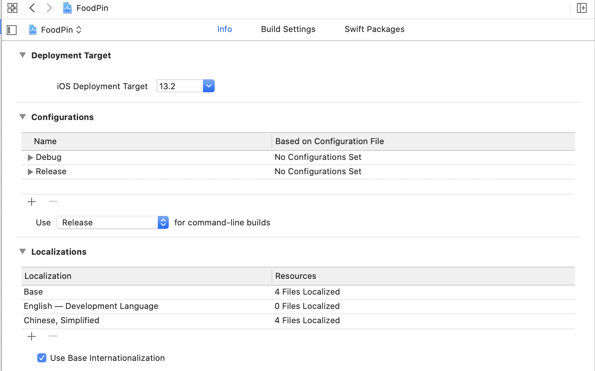
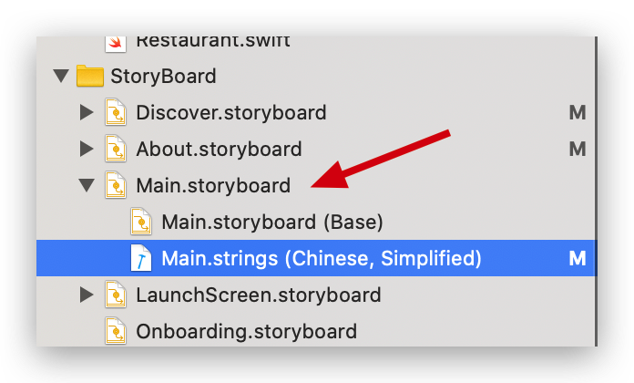

As we can see, the app we created so far only support English.So, we need to support multiple languages. First we will internationalize our app, then localizate it.

# Internationalize the app

We use `NSLocalizedString` to internationalize the string, and it has two arguments:

* `key`: the string to be localized
* `comment`:the string that is used to provide additional information for translation.

Let's take the `AboutViewController` as an example:

```sw
var sectionTitles = [NSLocalizedString("FeedBack", comment: "FeedBack"), NSLocalizedString("Folllow us", comment: "Follow us")]
```

# Exercise 1

Okay, adjust all the user-facing text (mmp....)

# Add Support Language

Click *FoodPin*->*Info*->*FoodPin* under project->*+*.Check all the file in the pop-over view.



# Export For Localization

> Xcode comes with an export feature to streamline the translation process. The export feature is intelligent enough to extract all localizable strings from your source code and Interface Builder/Storyboard files. The extracted strings will be stored in an XLIFF file. If you haven't heard of the term, XLIFF stands for XML Localization Interchange File, which is a well-known and globally-recognized file format for localization.

To use this function, click *FoodPin* -> *Editor* -> *Export For Localization*.After exporting, we will find three  sub-folders and one JSON file.

> * **contents.json** - it contains the meta data about the localization catalog like development region, target locale, tool info, and version.
> * **Localized Contents** - this is the folder you would pass to your translator. It contains the .xliff file and other assets (e.g. images) for localization.
> * **Source Contents** - this content of this folder is not for localization but just to provide additional contextual information to the localizers.
> * **Note** - by default, this folder is empty. However, in case you want to provide additional information (e.g. screenshot) for the translators or localizers for reference, you can put the files here.

导出之后需要自己更改.xliff文件里的内容至\<target>,惊了。。。

Note that `.swift` files do not have \<target>, we need to add ourselves.

# Import Localizations

Select *FoodPin*, *Editor*-> *Import Localizations*. Choose `zh-Hans.xcloc`.

Then, we note that the `Main.storyboard` is now split into two files.One is base, theother is for the language we just import. The `base` one is introduced in Xcode 10 so that we only need to edit one storyboard instead of multiple ones.




# To do

- [ ] The delete/share action do not have title