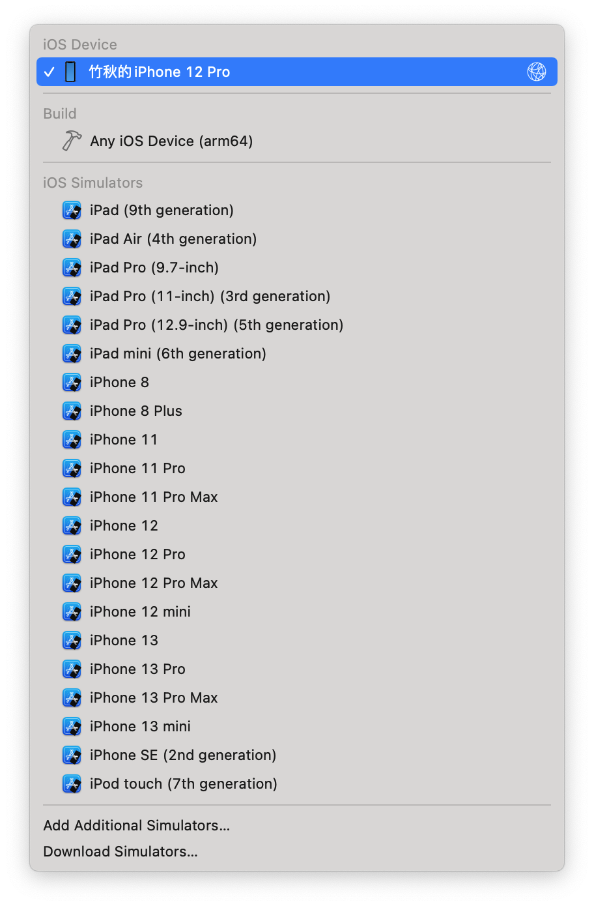
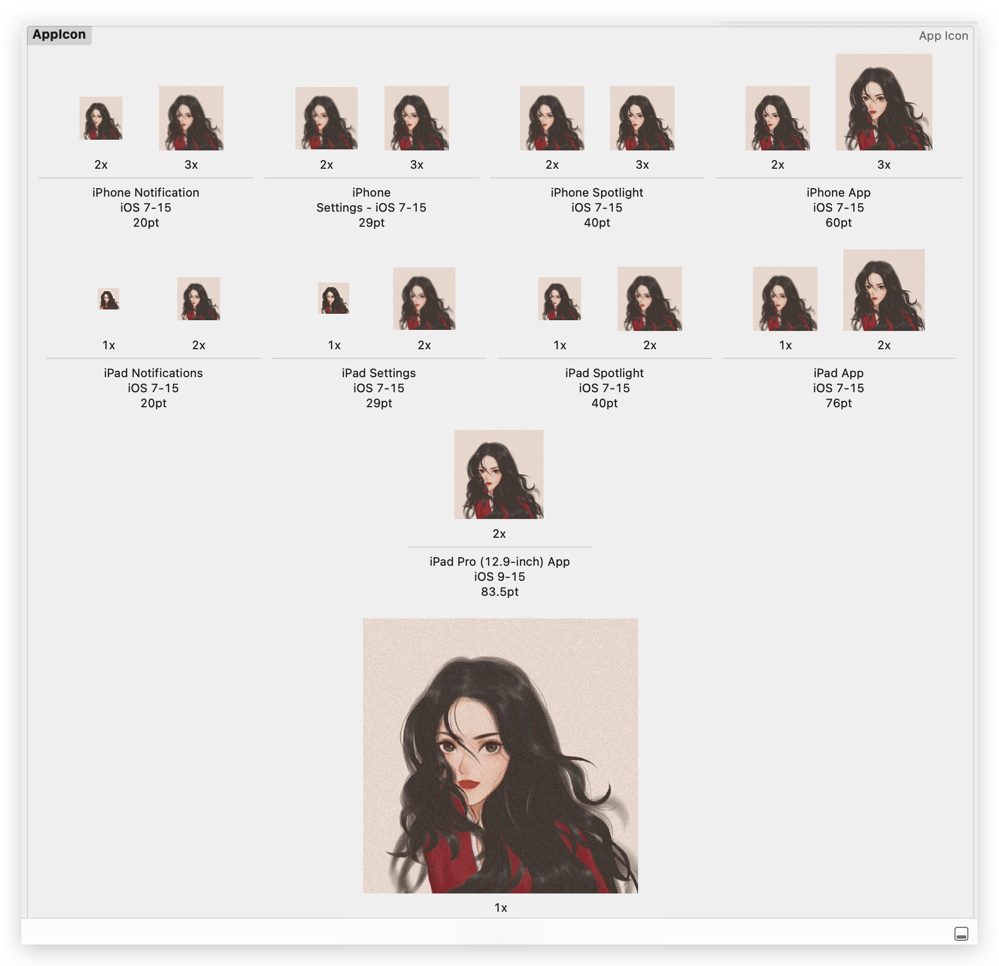
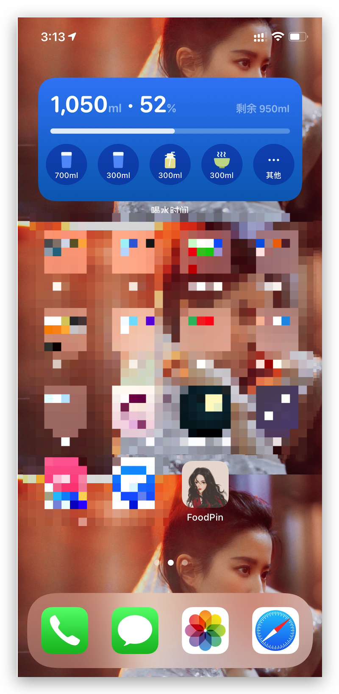

This chapter, we will deploy our app to a read device! Isn't that cool? BTW, we'll use chapter25's project for this chapter.

There four things we need to do before deploying:

* Request your development certificate
* Create an App ID for your app
* Configure your device for development
* Create a provisioning profile for your app

# Automatic Signing in Xcode

For 1,2 and 4 things, Xcode automatically did that for us. Select *FoodPin* -> *FoodPin* in Target-> *Signing & Capabilities*, we will find the *Automatically manage signing* is enabled by default.

Now, connect our device via USB, select it in the simulator.Go to `Signing & Capabilities` and add a account to the *Team*.Use our own Apple ID.

---

My device is iPhone 12 Pro, iOS 14.8. macOS 10.15.7 -> Xcode 11.3 This version's Xcode can't identify my iPhone, so I have to use my friends.

---

By using Zhiqi Chen's Mac, run in a real device successfully!!! So Cooooooooool~~!!!!!!

# Deploying the App over Wi-Fi

This one is easy. Just connect our device to mac, in Xcode, choose *Window*->*Devices and Simulators*, check *Connect via network*.Then, disconnect. We can deploy the app over Wi-Fi now.Oh, remember to connect Mac and iPhone in the same network.

# DIY

Let's make the app icon now! In the [website](https://icon.wuruihong.com/icon?utm_source=EJ3vGyMh#/ios), generate the icons using our own image, and drag them to the corresponding place~

So beautiful!~~:-D

Also, I make the Launch Screen stay longer by adding `sleep(3)` in `AppDelegate.swift` 's `func application(_ application, didFinishLaunchingWithOptions) -> Bool` method.

