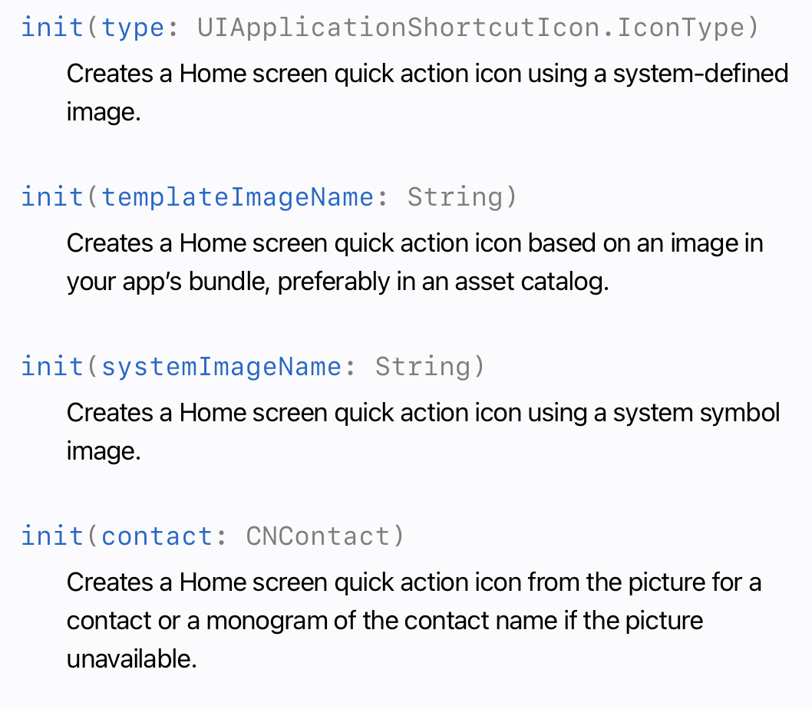
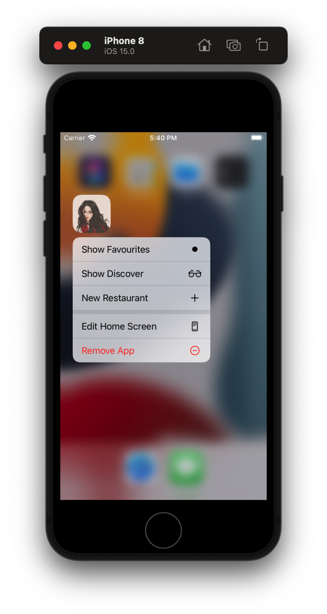
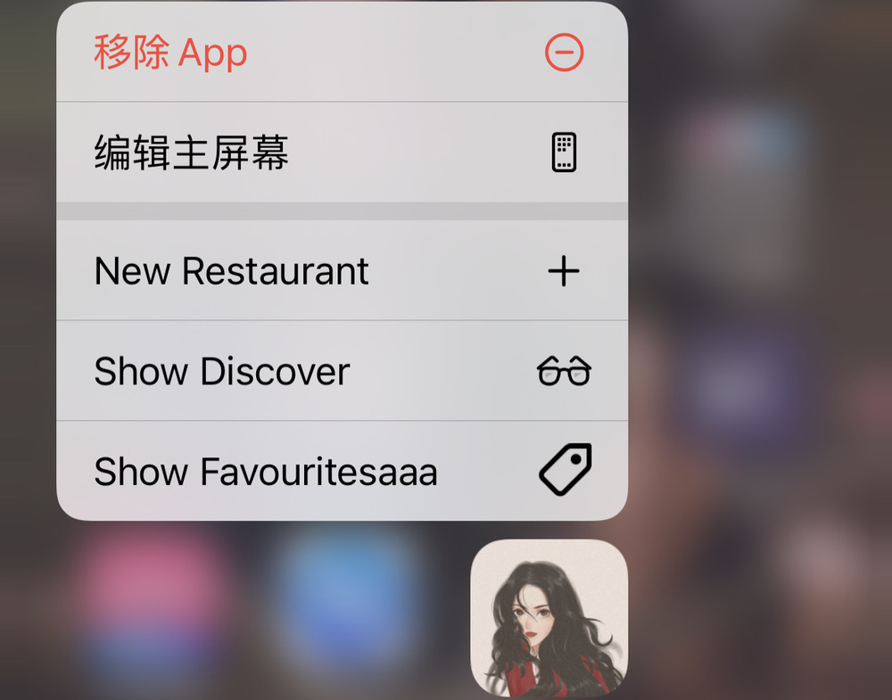
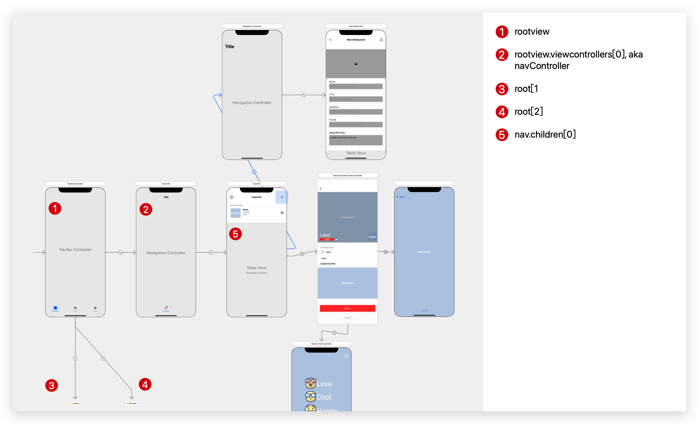
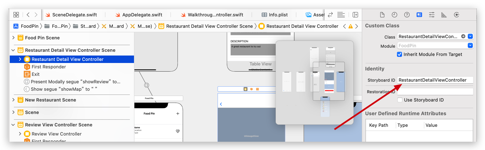
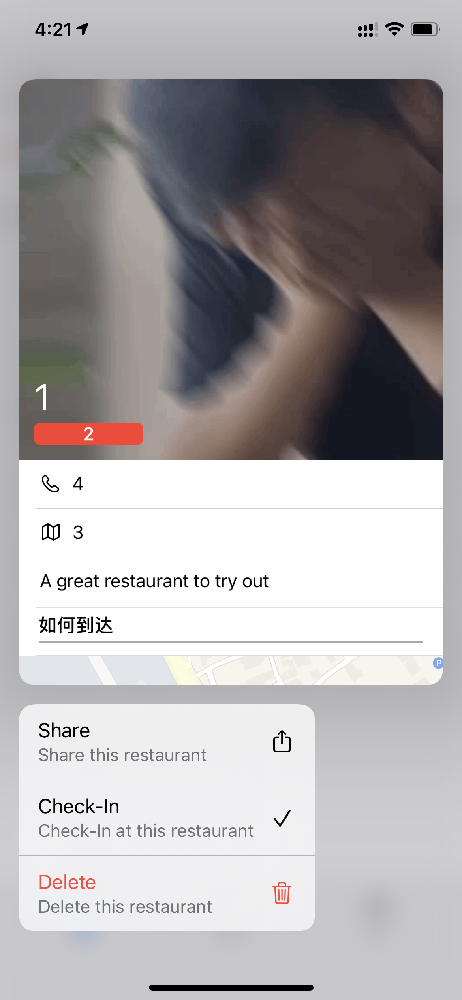
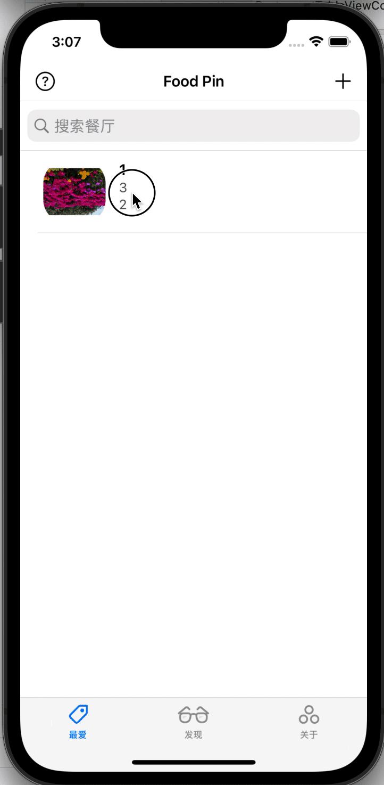
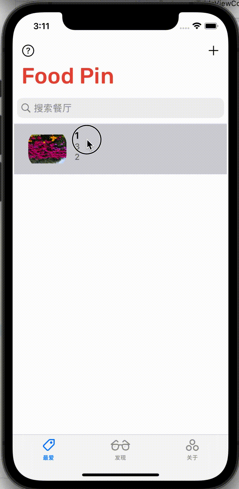

# Quick Actions

There two types of *Quick Actions*: *Static* and *Dynamic*.As the name suggests: the former is static and hardcoded in the `Info.plist`.  The latter can be updated at runtime.

For a quick action, there are five properities:

> * **UIApplicationShortcutItemType **(required) - a unique identifier used to identify the quick action. It should be unique across all apps. So a good practice is to prefix the identifier with the app bundle ID (e.g. com.appcoda.).
> * **UIApplicationShortcutItemTitle** (required) - the name of the quick action visible to the user.
> * **UIApplicationShortcutItemSubtitle** (optional) - the subtitle of the quick action. It is an optional string displayed right below the title of the quick action.
> * **UIApplicationShortcutItemIconType** (optional) - an optional string to specify the type of an icon from the system library. 
> * **UIApplicationShortcutItemIconFile** (optional) - if you want to use your own icon, specify the icon image to use from the app's bundle. Alternatively, specify the name of the image in an asset catalog. 
> * **UIApplicationShortcutItemUserInfo** (optional) - an optional dictionary containing some extra information you want to pass. For example, one use for this dictionary is to pass the app version.

Insert following code in `WalkThroughViewController`

```sw
//MARK: - QuickAction
    func createQuickAction(){
        if traitCollection.forceTouchCapability == UIForceTouchCapability.available{
            if let bundleIdentifier = Bundle.main.bundleIdentifier{
                let shortcutItem1 = UIApplicationShortcutItem(type: "\(bundleIdentifier).OpenFavourites", localizedTitle: "Show Favourites", localizedSubtitle: nil, icon: UIApplicationShortcutIcon(templateImageName: "favourite"), userInfo: nil)
                
                let shortcutItem2 = UIApplicationShortcutItem(type: "\(bundleIdentifier).OpenDiscover", localizedTitle: "Show Discover", localizedSubtitle: nil, icon: UIApplicationShortcutIcon(templateImageName: "discover"), userInfo: nil)
                let shortcutItem3 = UIApplicationShortcutItem(type: "\(bundleIdentifier).NewRestaurant", localizedTitle: "New Restaurant", localizedSubtitle: nil, icon: UIApplicationShortcutIcon(type: .add), userInfo: nil)
                UIApplication.shared.shortcutItems = [shortcutItem1,shortcutItem2,shortcutItem3]
            }
        }
    }
```

1. `traitCollection`:The traits, such as the size class and scale factor, that describe the current environment of the object.描述物体当前环境的特征，如尺寸类别和比例因子。

   If the device support 3D touch, then `forceTouchCapability` will be set to `UIForceTouchCapability.available`.

2. `UIApplicationShortcutIcon(templateImageName`:

   

   Call this method after `UserDefaults.standard.set(true, forKey: "hasVisitedWalkThrough")` so that user can only see the quick action after walkthrough.

   BTW, if we don't call this method, quick action still works. The reason lies in line 9.

   

   <font color = "red">Note:</font> By far this feature only works in devices that support 3D-touch, regardless simulator or real devices.

---

I tried to figure out how to implemente *Haptic Touch* , but found that Apple did not provide API like `shortcutItems`. ~~Instead, we need to replace it with API `context menu`.~~

~~Actually, the tutorial mentioned this on the previous part of this chapter:~~

> ~~If you've used 3D Touch before, Peep and Pop is a very nice feature that gives users a quicker access to the app's contents. In iOS 13, this feature is replaced by Context Menus. It's very similar to Peep and Pop but with an instant access to a list of action items. What's more is that Context Menus work on all devices running on iOS 13 (or later).~~

~~So, let's complete this chapter first and implemente the quick actions by *Context Menu*.~~

Following the official [guide](https://developer.apple.com/documentation/uikit/menus_and_shortcuts/add_home_screen_quick_actions/), we found that if we want to implement *Haptic Touch*, we must add the shortcuts in SceneDelegate.swift's `sceneWillResignActive`. And here comes the strange thing: when I first test this action menu in October 1st, 3D Touch works even if I did not implement the code in SceneDelegate.But we can't renew the menu's information unless we delete the app and load again.

But today, October 5th, if I just implement the code in `WalkthroughViewController` , there will not be any Quick Actions unless implement in `SceneDelegate.swift`. Besides, the Quick Action can be renewed now.............



---

Now, let's go back to the tutorial.By far, what we've implemented is adding Qucik Action menu, haven't implemented any functions. When the app is loaded and user selected a quick action, the method `windowScene(_:performActionFor:completionHandler:)` in `SceneDelegate.swift`will be called.

First, let's declare an enum 

```sw
    enum QuickAction: String{
        case OpenFavourites = "OpenFavourites"
        case OpenDiscover = "OpenDiscover"
        case NewRestaurant = "NewRestaurant"
        
        init?(fullIdentifier: String){
            guard let shortcutIdentifier = fullIdentifier.components(separatedBy: ".").last else{
                return nil
            }
            
            self.init(rawValue: shortcutIdentifier)
        }
    }
```

> 在swift的枚举类型中，有成员值、哈希值以及原始值（rawValue）。其中，成员值即为上面的OpenFavourites等，注意<font color = "red">成员值并不是整型的，仅仅只是代表一个符号</font>。字符串的实际内容即为原始值。而哈希值则是编译器用来指代成员值的值，实际上也是个整数。[ref](https://blog.csdn.net/super_lee2013/article/details/47626427)

* `.components`: used for separated, excluding the `separatedBy`.

* <font color = "red">guard</font>:

  > 与if语句相同的是，guard也是基于一个表达式的布尔值去判断一段代码是否该被执行。与if语句不同的是，guard只有在条件不满足的时候才会执行这段代码。你可以把guard近似的看做是Assert，但是你可以优雅的退出而非崩溃。[ref](https://www.jianshu.com/p/3a8e45af7fdd)
  >
  > A `guard` statement is used to transfer program control out of a scope if one or more conditions aren’t met.

* `init?`:

  > 有时候我们需要定义一个可失败的类、结构体或者枚举的初始化方法；失败的情况可能由无效的初始化参数值、缺少所需的外部资源或者一些其它阻止初始化成功的情况触发。
  > 比如：人的头发数量比如大于等于一，如果传进来的参数是负值，那就可以触发初始化失败。
  > <font color = "red">可失败的初始化方法创造了一个初始化对象的可选型(option)</font>
  >
  > [ref](https://www.jianshu.com/p/61fb73de4fcd)

* `init(rawValue: shortcutIdentifier)`: IMU, the initinal `init` func of enum type.

Then, declare a func for `windowScene`'s completionHandler.

```sw
private func handleQuickAction(shortItem: UIApplicationShortcutItem)-> Bool{
        let shortcutType = shortItem.type
        
        guard let shortIdentifier = QuickAction(fullIdentifier: shortcutType) else{
            return false
        }
        
        guard let tabController = window?.rootViewController as? UITabBarController else{
            return false
        }
        
        switch shortIdentifier {
        case .OpenFavourites:
            tabController.selectedIndex = 0
        case .OpenDiscover:
            tabController.selectedIndex = 1
        case .NewRestaurant:
            if let navController = tabController.viewControllers?[0]{
                let restaurantTableViewController = navController.children[0]
                restaurantTableViewController.performSegue(withIdentifier: "addRestaurant", sender: restaurantTableViewController)
            }
            else{
                return false
            }
        }
        
        return true
    }
```

1. Why the switch statement has dot statement? This is because these dot are not rawValue but 成员值, the full name is `QuickAction.openFavourites`.

2. For the relation between views, see the graph blow:

   

<font color = "red">Question1:</font> <span jump id = "q1">In my test</span>, the shortcut "New Restanrant" works only when the app is loaded. So how can a quick perform segue when the app is not loaded?

---

# Context Menu

To create a contect menu, we can adopt two methods:`tableView(_:contextMenuConfigurationForRowAt:point:)` and `tableView(_:willPerformPreviewActionForMenuWith:animator:)`. The formor is used to configure the details of the context menu like action items and the view controller for previewing the content.The latter controls what to be performed when the preview is tapped as its name looks like.

Add these:

```sw
override func tableView(_ tableView: UITableView, contextMenuConfigurationForRowAt indexPath: IndexPath, point: CGPoint) -> UIContextMenuConfiguration? {
        let configuration = UIContextMenuConfiguration(identifier: indexPath.row as NSCopying, previewProvider: {
            guard let restaurantDetailViewController = self.storyboard?.instantiateViewController(withIdentifier: "RestaurantDetailViewController") as? RestaurantDetailViewController else{
                return nil
            }
            let selectedRestaurant = self.restaurants[indexPath.row]
            restaurantDetailViewController.restaurant = selectedRestaurant
            return restaurantDetailViewController
        }) { actions in
            
            //check in
            let checkInAction = UIAction(title: "Check-In", image: UIImage(systemName: "checkmark"), discoverabilityTitle: "Check-In at this restaurant" ){ action in
                let cell = tableView.cellForRow(at: indexPath) as! RestaurantTableViewCell
                self.restaurants[indexPath.row].isVisited = !self.restaurants[indexPath.row].isVisited
                cell.thumbnailImageView.isHidden = !self.restaurants[indexPath.row].isVisited
            }
            //delete action
            let deleteAction = UIAction(title: "Delete", image: UIImage(systemName: "trash"), discoverabilityTitle: "Delete this restaurant", attributes: .destructive , state: .off ){action in
                if let appDelegate = (UIApplication.shared.delegate as? AppDelegate){
                    let context = appDelegate.persistentContainer.viewContext
                    let restaurantToDelete = self.fetchResultController.object(at: indexPath)
                    context.delete(restaurantToDelete)
                    appDelegate.saveContext()
                }
                
            }
            //shareAction
            let shareAction = UIAction(title: "Share", image: UIImage(systemName: "square.and.arrow.up"), discoverabilityTitle: "Share this restaurant"){action in
                let defaultText = NSLocalizedString("Just Checking in at ",comment: "Just Checking in at ") + (self.restaurants[indexPath.row].name ?? "")
                let activityController : UIActivityViewController
                if let restaurantImage = self.restaurants[indexPath.row].image, let imageToShare = UIImage(data: restaurantImage as Data){
                    activityController = UIActivityViewController(activityItems: [defaultText, imageToShare], applicationActivities: nil)
                }
                else{
                    activityController = UIActivityViewController(activityItems: [defaultText], applicationActivities: nil)
                }
                //for iPad
                if let popoverController = activityController.popoverPresentationController{
                    if let cell = tableView.cellForRow(at: indexPath){
                        popoverController.sourceView = cell
                        popoverController.sourceRect = cell.bounds
                    }
                }
                
                self.present(activityController, animated: true, completion: nil)
            }
            
            return UIMenu(title: "", children: [shareAction, checkInAction, deleteAction])
        }
        
        return configuration
    }
```

Easy to understand. The only thing we need to pay attention to is that <font color = "red">do not forget to set the identifier of `RestaurantDetailViewController`!!!</font>Otherwise the app will crash when we try to preview certain restaurant.



Result:



# Tap to preview

Add these code:

```sw
override func tableView(_ tableView: UITableView, willPerformPreviewActionForMenuWith configuration: UIContextMenuConfiguration, animator: UIContextMenuInteractionCommitAnimating) {
        
        guard let selectRow = configuration.identifier as? Int else{
            print("Fail to get the row number")
            return
        }
        
        guard let restaurantDeatilViewController = self.storyboard?.instantiateViewController(withIdentifier: "RestaurantDetailViewController") as? RestaurantDetailViewController else{
            return
        }
        
        let selectRestaurant = self.restaurants[selectRow]
        restaurantDeatilViewController.restaurant = selectRestaurant
        
        animator.preferredCommitStyle = .pop
        animator.addCompletion {
            self.show(restaurantDeatilViewController, sender: self)
        }
    }
```

If we use `.dismiss` in line 15, the detailview will show after the context menu disappears.



If we use `.pop` instead, we will get animation like this, which is expected:



# LaunchScreen Image

I tried to change the launch screen image, but failed in real device while succeeding in simulator.After looking up a [post](https://developer.apple.com/forums/thread/19759) six years age, I create a new folder and copy all the image folders to the new folder, rename the folder to `Assets.xcassets`, the it works in read devices~ Great!!!


# To Do

- [ ] [Question1](#q1)
- [x] If I change the launch screen image, it doesn't work in real device while works in simulators🤦‍♂️