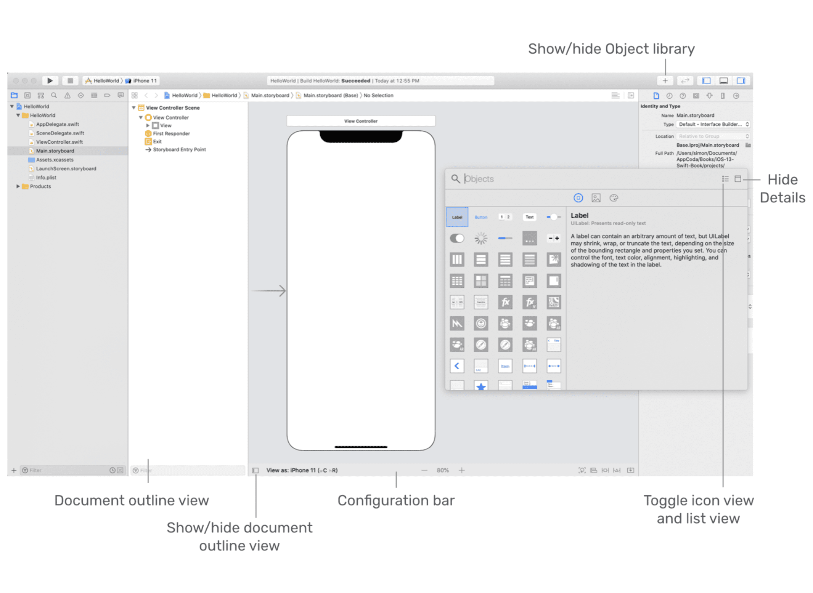
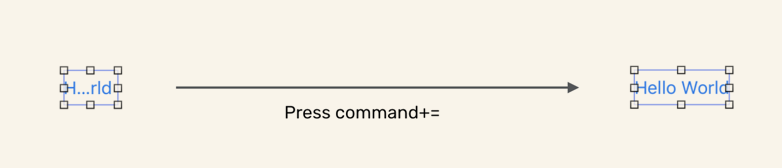

This chapter uses _Single View Application_ to develop the first simple iOS app.

# Main.storyboard

layout as follows:

* Each screen of an app is usually represented by a view controller.
* views are the basic building blocks for creating your user interface.
* A view controller is designed to manage its associated view and subviews (e.g. button and label).
* A scene in storyboard represents a view controller and its views.

# Get Started

* Use `cmd`+`=` to auto-resize one object like a button

  

