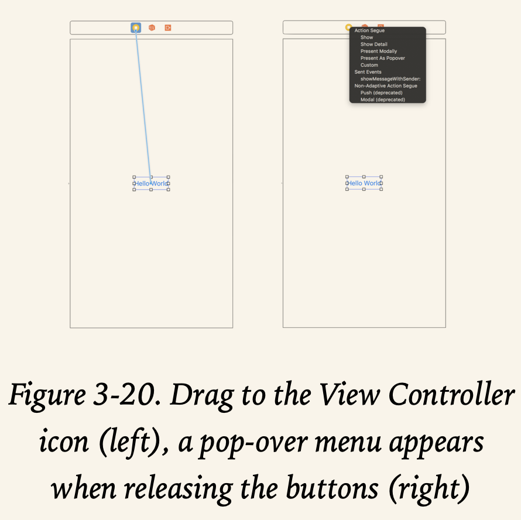
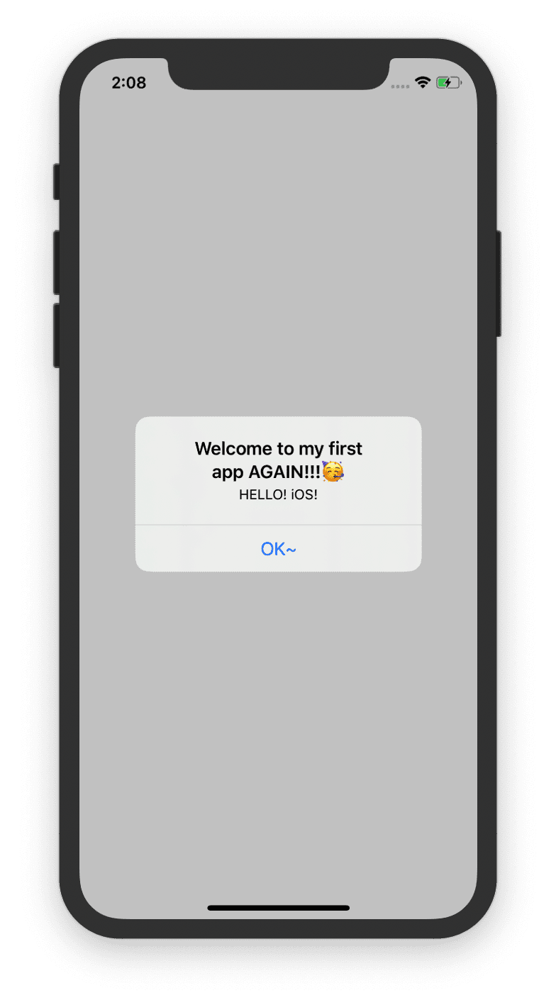
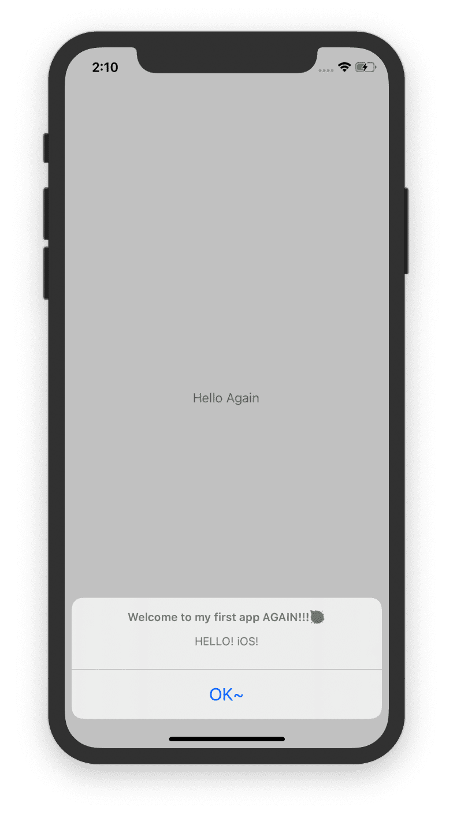

This chapter uses _Single View Application_ to develop the first simple iOS app.

# Main.storyboard

layout as follows:


* Each screen of an app is usually represented by a view controller.
* views are the basic building blocks for creating your user interface.
* A view controller is designed to manage its associated view and subviews (e.g. button and label).
* A scene in storyboard represents a view controller and its views.


# Get Started

* Use `cmd`+`=` to auto-resize one object like a button

  

* Code in the file `ViewController` to design the button action

  ```sw
  @IBAction func showMessage(sender:UIButton){
          //指示框的标题、内容
          let alertController = UIAlertController(title: "Welcome to my first app AGAIN!!!🥳", message: "HELLO! iOS!", preferredStyle: UIAlertController.Style.alert)
          //指示框的动作
          alertController.addAction(UIAlertAction(title: "OK~", style: UIAlertAction.Style.default, handler: nil))
          //暂时不晓得，激活动画？
          present(alertController,animated: true,completion: nil)
      }
  ```

* Since the code and the user interface are separated, we need to connect them. Back to the `Main.storyboard`, press and hold `control`, drag the button to the `View Controller` icon.

  

  Here comes the result:

  

---

* DIY TIME

  If I change the style `alert` to `actionSheet` in line3, the result will be like this:

  

---

* We can also change the color of the button. Select the button and then we will see.

  

