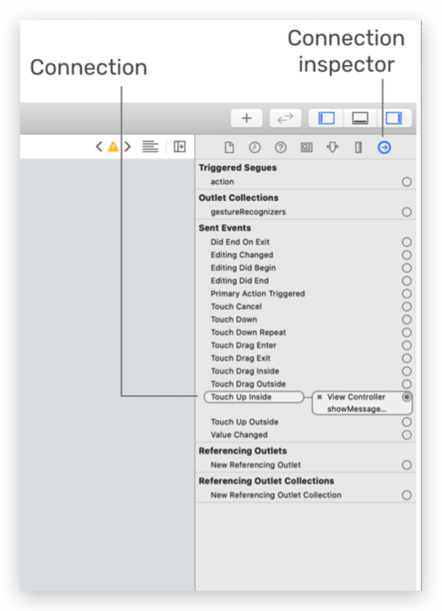
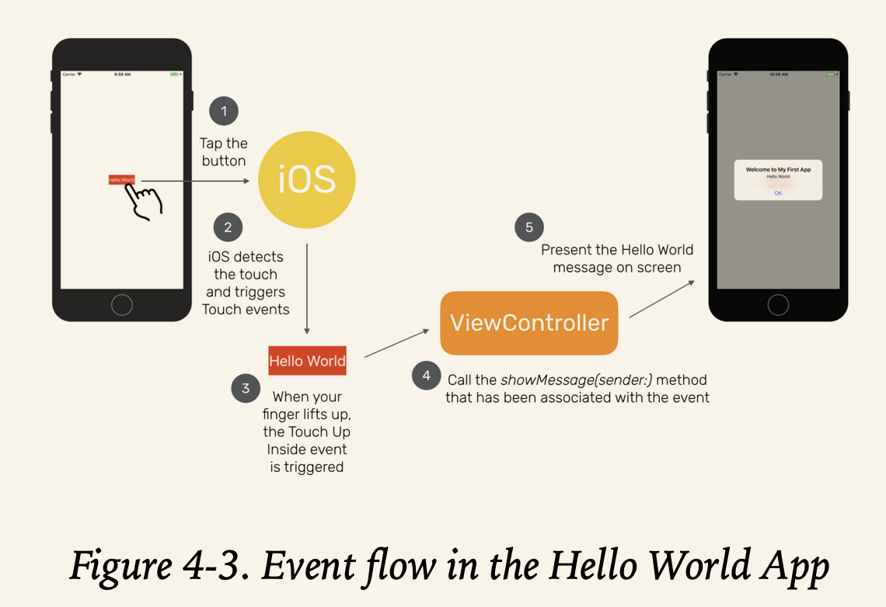
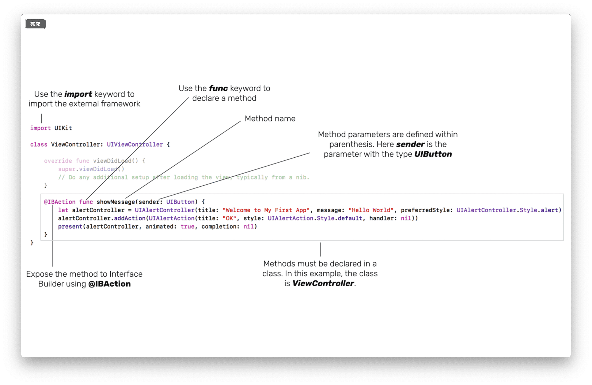
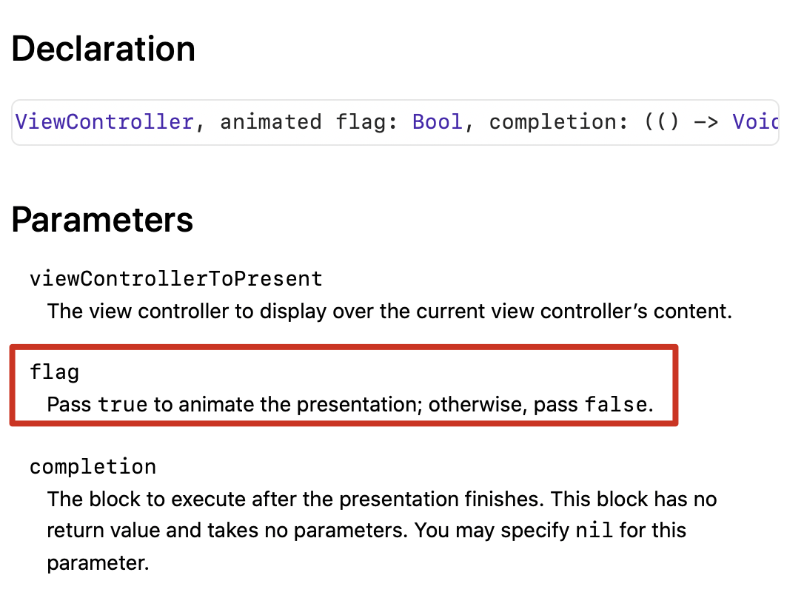
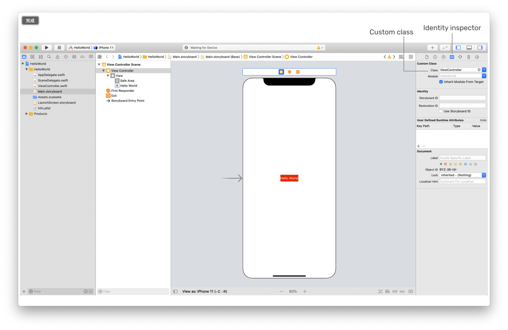
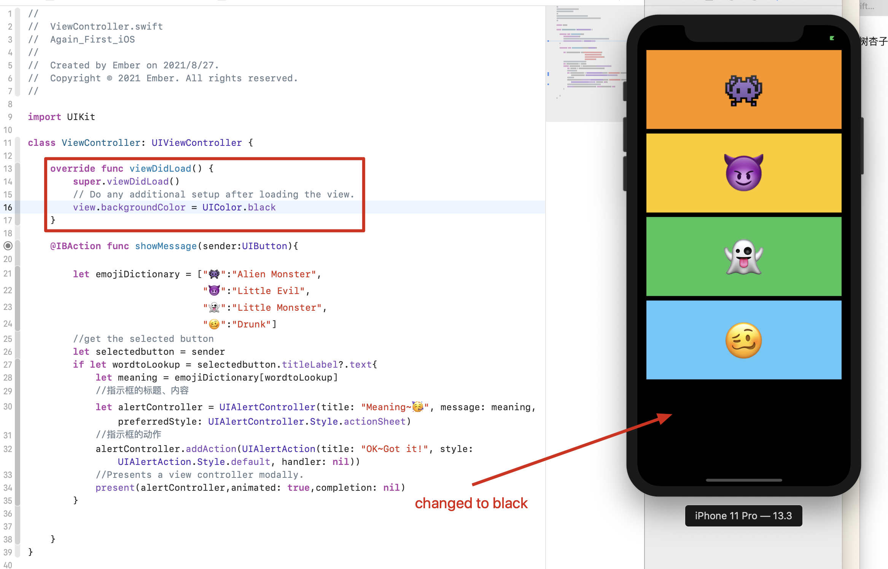

(I like the cover of this chapter~🥳)

# Event flow

* When we tap the button in the app, it sends a `showMessageWithSender` message to `ViewController`by invoking(唤起) the `showMessage(sender:)` method.

---

Swift is an Object Oriented Programming Language(“熟悉”的OO啊～)

---

* When we click the `Connection inspector` icon, we will see a list of available events and its corresponding method to call.

  

* Event Flow:

  

# showmessage

* @IBAction:

  > This keyword allows you to connect your source code to user interface objects in Interface Builder( which is story in other words). When it is inserted in the method declaration, it indicates the method can be exposed to Interface Builder. This is why the showMessageWithSender event appeared in a pop-over when you established the connection between the Hello World button and the code in chapter 3. 

* UIKit Framework: provides classes and functions to construct and manage your app's user interface.

* `let alertController = UIAlertController(title: "Meaning~🥳", message: meaning, preferredStyle: UIAlertController.Style.alert)`: this line  creates a `UIAlertController` object, and store it in `alertController`, therefore we have dot synax in the following lines.

* How to find out the usage of a class/function? Press `option` and click them~~~🥳

  And because of this , I find out the answer of chapter3's to do:

  

  `present()` func will ask the current view controller to display the `alertController` with animation(动画)

  > Sometimes, you may see some developers write the above line of code like this:
  >
  > `self.present(alertController, animated: true, completion: nil)`
  >
  > In Swift, you use the self property to refer to the current instance (or object). In most cases, the self keyword is optional. So you can omit it.

# Relationship Between User Interface and Code

Have you ever wonder, how does Xcode know that the View Controller in Interface Builder links up with the `ViewController` class defined in `ViewController.swift` ?

The reason is that when creating this project, we chose the template *Single View Application*.Then, the `ViewController` is automatically linked with the `ViewController` class defined in`ViewController.swift`

Check it like this:

# UIViewController

* UIViewController

  > We are not writing everything from scratch

  The line `class ViewController: UIViewController` means creating a new class `ViewController` that **extends** from `UIViewController`.Not unfamiliar, right? `UIViewController` is the fundamental building block in most iOS app, and has an empty view by default.

* viewDidLoad()

  In short, used for initialization. Easy to understand.Here is an example:

  

> Say, when a user clicks the home button to go back to the Home screen, the viewWillDisappear and viewDidDisappear methods will be automatically called.

Thought of sth? Yes! Auto locked!