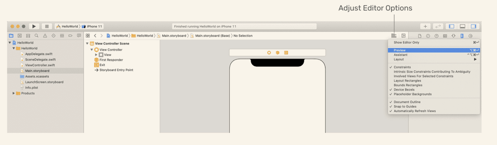

# Auto Layout

First, let's review the code we have learnt in the previous chapters.

```sw
@IBAction func showmessage(sender:UIButton){
	let alertcontroller = UIAlertController(title : "HELLO~", message : "Welcome TO Auto Layout!", preferredStyle : UIAlertController.Style.alert)
	
	alertcontroller.addAction(UIAlertAction(title : "OK~", style:UIAlertAction.Style.default, handler:nil))
	
	present(alertcontroller,animated:true,completion:nil)
}
```

I must code those lines by myself!

# Auto Layout Bar

Here is the button at the bottom-right corner of StoryBoard:


* **Align** : Create alignment constraints, such as aligning the left edges of two views.

* **Add new constraints** : Create spacing constraints, such as defining the width of a UI control.

* **Resolve auto layout issues** : Resolve layout issues.

* **Stack** : Embed(嵌入) views into a stack view. We will further discuss it in the next chapter.

* **Update frames** : Update the frame's position and size in reference to the given layout constraints.

To make the button positioned in the center of the whole screen regardless of screen size and orientation, here comes the steps:

1. click the button

2. click `Align`

   

3. click the `Horizontally ...` and `Vertically ...`

4. click `Add Constraints`

   Then , we will see the result like this:

   

> When your view layout is being configured correctly and there is no ambiguity, the constraint lines are in blue.
>

* issue fixing

If we drag the button to other place, thhe constraint lines will change to orange and a disclosure arrow will appear:


click the arrow, we will see the issue


Alternatively, we can just click the `Update Frame` button to fix the issue.

Besides above, I also tried the button `Resolve auto layout issues` as follow:


The meaning is easy to guess.

* An alternative way to preview storyboard:



use `+` button to add another device preview.


