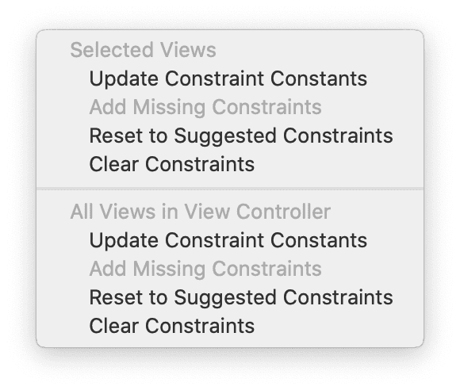
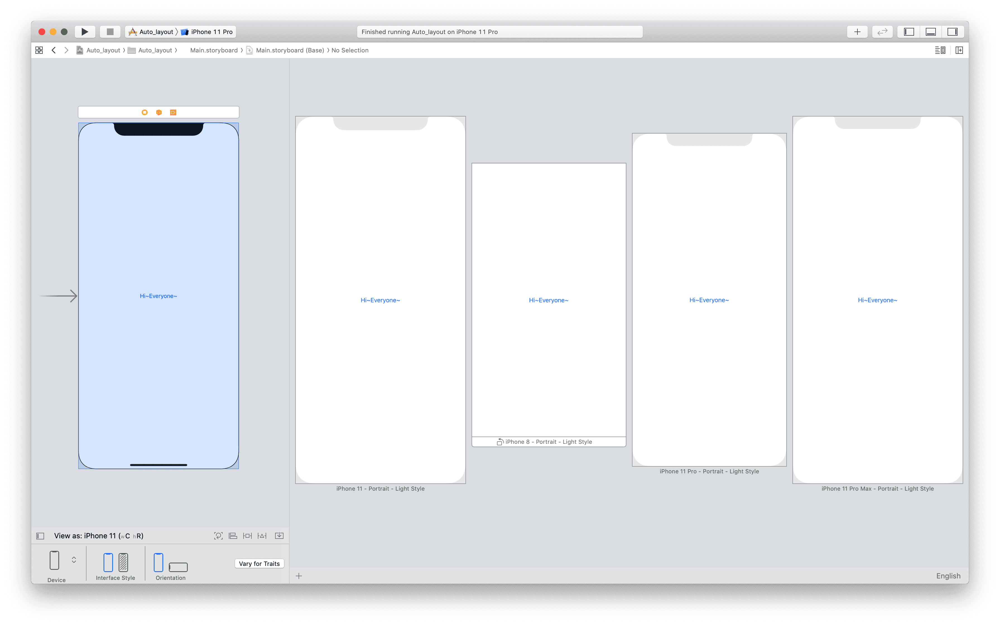
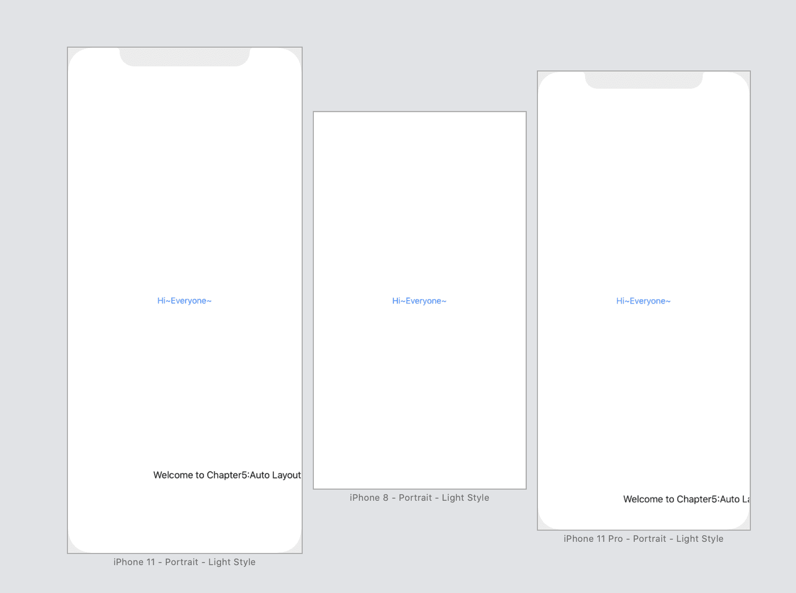
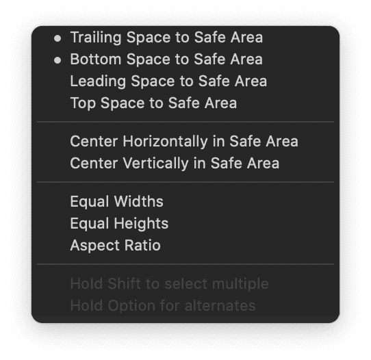
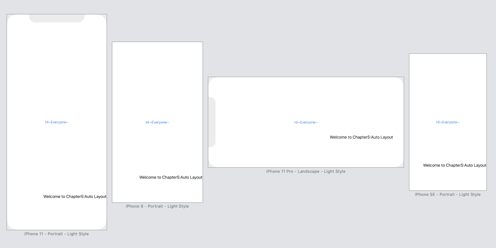

# Auto Layout

First, let's review the code we have learnt in the previous chapters.

```sw
@IBAction func showmessage(sender:UIButton){
	let alertcontroller = UIAlertController(title : "HELLO~", message : "Welcome TO Auto Layout!", preferredStyle : UIAlertController.Style.alert)
	
	alertcontroller.addAction(UIAlertAction(title : "OK~", style:UIAlertAction.Style.default, handler:nil))
	
	present(alertcontroller,animated:true,completion:nil)
}
```

I must code those lines by myself!

# Auto Layout Bar

Here is the button at the bottom-right corner of StoryBoard:


* **Align** : Create alignment constraints, such as aligning the left edges of two views.

* **Add new constraints** : Create spacing constraints, such as defining the width of a UI control.

* **Resolve auto layout issues** : Resolve layout issues.

* **Stack** : Embed(嵌入) views into a stack view. We will further discuss it in the next chapter.

* **Update frames** : Update the frame's position and size in reference to the given layout constraints.

To make the button positioned in the center of the whole screen regardless of screen size and orientation, here comes the steps:

1. click the button

2. click `Align`

   

3. click the `Horizontally ...` and `Vertically ...`

4. click `Add Constraints`

   Then , we will see the result like this:

   

> When your view layout is being configured correctly and there is no ambiguity, the constraint lines are in blue.
>

* issue fixing

If we drag the button to other place, thhe constraint lines will change to orange and a disclosure arrow will appear:


click the arrow, we will see the issue


Alternatively, we can just click the `Update Frame` button to fix the issue.

Besides above, I also tried the button `Resolve auto layout issues` as follow:



The meaning is easy to guess.

* An alternative way to preview storyboard:


use `+` button to add another device preview.



~~<font color = "red">Note:</font> click `show editor only` rather than clicking `~~

# Add a label and Constraints for it

>Labels in iOS are usually used for displaying simple text and messages.

If I add a new label `Welcome to Chapter5:Auto Layout` at the lower-right position, here comes the preview:



Obviously, we need to add some constraints to the label.

Needs:

1. The label is 0 points away from the right margin of the view
2. The label is 20 points away from the bottom margin of the view

This kind of constrains are *space constrains*, using `Add new constrains` button to create.This time, the tutorial uses *Control-drag* approach to apply auto layout.

# Control Drag

> In Interface Builder, you can control-drag from an item to itself or to another item along the axis(坐标轴) for which you want to add constraints.

Steps:

1. `control`+`drag` to the parent view until the view become blue

2. release, you'll see a pop-over menu.

   

3. The first one means the tail of safe area, i.e. the right margin. The third one means the left margin.

After these, the preview displays normally.



However, there is still an yellow warning, what's that?


I wonder I have created right and bottom constraints, which can confirm the position of label, why still say "Leading coonstraint is missing" ?

This is because when the language is right-to-left language(e.g. Arabic), current constraints won't work anymore. Use the mothod memtioned above (issue fixing) to fix it.


# Safe Areas

You can understand it as the area that is safe for designing.Generally, Safe Area is the whole screen excluding the top and bottom area.


Safe Areas can update themselves helping developers easier to work with layout constraints.


# Editing Constraints

Choose the constraint in the document outline view or just click certain constraint, than in the `Attribute inspector` or `Size inspector` menu, you can customize the distance. Or just double-click certain constraint, editing in the pop-over window.


# Exercise

Easy to complete.


# Summary

It's just the basics content of Auto-Layout above, the tutorial will explore more as digging deeper.