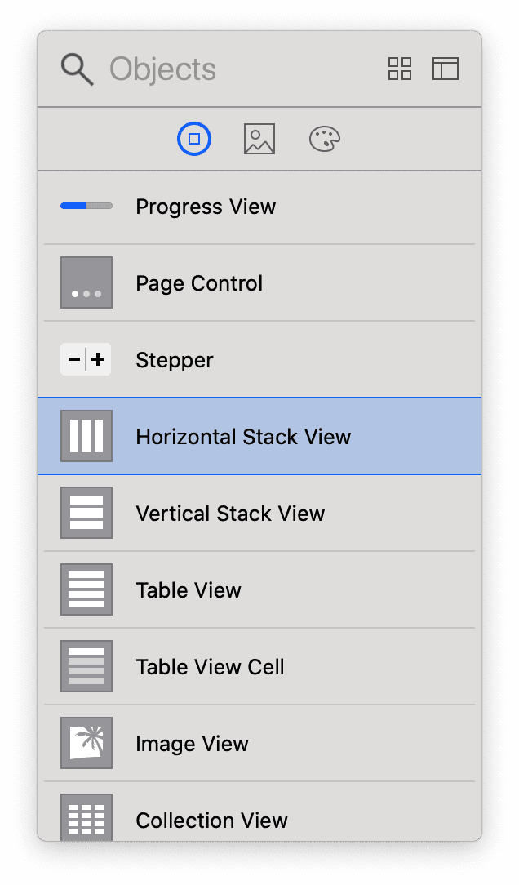
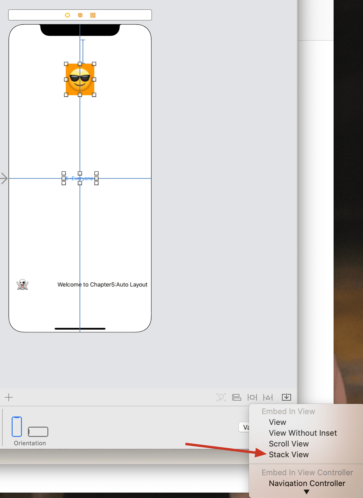
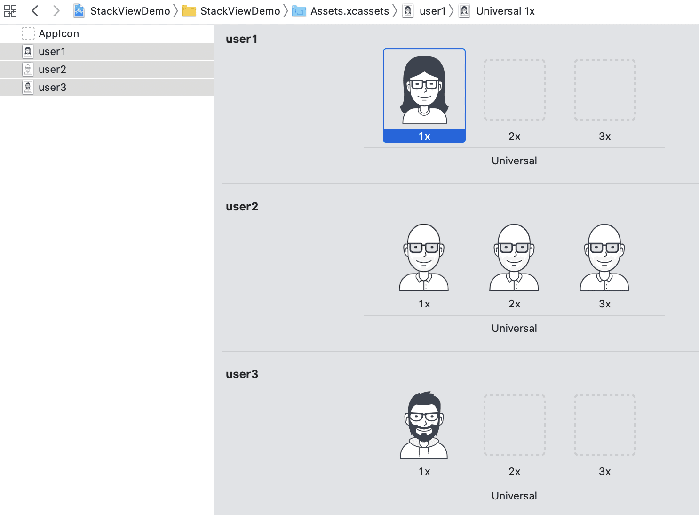
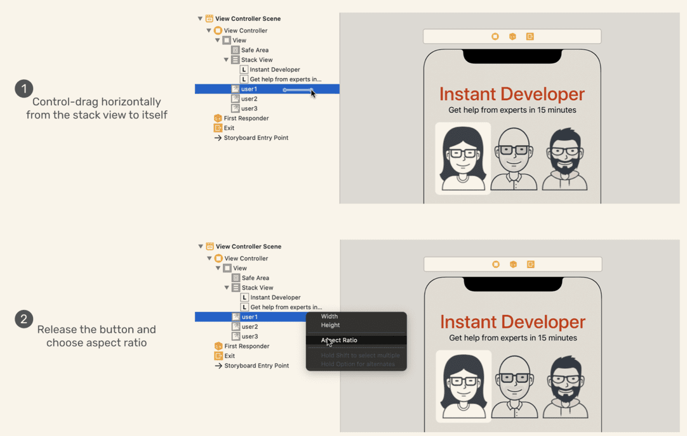

> To the user, the interface is the product.
>
> ---Aza Raskin

As our App UI become more complex, using auto-layout only is far from enough.So here comes the **Stack View**

# Stack View

> The stack view provides a streamlined interface for laying out a collection of views in either a column or a row

By using stack view, we can embed multiple UI objects into one.In other word, a stack is a set of object, where we design constraints inside (in my understanding).Besides, we can embed a stack view in another stack view.Therefore, we only need to define constraints for the subview(i.e. stackview).

There are two ways to use stack view.

1. Drag a stack from Library and add views(e.g. Label, Button and so on) into it.

2. Choose two or more views and then click stack view like this:

# Add images to your App

The folder *Assets.xcassets* is for managing images and icons used for your app.

Here are two concepts:

* raster image: understanded as no-vector image. Thus, we need to provide three different resolutions of images when using raster image, with suffix `@2x` `@3x`
* vector image:矢量图, knew before.

> Whenever possible, ask your designer to prepare the images in PDF format. 

When you need to add images to *Assert*, you can't just drag files to the files position in Finder, instead, you must drag files to Xcode `Set List` or `Set Viewer`, then Xcode will organize these sets automatically.

 

After this ,we just need to use the set of name , omitting the file extension.

# Get Started

Once we drag a view to a stack view, the stack view will automaticall resize itself to fit the view.

Now, there are many views stacking in the smae place, we may have problem selecting certain view. We can hold `Shift` and `Double-Click` to choose which one we want.Also, we can just choose in the document outline.

---

* properties of stack view

  

The following are the content of tutorial:

* The axis option indicates whether the arranged views should be layout vertically or horizontally. By changing it from vertical to horizontal, you can turn the existing stack view to a horizontal stack view.

* The alignment option controls how the arranged views are aligned. For example, if it is set to Leading, the stack view aligns the leading edge (i.e. left) of its arranged views along its leading edge.

* The distribution option defines the size and position of the arranged views. By default, it is set to Fill. In this case, the stack view tries its best to fit all subview in its available space. If it is set to Fill Equally, the vertical stack view distributes both labels equally so that they are all the same size along the vertical axis.

Sample:

---

When I put three views to the storyboard, I find that the no-vector image(user2) is more clear, funny😂

---

* Set the aspect ratio(宽高比):

`control-drag`  horizontally and then click `Aspect Ratio`(这操作属实把我惊呆了，不愧你是，)， then the aspect ratio is locked.Similarly, we can lock the width and height as well.

Note: After setting the aspect ratio, the width or height of the image may change, just leave it.

---

When we nest the Label stackview and image stackview into one stack view, make sure the `Alignment` is set to Fill , so that we the image stack view, which is set to `Fill` as well can automatically resize itself oon larger screen like iPad.

---

* add contraints to the stack view: top,leading and trailing.(50,10,10)
  1. use `control` + drag (myself)
  2. click `add new contraints`(tutorial, more simple)

---

By far, our layout works well in different meachines, except small screen like iPhone SE and 4s: the `Instant Developer` is truncated because of the width of screen.

And in landscape mode, the image is truncated as well

To fix the first problem, choose the label, and click` Autoshrink` -> `Minimun Font Size`, this tells Xcode to determine the suitable font size so that it can perfectly be displayed.