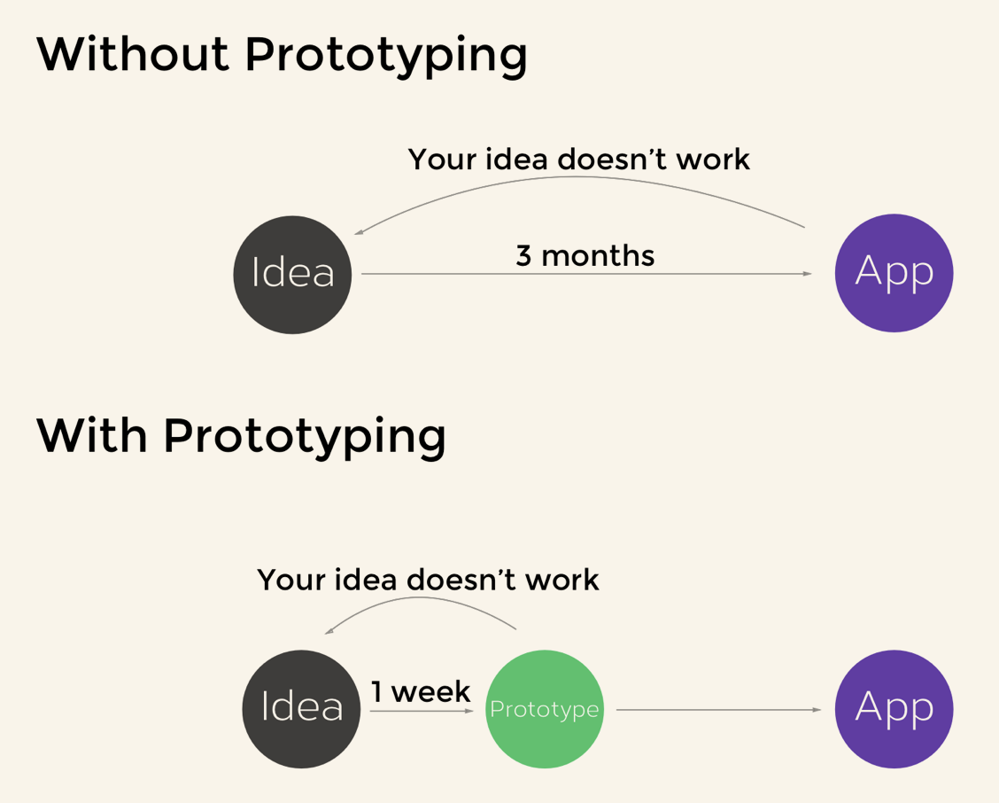

# Prototyping

> In the context of app development, a prototype can be an early sample of an app which is not fully functional and contains a basic UI or even sketches.

Advantage:

So, when you got an idea, sketch it on paper! You don't need to be an expert in drawing, you just need to visualize your main point.

# Tools you can choose

1. **[POP](https://marvelapp.com/pop/)**: can easily turn your hand drawings or wireframes into a working prototype. Besides, this iOS app can make your prototype interactive! What's more, POP can provide an share link for you to share your interactive prototype with your users or friends!
2. **[Sketch](https://www.sketch.com/pricing/)**:Reviews on the Internet of this App is not bad.But, as far as I know, it's a little bit expensive, emmmm..... so as **[Adobe Experience Design](https://www.adobe.com/hk_en/products/xd/pricing/individual.html)**......
3. **[Invision](https://www.invisionapp.com/plans)**: seems to be free
4. Keynote: Keynote大法好！I like this one! [Here](https://webdesign.tutsplus.com/tutorials/how-to-demo-an-ios-prototype-in-keynote--cms-22279) is a simple tutorial.

In a word:

> No matter if you are a solo developer or a member of a development team, I want you to start prototyping today. Rather than jumping right in to build an app, lay out your idea on paper first and build a simple demo using POP or other prototyping tools. This will save you a lot of time and money creating a product with no appeal.
>

