# Table View

After drag a *table view* to the storyboard and resize it to fill the whole *safe area*, we can set the value of `Prototype Celll`  in the *Attribute inspector* from 0 to 1 to generate a prototype cell.

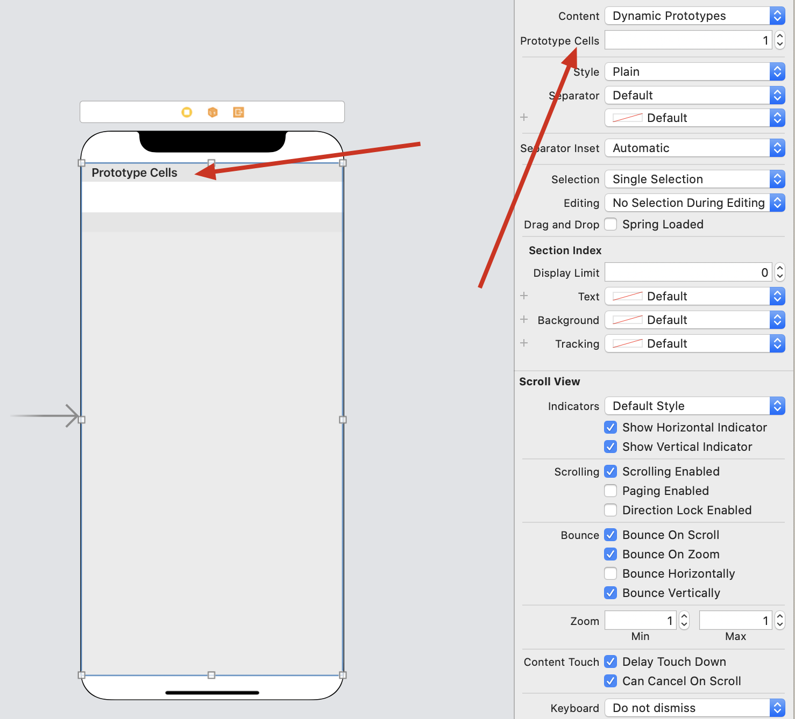

We can think *prototype cell* as a cell template so that we can resuse it in all the table cells, in other words, it's a place where you can put text or image(in my understanding).

Set the identifier to `datacell`, this is the<font color = "red"> unique key for identifying the prototype cell, which will be used in coding later.</font>

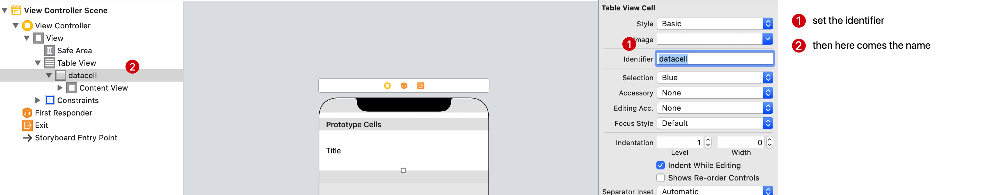

When I read to the autolayout part of tableview, I found sth new when practicing:

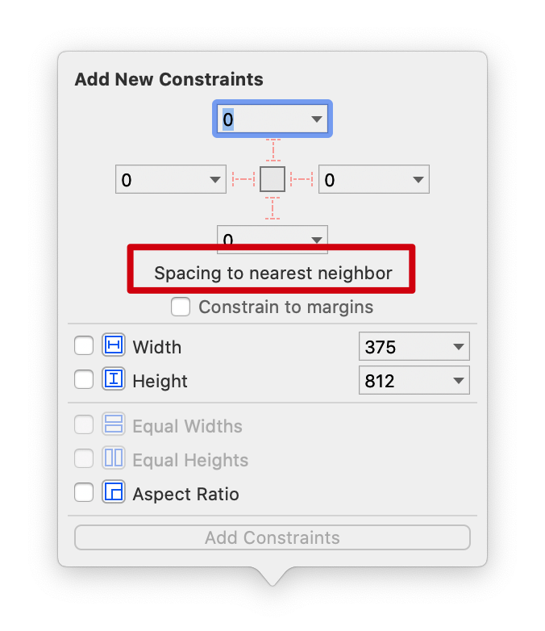

Found sth?<font color = "red">NEAREST!!!</font> This means that the default one is not `Safe Area`. Besides, I prefer the table fill in the whole screen area, so set the corresponding value of each constraint to `superview` like this graph:

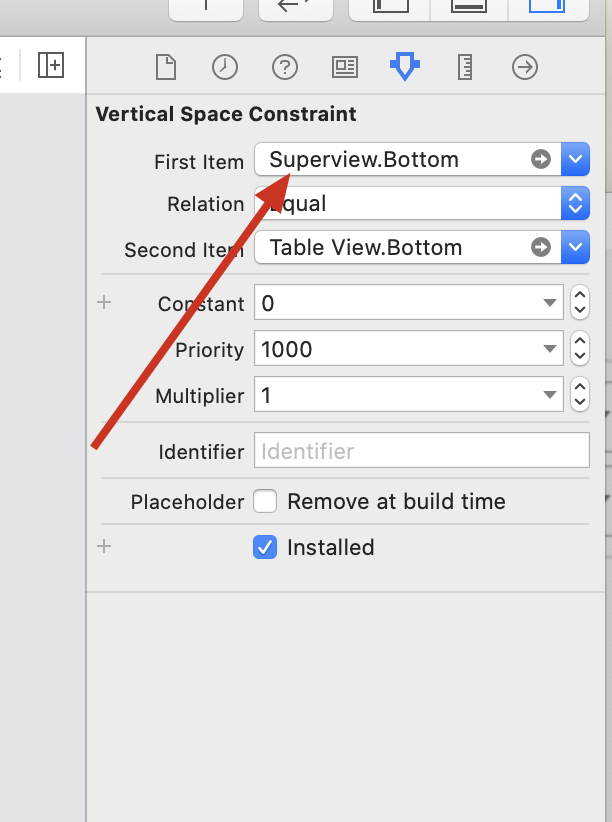

As for `Constrain to margins`, here are some answer from stackoverflow:

> 1. In iOS 8 you now have the option to define your constrains relative to a predefined margin to the superview's bounds, instead of the superview's bounds themselves. Yes, it is totally related to the layout margins you pointed to in the docs. One advantage is that you may redefine your margins dynamically, or differently for each kind of device, and the layout will be updated correspondingly without modifying the constraints.
>
>    When to use it: when you want to take advantage of this new flexibility.
>
>    When to NOT use it: for any app targeted to run on iOS 7 or below.
>
> 2. 如果你点了constrain to margins，左右会有8个点的空挡，而是从8个点后开始计算约束，而没有点时，已屏幕的0点开始计算。

# Protocols

Here, introducing two classes: `UITableViewDataSource` and `UITableViewDelegate`.The formmer provides the data information, while the latter provides the size (aka apperance) information of tableview. BTW, tableview belongs to class `UITableVIew`. The relation is as following:

<span jump id="relation">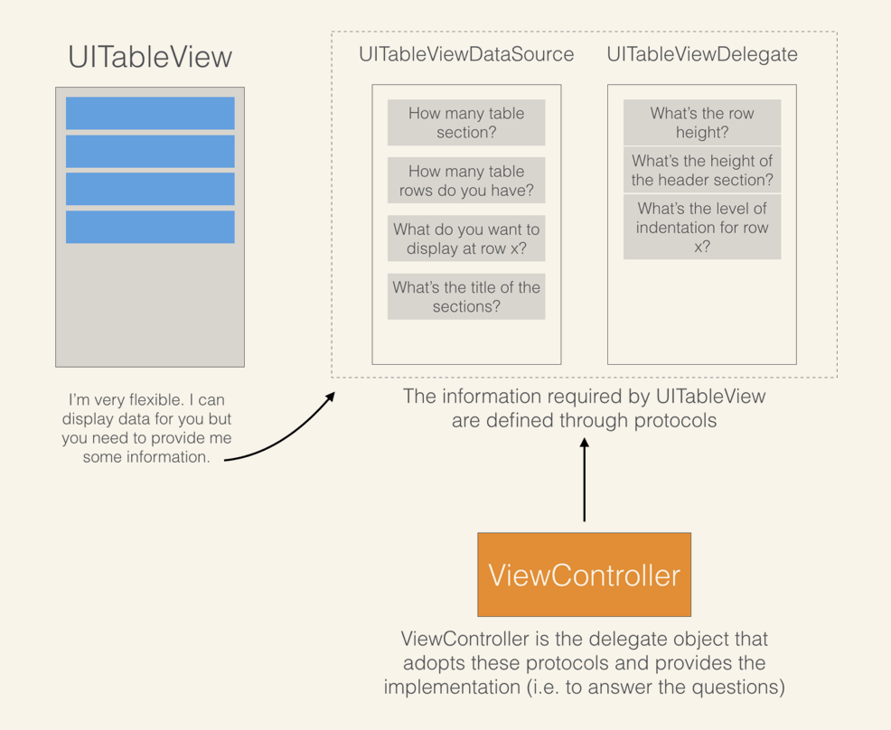</span>

Pay attention to the concept <font color = "red">delegation pattern</font>, it's very important in iOS programming.

Now, add these two behind the `UIViewController` in `ViewController.swift`, after fixing the error, the code will be like this:

```sw
class ViewController: UIViewController, UITableViewDataSource, UITableViewDelegate {
    func tableView(_ tableView: UITableView, numberOfRowsInSection section: Int) -> Int {
        <#code#>
    }
    
    func tableView(_ tableView: UITableView, cellForRowAt indexPath: IndexPath) -> UITableViewCell {
        <#code#>
    }
    

    override func viewDidLoad() {
        super.viewDidLoad()
        // Do any additional setup after loading the view.
    }


}
```

这部分得用中文写了：书上这部分代码看得我云里雾里的，主要还是swift语法方面的问题。直接上书上关于这部分的完整代码：

```sw
func tableView(_ tableView: UITableView, numberOfRowsInSection section: Int) -> Int {
    // Return the number of rows in the section.
    return restaurantNames.count
}

func tableView(_ tableView: UITableView, cellForRowAt indexPath: IndexPath) -> UITableViewCell {
    let cellIdentifier = "datacell"
    let cell = tableView.dequeueReusableCell(withIdentifier: cellIdentifier, for: indexPath)

    // Configure the cell...
    cell.textLabel?.text = restaurantNames[indexPath.row]

    return cell
}
```

有这么几个问题：

1. line1的下划线`_`怎么个意思？
2. 这两个函数的参数什么情况？怎么类型前面有两个名字？
3. `->`后面，是指函数返回值的类型？为什么不用类似于之前提到过的`@IBAction`形式？
4. IndexPath？
5. dequeueReusableCell，这个书上有解释，但没解释其参数语法

经过顺藤摸瓜般的搜索，最终找到了[这篇文章](https://www.jianshu.com/p/b355e2e389bb)，之后，一切变得豁然开朗了起来。

Swift的函数语法里，其函数定义时，会有两个参数名：外部参数名与内部参数名，如只有一个参数名，则说明内外部参数名同名。顾名思义，一个在调用的时候外部用，一个在函数内部用。调用的时候，<font color = "red">需要写上外部参数名，不得省略</font>，除非在定义的时候前面有下划线`_` ！如以下代码：

```sw
import UIKit

var str = "Hello, playground"

func join(s1: String, s2: String, joiner: String = " ") -> String {
    return s1 + joiner + s2
}
// call the function.
join(s1: "hello", s2: "world", joiner: "-")

func join2(_ s1: String, _ s2: String, joiner: String = " ") -> String {
    return s1 + joiner + s2
}
// call the function.
join2("hello", "world", joiner: "-")
```

附上上面那篇文章中的代码，每种情况写得都很清楚，点赞👍

```sw
import UIKit
class ViewController: UIViewController {
    override func viewDidLoad() {
        super.viewDidLoad()
        funcA(author: "CoderZb", LuckyNumbers: 15,hobby:"sing")// 写外部参数名author 、LuckyNumbers、hobby
        funcB(author: "zhangsan", LuckyNumbers: 18,hobby:"jump")// 写外部参数名author 、LuckyNumbers、hobby
        funcC("summer",7,"running")// 不用写外部参数名
        funcD("stone",LuckyNumbers:28,"eating")
        funcE(author:"rose",11,hobby:"swimming")
    }
    // 外部参数名和内部参数名不一样。调用者必须写上外部参数名
    func funcA(author param1:String = "bin",LuckyNumbers param2:Int = 0,hobby param3:String = "codeing"){// param1默认值为"bin",param2默认值为0
        print("funcA---author为 \(param1),LuckyNumbers为 \(param2),hobby为 \(param3)")
    }
    // 外部参数名和内部参数名一样，所以合二为一即可。调用者也必须写上这个合二为一的参数名
    func funcB(author :String = "bin",LuckyNumbers :Int = 0,hobby :String = "codeing"){
        print("funcB---author为 \(author),LuckyNumbers为 \(LuckyNumbers),hobby为 \(hobby)")
    }
    // 外部参数名为下划线 ,那么调用者不需要写外部参数名
    func funcC(_ param1:String,_ param2:Int = 0,_ param3:String = ""){
        print("funcC---author为 \(param1),LuckyNumbers为 \(param2),hobby为 \(param3)")
    }
    // funcD函数的第一个参数和第三个参数的外部参数名都为下划线，所以调用者的第一个参数和第三个参数都不用写外部参数名
    // funcD函数的第二个参数有外部参数名，也有内部参数名，所以调用者的第二个参数写外部参数名
    func funcD(_ param1:String,LuckyNumbers param2:Int = 0, _ param3:String){
        print("funcD---author为 \(param1),LuckyNumbers为 \(param2),hobby为 \(param3)")
    }
    // funcE函数的第一个参数外部参数名和内部参数名一样，所以调用者的第一个参数写外部参数名
    // funcE函数的第二个参数外部参数名为下划线，所以调用者的第二个参数不用写外部参数名
    // funcE函数的第三个参数的外部参数名和内部参数名不一样，所以调用者的第三个参数写外部参数名
    func funcE(author :String,_ param2:Int,hobby param3:String = "coding"){
        print("funcE---author为 \(author),LuckyNumbers为 \(param2),hobby为 \(param3)")
    }
}
```

这么一来，1&2解决。

第三个问题，回过头去看了看书上关于`@IBAction`的解释：

> It's the @IBAction keyword. This keyword allows you to connect your source code to user interface objects in Interface Builder. When it is inserted in the method declaration, it indicates the method can be exposed to Interface Builder.

也就是说，这种写法，会让函数在`Interface Builder`中提供接口，而`->`的写法则不会

第四个问题，直接上[官网](https://developer.apple.com/documentation/foundation/indexpath/)的截图：

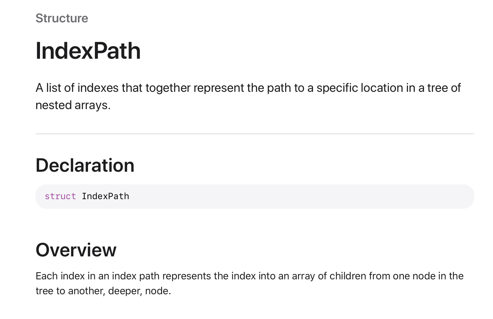

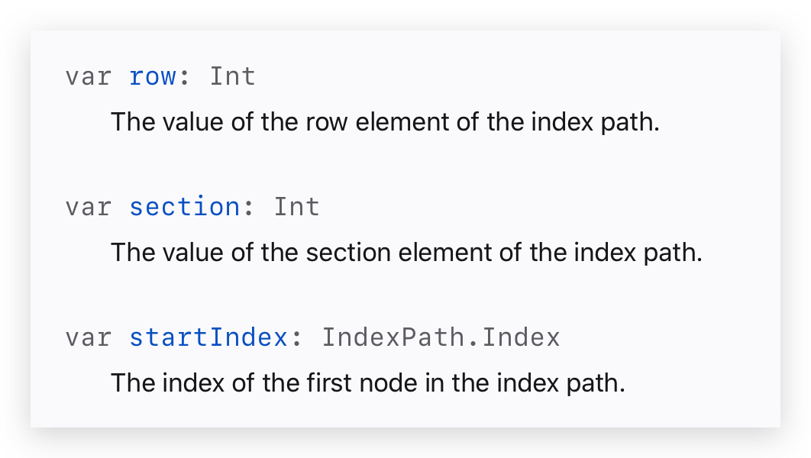

第五个问题，书上有解释：

> The dequeueReusableCell method is used for retrieving a reusable table cell from the queue with the specified cell identifier. The datacell identifier is the one we defined earlier in Interface Builder.
>

就是说，使用该<font color = "red">函数（注意是函数/方法，不是类）</font>，能够重用cell，以防每次都重新allocate一个新的cell，提高运行速度。关于参数，查阅了一下[官网](https://developer.apple.com/documentation/uikit/uitableview/1614878-dequeuereusablecell/)：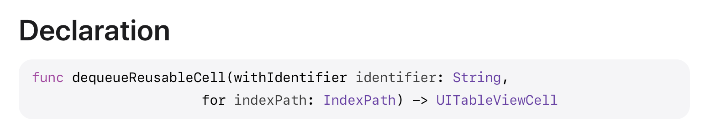

也就是说，这里调用`dequeueReusableCell`方法的时候，<font color = "red">`for` 是一个外部参数名！</font>（个人理解，不过这不会和保留字撞上吗。。。）

试了一下，还真的可以，好家伙👍

```sw
func join2(_ s1: String, _ s2: String, for joiner: String = " ") -> String {
    return s1 + joiner + s2
}
// call the function.
join2("hello", "world", for: "-")
```

切回英语模式hhh

---

The first method aims to informing the table view the number of rows in a section.The second one aims for getting the current table cell and put corresponding text there.

* mark `?`

  Here, the type of `cell.textLabel` is *optional*, of course we can use `if let` pattern to vertify, alternatively , placing a `?` after has the same effect.

# Connecting D&D

Connecting DataSource and Delegate.

Pay attention to the graph [relation](#relation).The `ViewController` is *Delegate*, so we need to tell `TableView`. Hole `control` and drag from `Table View` to `View Controller`, release and choose both `delegate` `datasource`. Then we can check these connections in `Connections inspector` or just right-click

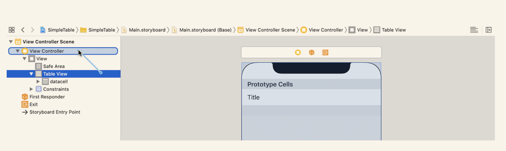

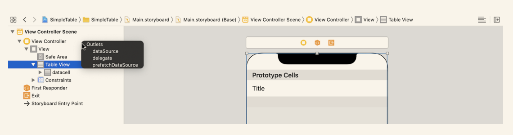

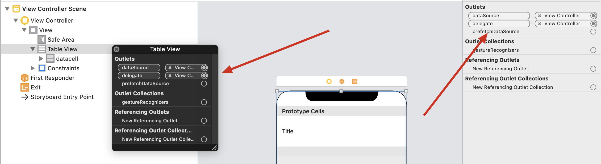

