# TableViewController

This chapter, the author plan to replace `TableView` with `TableViewController`. In chapter8, we need to adopt `UITableViewDataSource` and `UITableViewDelegate`, while `UITableViewController` has already adopted these protocols and established the connections.

## User Interface

So, delete the `View Controller` in storyboard and `ViewController.swift` file, then drag a `Table View Controller` to the storyboard to designate this one as the initial view controller.Tick the `is Initial View Controller` button.


Next, we create our own class to populate our own data.Create `RestaurantTableViewController.swift`, and in the `Main.storyboard` make the `Custom Class` of table view controller `RestaurantTableViewController` to establish a connection.

Finally, make the style of prototype cell `basic` and set the Identifier to `datacell` which is same as chapter8. After all of this, the user interface is ready.

## Code

First, define the names of restaurants like chapter8:

```sw
var restaurantNames = ["Cafe Deadend", "Homei", "Teakha", "Cafe Loisl", "Petite Oyster", "For Kee Restaurant", "Po's Atelier", "Bourke Street Bakery", "Haigh's Chocolate", "Palomino Espresso", "Upstate", "Traif", "Graham Avenue Meats And Deli", "Waffle & Wolf", "Five Leaves", "Cafe Lore", "Confessional", "Barrafina", "Donostia", "Royal Oak", "CASK Pub and Kitchen"]
```

The, code the two methods which are same as chapter8.

There is an extra method in `RestaurantTableViewController`: `numberOfSections`. This method tells the number of section to the table view. Change the return value to 1 or just remove the method, since the number of section is set to 1 by default.

By now, there are two methods to show table view:

1. use `UITableView` with `UITableViewDataSource` and `UITableViewDelegate`
2. use `UITableViewController`

Here is the difference:

> You may wonder which approach you should use. In general, approach #2 is good enough. UITableViewController has configured everything for you. You can simply override some methods to provide the table data. But what you lose is flexibility. The table view, embedded in UITableViewController, is fixed. You can't change it. If you want to layout a more complicated UI using table views, approach #1 will be more appropriate.

In short, one is flexible, the other is easy.

Next one is same as chapter8's exercise.

# Customize Table View Cell

## Design prototype cells

Obviously, we must change the style of prototype cell form `basic` to `custom`. Then , we can change the height of the cell as preferring. Here, I set the height of the cell to `87`, (uncheck `Automatic` )

After this, we can DIY the elements in the prototype cell. Firstly, we drag an `ImageView` to the cell. My own sizes of image are as following:


Then, drag three labels:

* Name:change the font of this one to `Text Style Headline`

  

* Location: Subhead Dark Gray

* Type: Same as Location

  

Embed these three as a stack view, embed the stack view and image view as a new stack view.Add four constraints to the stack view.


`Constrain to margins` is checked so that the contraints are based on the stack view's container: `prototype cell`

Lock the width and height of image view.

# Update cell data

By default, the class of prototype cell is `UITableViewCell`. And that's why we can't update data in `RestaurantUITableViewController.swift`, in my understanding. So, we need to create a custom class `RestaurantTableViewCell` for prototype cell like table view controller.Then, we define four var in the class.

```sw
@IBOutlet var nameLabel : UILabel!
@IBOutlet var locationLabel : UILabel!
@IBOutlet var typeLabel : UILabel!
@IBOutlet var thumbnailImageView : UIImageView!
```

---

Code Explanation:

1. Why is `!` ? Here, we use `!` to indicate that these var must have value when used.

   see [ref](https://www.cnblogs.com/yaozuopan/p/12134404.html)

   > 类的属性
   >
   > ```sw
   > class MyClass {
   > 	var value: String!
   > 	var optionalValue: String? // defaulit is nil, 所有定义为可选类型的，可选值都是nil, 和数据类型没有关系。
   > }
   > ```
   >
   > 在MyClass定义了2个属性：value和optionalValue，其中optionalValue为可选类型；这表示<font color = "red">value在使用之前一定是赋了值的(一定有值)</font>，optionalValue则有可能值缺失。下面先来看看几个代码片段来深入了解感叹号( ! )与问号( ? )之谜

2. What's the difference between `UIImage` and `UIImageView` ?

   Let's put the explanations from official directly:

   

   

   Together with the code in chapter8 (Actually in chapter9 BMS):

   `cell.imageView?.image = UIImage(named: restaurantNames[indexPath.row])`

   Now we can say that `UIImage` aims to managing, while `UIImageVIew` aims to displaying, IMU.

3. `@IBoutlet`: indicate a property that can be connected with a view object in a storyboard, like color, size, title and so on.

   > If you want to change the value or properties of a UI element (e.g. label), <font color = "red">you have to establish a connection between them</font> so that an object in your code can obtain a reference to an object defined in a storyboard.
   >

   `@IBAction`: indicate an action method

   Both provide an interface exposed to storyboard (between storyboard and source code.)

---

<font color = "red">Set the prototype cell's class to `RestaurantTableViewCell`</font> before establishing the connections.

# Make Connections

It's a little different between `@IBAction` and `@IBoutlet` 's connection establishing.

We know that to make *Action* connections, hold `control` and drag from button to the top menu. Here, we need to right-click `datacell`, which has been defined as `RestaurantTableViewCell` class, than in the pop-over menu, drap from the circle to the coresponding label.


When the connections are done, we will see the changes in the `RestaurantTableViewCell` 


（流批，太细了👍，Orz）

# Controller and Cell

Now, let's make a small summary: What's the difference between  `RestauranTableViewController` and `RestaurantTableViewCell` ?

IMU, the former is for controllering the whole tableview, like what to display. The latter is for customing the element's name, like the four labels' name.

# updating the table view controller

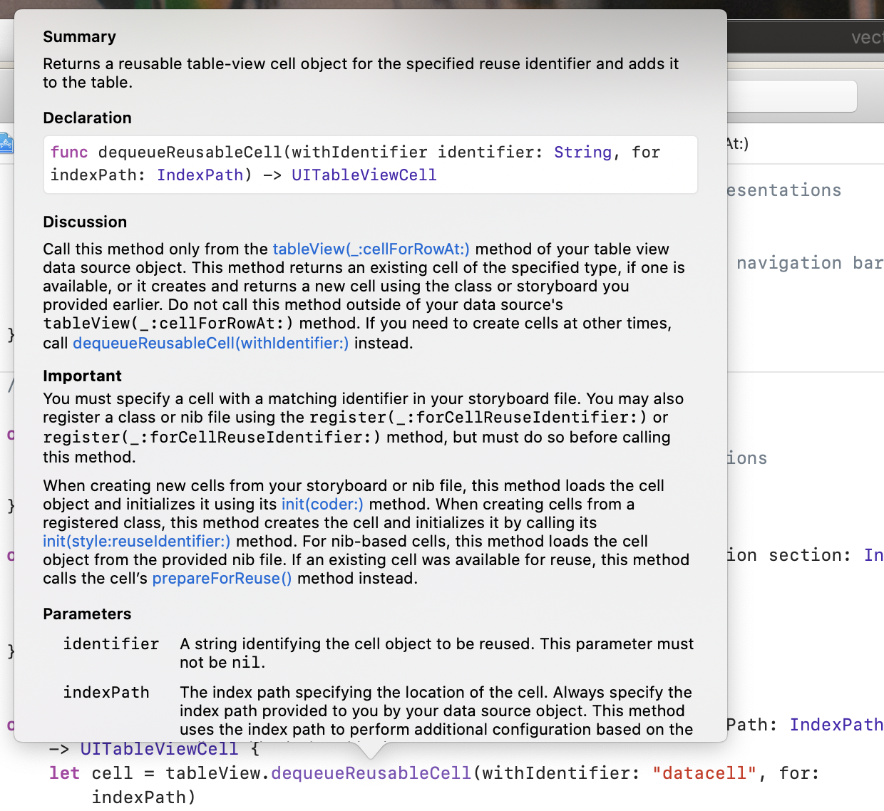

As the graph shows, the method `dequeueReusableCell` returning type is `UITableViewCell`, we need to convert it to `RestaurantTableViewCell`, which is called `downcasting`. Use `as!` to achieve that.

```
let cell = tableView.dequeueReusableCell(withIdentifier: "datacell", for: indexPath) as! RestaurantTableViewCell
```

---

`as!` and `as?`

> If you're quite sure that the downcasting can perform correctly, use as! to perform the conversion. In case you're not sure if the value of one type can be converted to another, use as? to perform an optional downcasting. You're required to perform additional checking to see if the downcasting is successful or not.
>

---

Two one lines, easy to understand

```sw
cell.nameLabel.text = restaurantNames[indexPath.row]
cell.thumbnailImageView.image = UIImage(named: restaurantNames[indexPath.row])
```

<font color = "red">Note</font>:There is no `?` after Label, because we use `!` when defining in `RestaurantTableViewCell`

Let's run! Wow~~\~\~\~\~\~\~\~\~\~\~\~\~\~

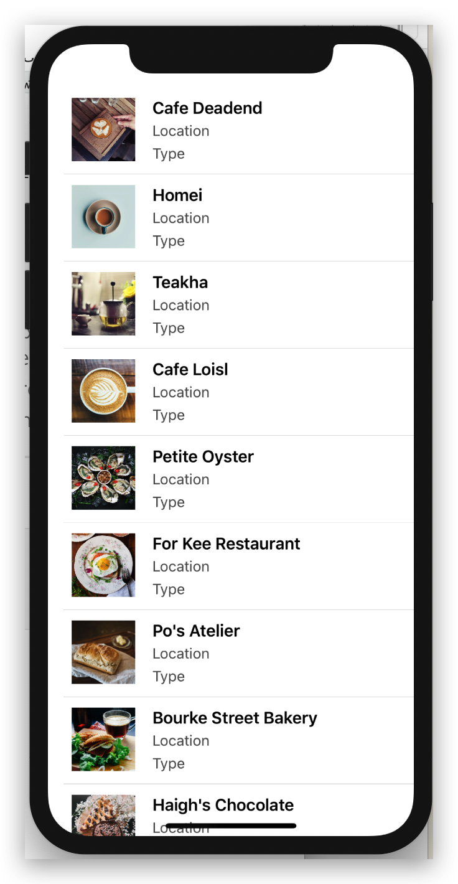 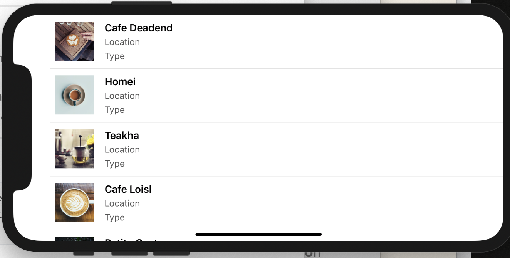

# Circular Image

> Every view in the UIKit (e.g. UIView, UIImageView) is backed by an instance of the CALayer class (i.e. layer object). The layer object is designed to manage the backing store for the view and handles view-related animations.
>
> The layer object provides various attributes that can be set to control the visual content of the view such as:
>
> * Background color
> * Border and border width
> * Shadow color, width, etc
> * Opacity
> * Corner radius

Corner radius is the attribute we need to change.And there are two ways to change it:

1. Storyboard:

   * choose the image view, in the *identify menu*, click `+` button of *User Defined Runtime Attributes*, set the corsponding as the graph. Note that the value should be half of width to make the view circular (to make the result looks better, I reset the number of image view size to 70-70)

     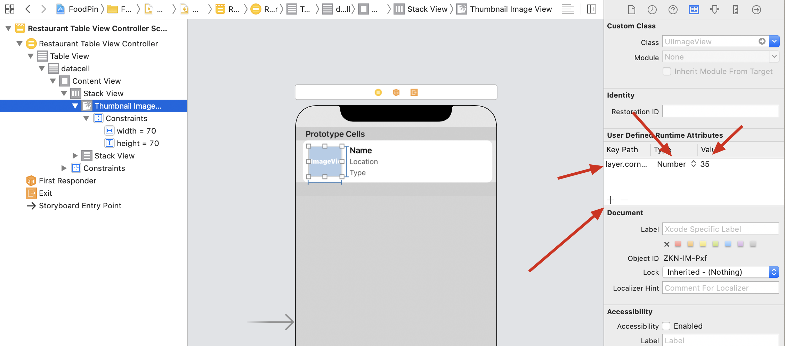

   * in *Attribute inspector*, make sure to check `Clip to Bounds`

   * result

      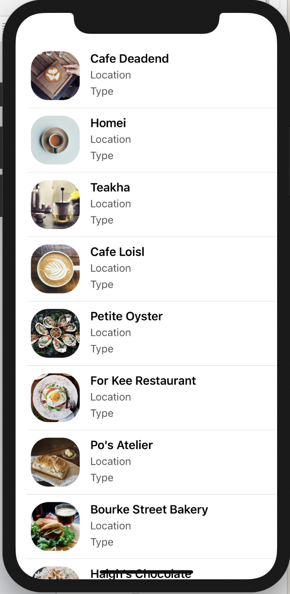

Looks beautiful, right? I think the right one is more beautiful, whose value is 25.（圆角矩形hhh

2. Code(prefered):use `didset`.

   > `didSet` is known as a property observer in Swift. As its name suggests, the code block specified in didSet will be called every time a property's value is set. In the code above, when an image view is assigned, the `didSet`  code block will be called to change the corner radius and set the clipsToBounds value to true.

   ```sw
   @IBOutlet var thumbnailImageView : UIImageView!{
           didSet{
               thumbnailImageView.layer.cornerRadius = thumbnailImageView.layer.bounds.width/2.7;
               thumbnailImageView.clipsToBounds = true;
           }
       }
   ```

   Note, code these in `RestaurantTableViewCell.swift`, to achieve ` when an image view is assigned, the didSet code block will be called`

   <font color = "red">If you use both methods,</font> Xcode will use the second, test BMS.

# Exercise

## 1

Easy to complete:

```sw
var restaurantLocations = ["Hong Kong", "Hong Kong", "Hong Kong", "Hong Kong", "Hong Kong", "Hong Kong", "Hong Kong", "Sydney", "Sydney", "Sydney", "New York", "New York", "New York", "New York", "New York", "New York", "New York", "London", "London", "London", "London"]

var restaurantTypes = ["Coffee & Tea Shop", "Cafe", "Tea House", "Austrian / Causual Drink", "French", "Bakery", "Bakery", "Chocolate", "Cafe", "American / Seafood", "American", "American", "Breakfast & Brunch", "Coffee & Tea", "Coffee & Tea", "Latin American", "Spanish", "Spanish", "Spanish", "British", "Thai"]
    ...
    
cell.locationLabel.text = restaurantLocations[indexPath.row]
cell.typeLabel.text = restaurantTypes[indexPath.row]
```

result:

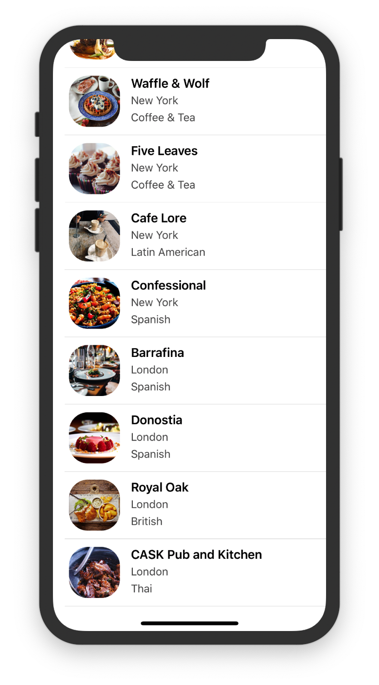

## 2

Not so hard, just adjust the layout of storyboard.

I'll do this one from scratch, and won't record everything this time.

* When define the constraints of the big stack view, don't check `contraint to margin` this time

* The content mode of imageview is `Aspect Fill`

* do not forget change this line's `let cell = tableView.dequeueReusableCell(withIdentifier: "datacell", for: indexPath)` `withIdentifier` value to datacell !!!

* Label name changes after connections maked

  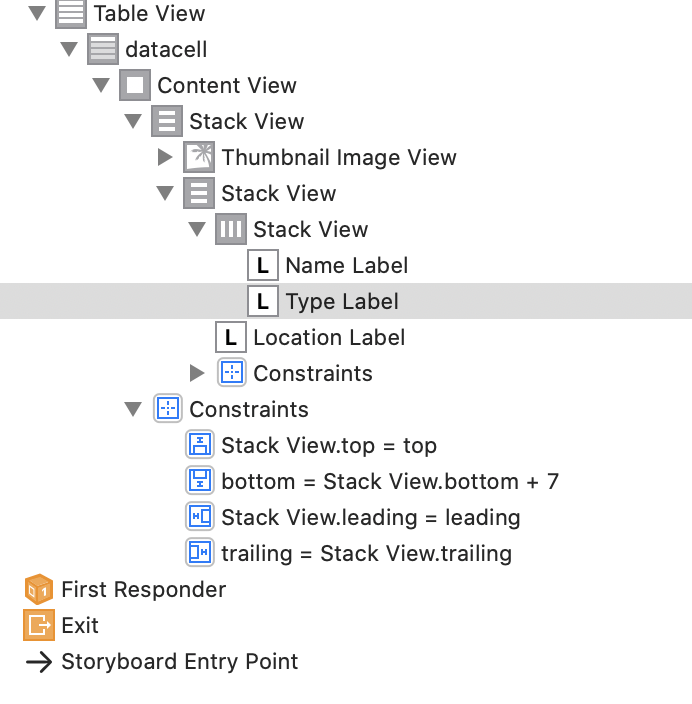

---

I got a problem when I finish exercise2:

如图，有字段会被省去，即无法从右向左排列。~~后来经过与标准答案的对比，以及自己的思索，发现了问题所在。~~想错了，并不是spacing的问题。

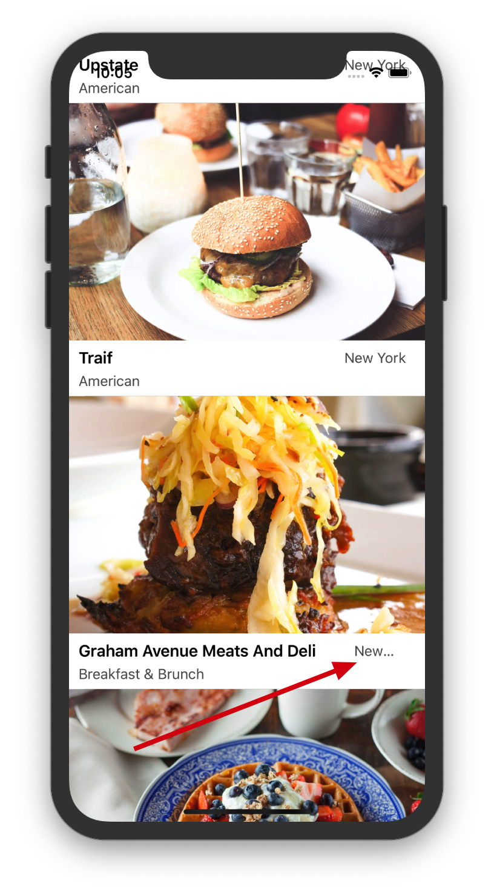

我的stack view的结构如下图所示：

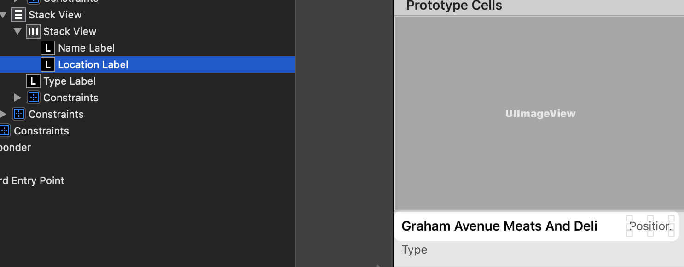

~~即先是Name与posion为一个水平stack view，之后再与下面的type为一个纵向stack view。这样会出现什么问题？？？~~

~~水平stack view之间会有间隙Spacing！！！而且这个间隙不是动态变化的，设置以后始终都是这个值！！！这就意味着这里的水平stackview设置了固定的间隙，两个Label一定要满足这个spacing~~

对于水平方向的stack view，要想实现根据屏幕尺寸自动布局，就必须<font color = "red">设置水平方向的contraints</font>。所以，自己的作答里，先水平再竖直，水平方向上需要设立相对于superview，即竖直stack的contraint。之后竖直stack设立四个constraints；标答里先竖直再水平，只需水平设置四个contraints，这样水平方向的contraints（尤其是trailing方向的）就兼顾了自己作答里水平stack与竖直stack尾端contraint的作用，故contraints总数少了一个。

<font color = "red">每个contraint的superview都是其嵌套的view，故设立多个stackview嵌套时，会不可避免地需要设立多组contraints</font>。因此最好在设计之初就遵循以下原则尽量少嵌套stackview

总结就是那个方向需要变化，就将这个方向的stack作为最大的stack以减少contraints的数量。比如这里name和location需要根据屏幕尺寸水平缩放，故最好像表达那样将水平stack作为较大的stack。

还遇到一个问题：图片的宽度不会变。这里也就需要对图片进行contraints。<font color = "red">不要滥用stack view</font>，像这里的image完全可以独立出来。当然，放进stack view也没问题。<font color = "red">最外侧的view需要设立四周的contraints</font>，故放进stack时最大的stack需要多设立一个top contraint（加上上面提到的水平右侧constraint，总共多两个）；不放进时，最外层由image+stack构成，image设立上左右，stack设立上下左右。放进去时，由于image是左右到顶的，而下面三个标签不是，需要重新设计contraints，较为繁琐。

一个原则，哪个需要缩放就对哪个设立contraints，例如上面提到的name与position构成的水平stack、image

result：

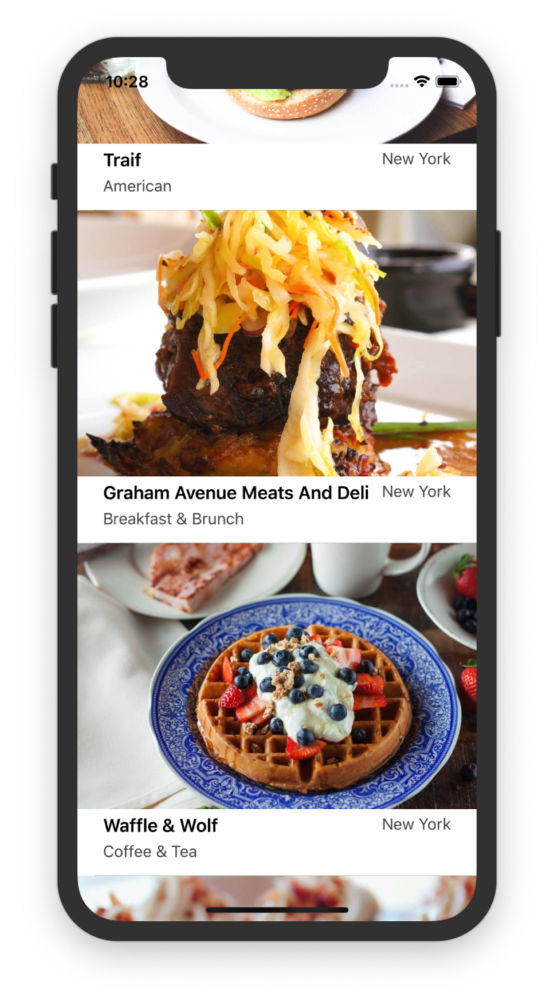

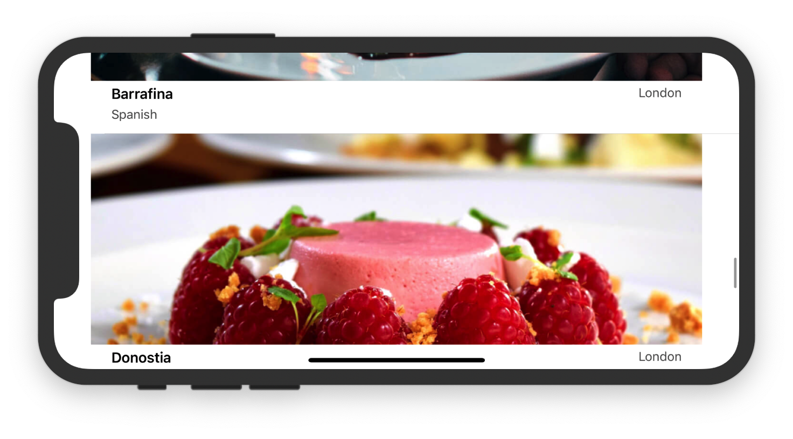