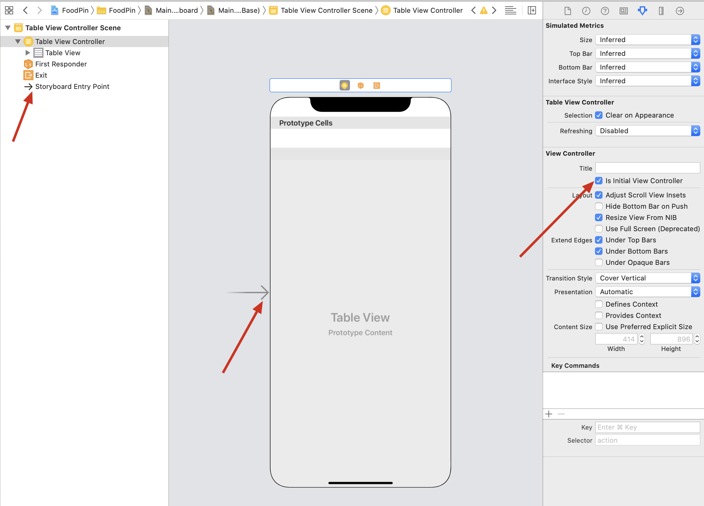
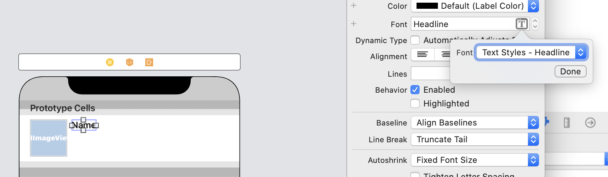
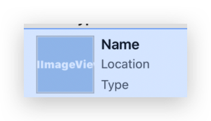
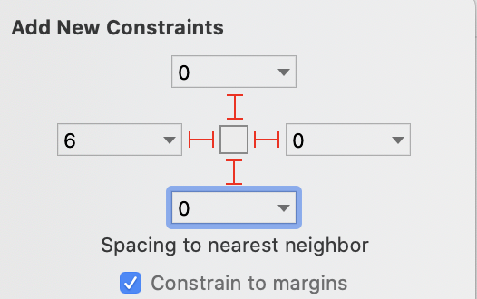
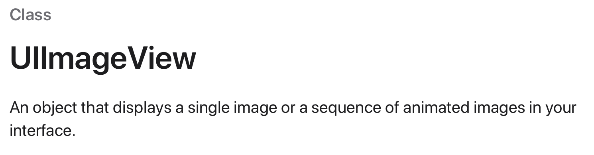
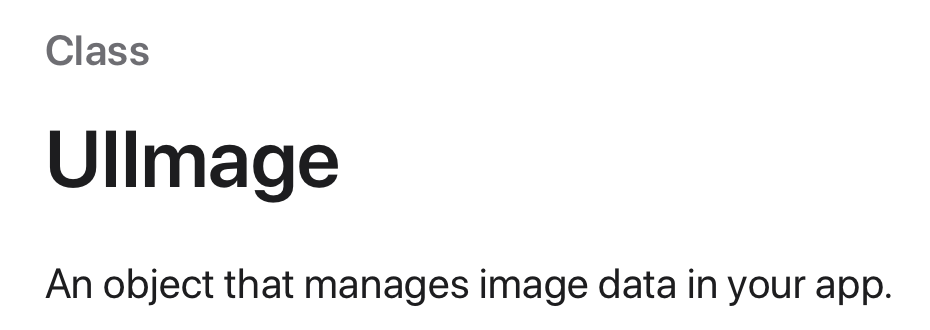
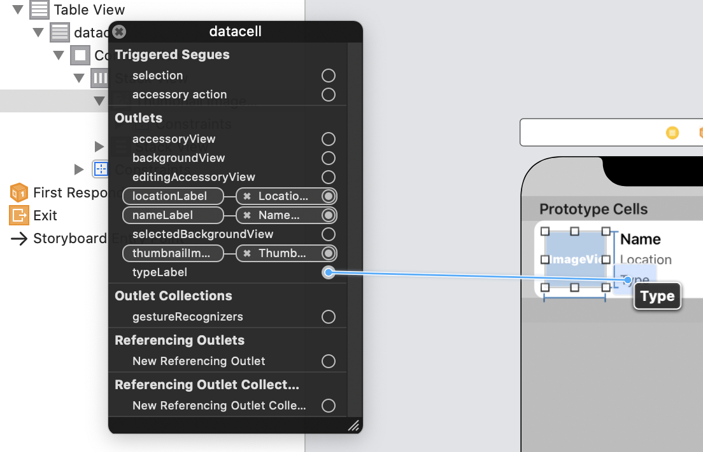
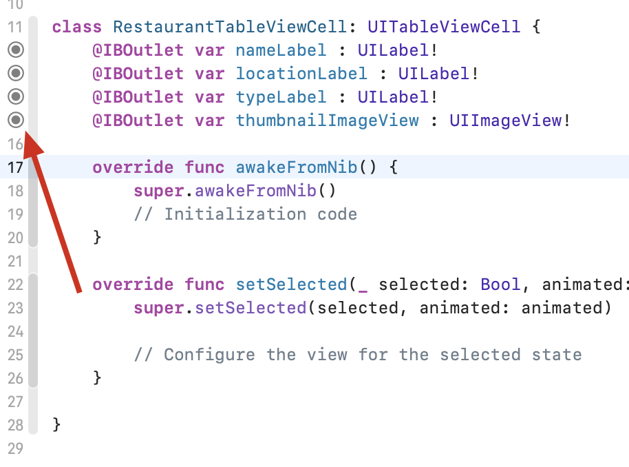
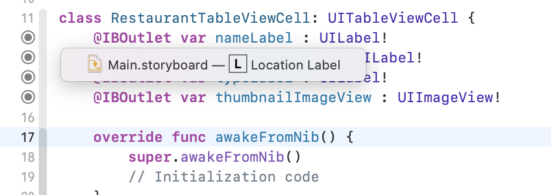

# TableViewController

This chapter, the author plan to replace `TableView` with `TableViewController`. In chapter8, we need to adopt `UITableViewDataSource` and `UITableViewDelegate`, while `UITableViewController` has already adopted these protocols and established the connections.

## User Interface

So, delete the `View Controller` in storyboard and `ViewController.swift` file, then drag a `Table View Controller` to the storyboard to designate this one as the initial view controller.Tick the `is Initial View Controller` button.



Next, we create our own class to populate our own data.Create `RestaurantTableViewController.swift`, and in the `Main.storyboard` make the `Custom Class` of table view controller `RestaurantTableViewController` to establish a connection.

Finally, make the style of prototype cell `basic` and set the Identifier to `datacell` which is same as chapter8. After all of this, the user interface is ready.

## Code

First, define the names of restaurants like chapter8:

```sw
var restaurantNames = ["Cafe Deadend", "Homei", "Teakha", "Cafe Loisl", "Petite Oyster", "For Kee Restaurant", "Po's Atelier", "Bourke Street Bakery", "Haigh's Chocolate", "Palomino Espresso", "Upstate", "Traif", "Graham Avenue Meats And Deli", "Waffle & Wolf", "Five Leaves", "Cafe Lore", "Confessional", "Barrafina", "Donostia", "Royal Oak", "CASK Pub and Kitchen"]
```

The, code the two methods which are same as chapter8.

There is an extra method in `RestaurantTableViewController`: `numberOfSections`. This method tells the number of section to the table view. Change the return value to 1 or just remove the method, since the number of section is set to 1 by default.

By now, there are two methods to show table view:

1. use `UITableView` with `UITableViewDataSource` and `UITableViewDelegate`
2. use `UITableViewController`

Here is the difference:

> You may wonder which approach you should use. In general, approach #2 is good enough. UITableViewController has configured everything for you. You can simply override some methods to provide the table data. But what you lose is flexibility. The table view, embedded in UITableViewController, is fixed. You can't change it. If you want to layout a more complicated UI using table views, approach #1 will be more appropriate.

In short, one is flexible, the other is easy.

Next one is same as chapter8's exercise.

# Customize Table View Cell

## Design prototype cells

Obviously, we must change the style of prototype cell form `basic` to `custom`. Then , we can change the height of the cell as preferring. Here, I set the height of the cell to `87`, (uncheck `Automatic` )

After this, we can DIY the elements in the prototype cell. Firstly, we drag an `ImageView` to the cell. My own sizes of image are as following:


Then, drag three labels:

* Name:change the font of this one to `Text Style Headline`

  

* Location: Subhead Dark Gray

* Type: Same as Location

  

Embed these three as a stack view, embed the stack view and image view as a new stack view.Add four constraints to the stack view.



`Constrain to margins` is checked so that the contraints are based on the stack view's container: `prototype cell`

Lock the width and height of image view.

# Update cell data

By default, the class of prototype cell is `UITableViewCell`. And thta's why we can't update data in `RestaurantUITableViewController.swift`, in my understanding. So, we need to create a custom class `RestaurantTableViewCell` for prototype cell like table view controller.Then, we define four var in the class.

```sw
@IBOutlet var nameLabel : UILabel!
    @IBOutlet var locationLabel : UILabel!
    @IBOutlet var typeLabel : UILabel!
    @IBOutlet var thumbnailImageView : UIImageView!
```

---

Code Explanation:

1. Why is `!` ? Here, we use `!` to indicate that these var must have value when used.

   see [ref](https://www.cnblogs.com/yaozuopan/p/12134404.html)

   > 类的属性
   >
   > ```sw
   > class MyClass {
   > 	var value: String!
   > 	var optionalValue: String? // defaulit is nil, 所有定义为可选类型的，可选值都是nil, 和数据类型没有关系。
   > }
   > ```
   >
   > 在MyClass定义了2个属性：value和optionalValue，其中optionalValue为可选类型；这表示<font color = "red">value在使用之前一定是赋了值的(一定有值)</font>，optionalValue则有可能值缺失。下面先来看看几个代码片段来深入了解感叹号( ! )与问号( ? )之谜

2. What's the difference between `UIImage` and `UIImageView` ?

   Let's put the explanations from official directly:

   

   

   Together with the code in chapter8 (Actually in chapter9 BMS):

   `cell.imageView?.image = UIImage(named: restaurantNames[indexPath.row])`

   Now we can say that `UIImage` aims to managing, while `UIImageVIew` aims to displaying, IMU.

3. `@IBoutlet`: indicate a property that can be connected with a view object in a storyboard, like color, size, title and so on.

   > If you want to change the value or properties of a UI element (e.g. label), <font color = "red">you have to establish a connection between them</font> so that an object in your code can obtain a reference to an object defined in a storyboard.
   >

   `@IBAction`: indicate an action method

   Both provide an interface exposed to storyboard (between storyboard and source code.)

---

<font color = "red">Set the prototype cell's class to `RestaurantTableViewCell`</font> before establishing the connections.

# Make Connections

It's a little different between `@IBAction` and `@IBoutlet` 's connection establishing.

We know that to make *Action* connections, hold `control` and drag from button to the top menu. Here, we need to right-click `datacell`, which has been defined as `RestaurantTableViewCell` class, than in the pop-over menu, drap from the circle to the coresponding label.



When the connections are done, we will see the changes in the `RestaurantTableViewCell` 



（流批，太细了👍，Orz）


