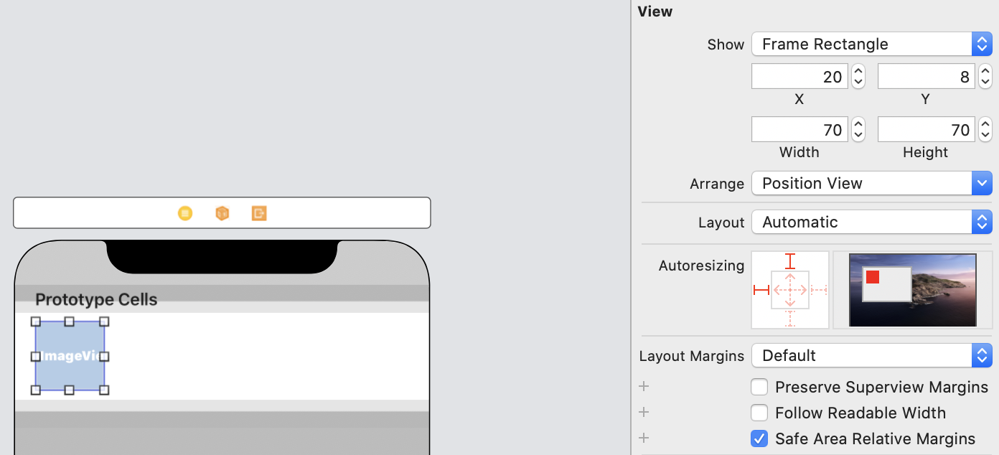

# TableViewController

This chapter, the author plan to replace `TableView` with `TableViewController`. In chapter8, we need to adopt `UITableViewDataSource` and `UITableViewDelegate`, while `UITableViewController` has already adopted these protocols and established the connections.

## User Interface

So, delete the `View Controller` in storyboard and `ViewController.swift` file, then drag a `Table View Controller` to the storyboard to designate this one as the initial view controller.Tick the `is Initial View Controller` button.


Next, we create our own class to populate our own data.Create `RestaurantTableViewController.swift`, and in the `Main.storyboard` make the `Custom Class` of table view controller `RestaurantTableViewController` to establish a connection.

Finally, make the style of prototype cell `basic` and set the Identifier to `datacell` which is same as chapter8. After all of this, the user interface is ready.

## Code

First, define the names of restaurants like chapter8:

```sw
var restaurantNames = ["Cafe Deadend", "Homei", "Teakha", "Cafe Loisl", "Petite Oyster", "For Kee Restaurant", "Po's Atelier", "Bourke Street Bakery", "Haigh's Chocolate", "Palomino Espresso", "Upstate", "Traif", "Graham Avenue Meats And Deli", "Waffle & Wolf", "Five Leaves", "Cafe Lore", "Confessional", "Barrafina", "Donostia", "Royal Oak", "CASK Pub and Kitchen"]
```

The, code the two methods which are same as chapter8.

There is an extra method in `RestaurantTableViewController`: `numberOfSections`. This method tells the number of section to the table view. Change the return value to 1 or just remove the method, since the number of section is set to 1 by default.

By now, there are two methods to show table view:

1. use `UITableView` with `UITableViewDataSource` and `UITableViewDelegate`
2. use `UITableViewController`

Here is the difference:

> You may wonder which approach you should use. In general, approach #2 is good enough. UITableViewController has configured everything for you. You can simply override some methods to provide the table data. But what you lose is flexibility. The table view, embedded in UITableViewController, is fixed. You can't change it. If you want to layout a more complicated UI using table views, approach #1 will be more appropriate.

In short, one is flexible, the other is easy.

Next one is same as chapter8's exercise.

# Customize Table View Cell

## Design prototype cells

Obviously, we must change the style of prototype cell form `basic` to `custom`. Then , we can change the height of the cell as preferring. Here, I set the height of the cell to `87`, (uncheck `Automatic` )

After this, we can DIY the elements in the prototype cell. Firstly, we drag an `ImageView` to the cell. My own sizes of image are as following:



Then, drag three labels:

* Name:change the font of this one to `Text Style Headline`

  

* Location: Subhead Dark Gray

* Type: Same as Location

  

Embed these three as a stack view, embed the stack view and image view as a new stack view.Add four constraints to the stack view.


`Constrain to margins` is checked so that the contraints are based on the stack view's container: `prototype cell`

Lock the width and height of image view.